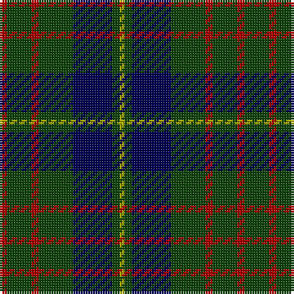

In pattern [RGRGBGY](/patterns/rgrgbgy/).

This was sourced from weddslist.  It is a [7 stripes tartan](/stripes/stripes7/).

Original link http://www.weddslist.com/cgi-bin/tartans/pg.pl?source=x

## Thread count
DR/3 DG10 DR3 DG14 DB16 DG3 LG/2

## Palette
Each colour and its ΔE from the base-6 reference it is a variant of.

| Colour | Shade | Base | ΔE (OKLab) |
|---|---|---|---|
| DB | <code style="background-color:#000052;">#000052</code> `#000052` | B <code style="background-color:#2C4084;">#2C4084</code> | 0.20 |
| DG | <code style="background-color:#11450D;">#11450D</code> `#11450D` | G <code style="background-color:#006400;">#006400</code> | 0.10 |
| DR | <code style="background-color:#AA0000;">#AA0000</code> `#AA0000` | R <code style="background-color:#C80000;">#C80000</code> | 0.06 |
| LG | <code style="background-color:#AAAA00;">#AAAA00</code> `#AAAA00` | Y <code style="background-color:#E8C000;">#E8C000</code> | 0.11 |

# Sample pattern

## Nearest tartans

The nearest existing variants by ΔTartan distance.

1. [Cameron Hunting](/setts/s7/r6g20r6g28b32g6y4-b000052-g11450d-raa0000-yaaaa00/) — ΔT 0.00
1. [Cameron Hunting](/setts/s7/r3g10r3g14b16g3y2-b000064-g004c00-rc80000-yffc800/) — ΔT 0.74
1. [Sinclair Hunting](/setts/s7/g12r4g26k12w4k32r6-g005020-k101010-r960028-we0e0e0/) — ΔT 0.79
1. [Salvation Army Htg (Corporate)](/setts/s7/b20g32k4y8k4g32b16-b1c1c50-g285800-k101010-ycca800/) — ΔT 0.82
1. [Glen Nevis #1 (Fashion)](/setts/s8/g16r4g4r6g16b24g4y4-b1c0070-g003820-r880000-ye8c000/) — ΔT 0.89
1. [MacIntyre LC](/setts/s6/g8b24r6b24g64y8-b000052-g11450d-raa0000-yaaaaaa/) — ΔT 0.90
1. [MacIntyre LC](/setts/s6/g4b12r3b12g32y4-b000052-g11450d-raa0000-yaaaaaa/) — ΔT 0.90
1. [Trafalgar (Fashion)](/setts/s6/g6b2g16b14k6y2-b2c2c80-g006818-k101010-ye8c000/) — ΔT 0.96
1. [Wilson's No.167](/setts/s10/k40b4k12g32ba8k18ba8g32k12b4-b5c8ca8-ba440044-g006818-k101010/) — ΔT 0.97
1. [Guthrie Family Tartan Tartan Number: 1085. Earliest known date: pre 2003 From the Barony of Guthrie in Angus, the name is also said to derive from Guthrum, a Scandinavian prince. Sir David Guthrie was King's Treasurer in the fifteenth century and built Guthrie Castle near Friockheim, Angus, in 1468. See products available Copyright © Blair Urquhart, Comrie, 2015](/setts/s9/k6g48k54r6k6r6k54b48r6-b2c2c80-g006818-k101010-rc80000/) — ΔT 0.99

## Neighbour map

Every grey dot is one of 15726 variants placed by the first two principal components of the ΔTartan feature space (44% of its variance). Red is this tartan; blue dots are its nearest — click one to open its page.

<svg viewBox="0 0 640 380" role="img" style="max-width:100%;height:auto;border:1px solid #e0e0e0;border-radius:4px;display:block" xmlns="http://www.w3.org/2000/svg"><image href="/nn/cloud.v1.png" width="640" height="380"/><a href="/setts/s7/r6g20r6g28b32g6y4-b000052-g11450d-raa0000-yaaaa00/"><circle cx="283.0" cy="237.6" r="4" fill="#3465a4"><title>Cameron Hunting</title></circle></a><a href="/setts/s7/r3g10r3g14b16g3y2-b000064-g004c00-rc80000-yffc800/"><circle cx="261.3" cy="227.6" r="4" fill="#3465a4"><title>Cameron Hunting</title></circle></a><a href="/setts/s7/g12r4g26k12w4k32r6-g005020-k101010-r960028-we0e0e0/"><circle cx="251.4" cy="234.9" r="4" fill="#3465a4"><title>Sinclair Hunting</title></circle></a><a href="/setts/s7/b20g32k4y8k4g32b16-b1c1c50-g285800-k101010-ycca800/"><circle cx="293.6" cy="247.9" r="4" fill="#3465a4"><title>Salvation Army Htg (Corporate)</title></circle></a><a href="/setts/s8/g16r4g4r6g16b24g4y4-b1c0070-g003820-r880000-ye8c000/"><circle cx="261.3" cy="242.0" r="4" fill="#3465a4"><title>Glen Nevis #1 (Fashion)</title></circle></a><a href="/setts/s6/g8b24r6b24g64y8-b000052-g11450d-raa0000-yaaaaaa/"><circle cx="319.1" cy="224.4" r="4" fill="#3465a4"><title>MacIntyre LC</title></circle></a><a href="/setts/s6/g4b12r3b12g32y4-b000052-g11450d-raa0000-yaaaaaa/"><circle cx="319.1" cy="224.4" r="4" fill="#3465a4"><title>MacIntyre LC</title></circle></a><a href="/setts/s6/g6b2g16b14k6y2-b2c2c80-g006818-k101010-ye8c000/"><circle cx="246.1" cy="243.8" r="4" fill="#3465a4"><title>Trafalgar (Fashion)</title></circle></a><a href="/setts/s10/k40b4k12g32ba8k18ba8g32k12b4-b5c8ca8-ba440044-g006818-k101010/"><circle cx="264.7" cy="219.0" r="4" fill="#3465a4"><title>Wilson's No.167</title></circle></a><a href="/setts/s9/k6g48k54r6k6r6k54b48r6-b2c2c80-g006818-k101010-rc80000/"><circle cx="275.8" cy="212.4" r="4" fill="#3465a4"><title>Guthrie Family Tartan Tartan Number: 1085. Earliest known date: pre 2003 From the Barony of Guthrie in Angus, the name is also said to derive from Guthrum, a Scandinavian prince. Sir David Guthrie was King's Treasurer in the fifteenth century and built Guthrie Castle near Friockheim, Angus, in 1468. See products available Copyright © Blair Urquhart, Comrie, 2015</title></circle></a><circle cx="283.0" cy="237.6" r="5" fill="#c00000"/></svg>

ID: /setts/s7/r3g10r3g14b16g3y2-b000052-g11450d-raa0000-yaaaa00/
