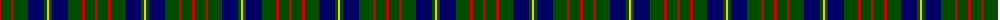

In pattern [RGRGBGY](/patterns/rgrgbgy/).

This was sourced from weddslist.  It is a [7 stripes tartan](/stripes/stripes7/).

Original link http://www.weddslist.com/cgi-bin/tartans/pg.pl?source=rb

## Thread count
R/3 G10 R3 G14 DB16 G3 Y/2

## Palette
Each colour and its ΔE from the base-6 reference it is a variant of.

| Colour | Shade | Base | ΔE (OKLab) |
|---|---|---|---|
| DB | <code style="background-color:#000064;">#000064</code> `#000064` | B <code style="background-color:#2A418A;">#2A418A</code> | 0.18 |
| G | <code style="background-color:#004C00;">#004C00</code> `#004C00` | G <code style="background-color:#006100;">#006100</code> | 0.07 |
| R | <code style="background-color:#C80000;">#C80000</code> `#C80000` | R <code style="background-color:#CC0000;">#CC0000</code> | 0.01 |
| Y | <code style="background-color:#FFC800;">#FFC800</code> `#FFC800` | Y <code style="background-color:#F2BF00;">#F2BF00</code> | 0.03 |

# Sample pattern

## Nearest tartans

The nearest existing variants by ΔTartan distance.

1. [Cameron of Lochiel (Hunting)](/setts/s7/r6g20r6g28b32g6y4-b1c0070-g006818-rc80000-ye8c000/) — ΔT 0.48
1. [Cameron Hunting](/setts/s7/r6g20r6g28b32g6y4-b000052-g11450d-raa0000-yaaaa00/) — ΔT 0.74
1. [Cameron Hunting](/setts/s7/r3g10r3g14b16g3y2-b000052-g11450d-raa0000-yaaaa00/) — ΔT 0.74
1. [Heritage Tartan, The](/setts/s6/b8r4b24g35w4g8-b1c0070-g006818-r880000-wc0c0c0/) — ΔT 0.86
1. [Cameron Hunting Clan Tartan Tartan Number: 1535. Earliest known date: 1956 A document written in Latin of 1689 descibes the Cameron men from Lochaber as being clad in blue and yellow when they followed their great Chief, Sir Ewan Cameron, to battle and victory at Killiecrankie. This new design was evolved in the 1940s by J G MacKay of Portree and first put on show at the Cameron Gathering at Achnacarry in 1956. The original Cameron first appeared in the Vestiarium Scoticum (1842). See products available Copyright © Blair Urquhart, Comrie, 2015](/setts/s7/r6g20r6g28b32g6y4-b2c2c80-g006818-re87878-ye8c000/) — ΔT 0.95
1. [MacIntyre L](/setts/s6/g4b12r3b12g32w4-b000064-g004c00-rc80000-wd0d0d0/) — ΔT 0.95
1. [Trafalgar (Fashion)](/setts/s6/g6b2g16b14k6y2-b2c2c80-g006818-k101010-ye8c000/) — ΔT 0.96
1. [Sinclair Hunting](/setts/s7/g12r4g26k12w4k32r6-g005020-k101010-r960028-we0e0e0/) — ΔT 1.00
1. [Unidentified #28](/setts/s6/g4b8k12ba2g18k4-b0596fa-ba3c82af-g005020-k101010/) — ΔT 1.02
1. [MacIntyre Hunting (VS)](/setts/s6/g8b24r6b24g64w8-b202060-g006818-rc80000-wfcfcfc/) — ΔT 1.03

## Neighbour map

Every grey dot is one of 15726 variants placed by the first two principal components of the ΔTartan feature space (44% of its variance). Red is this tartan; blue dots are its nearest — click one to open its page.

<svg viewBox="0 0 640 380" role="img" style="max-width:100%;height:auto;border:1px solid #e0e0e0;border-radius:4px;display:block" xmlns="http://www.w3.org/2000/svg"><image href="/nn/cloud.v1.png" width="640" height="380"/><a href="/setts/s7/r6g20r6g28b32g6y4-b1c0070-g006818-rc80000-ye8c000/"><circle cx="257.9" cy="223.3" r="4" fill="#3465a4"><title>Cameron of Lochiel (Hunting)</title></circle></a><a href="/setts/s7/r6g20r6g28b32g6y4-b000052-g11450d-raa0000-yaaaa00/"><circle cx="283.0" cy="237.6" r="4" fill="#3465a4"><title>Cameron Hunting</title></circle></a><a href="/setts/s7/r3g10r3g14b16g3y2-b000052-g11450d-raa0000-yaaaa00/"><circle cx="283.0" cy="237.6" r="4" fill="#3465a4"><title>Cameron Hunting</title></circle></a><a href="/setts/s6/b8r4b24g35w4g8-b1c0070-g006818-r880000-wc0c0c0/"><circle cx="282.1" cy="225.7" r="4" fill="#3465a4"><title>Heritage Tartan, The</title></circle></a><a href="/setts/s7/r6g20r6g28b32g6y4-b2c2c80-g006818-re87878-ye8c000/"><circle cx="265.4" cy="226.0" r="4" fill="#3465a4"><title>Cameron Hunting Clan Tartan Tartan Number: 1535. Earliest known date: 1956 A document written in Latin of 1689 descibes the Cameron men from Lochaber as being clad in blue and yellow when they followed their great Chief, Sir Ewan Cameron, to battle and victory at Killiecrankie. This new design was evolved in the 1940s by J G MacKay of Portree and first put on show at the Cameron Gathering at Achnacarry in 1956. The original Cameron first appeared in the Vestiarium Scoticum (1842). See products available Copyright © Blair Urquhart, Comrie, 2015</title></circle></a><a href="/setts/s6/g4b12r3b12g32w4-b000064-g004c00-rc80000-wd0d0d0/"><circle cx="298.2" cy="215.7" r="4" fill="#3465a4"><title>MacIntyre L</title></circle></a><a href="/setts/s6/g6b2g16b14k6y2-b2c2c80-g006818-k101010-ye8c000/"><circle cx="246.1" cy="243.8" r="4" fill="#3465a4"><title>Trafalgar (Fashion)</title></circle></a><a href="/setts/s7/g12r4g26k12w4k32r6-g005020-k101010-r960028-we0e0e0/"><circle cx="251.4" cy="234.9" r="4" fill="#3465a4"><title>Sinclair Hunting</title></circle></a><a href="/setts/s6/g4b8k12ba2g18k4-b0596fa-ba3c82af-g005020-k101010/"><circle cx="226.1" cy="239.3" r="4" fill="#3465a4"><title>Unidentified #28</title></circle></a><a href="/setts/s6/g8b24r6b24g64w8-b202060-g006818-rc80000-wfcfcfc/"><circle cx="292.6" cy="209.1" r="4" fill="#3465a4"><title>MacIntyre Hunting (VS)</title></circle></a><circle cx="261.3" cy="227.6" r="5" fill="#c00000"/></svg>

ID: /setts/s7/r3g10r3g14b16g3y2-b000064-g004c00-rc80000-yffc800/
