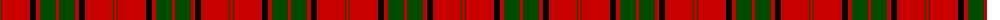

In pattern [RGRKRGR](/patterns/rgrkrgr/).

This was sourced from weddslist.  It is a [7 stripes tartan](/stripes/stripes7/).

Original link http://www.weddslist.com/cgi-bin/tartans/pg.pl?source=rb

## Thread count
R/3 G1 R28 K6 R4 G16 R/3

## Palette
Each colour and its ΔE from the base-6 reference it is a variant of.

| Colour | Shade | Base | ΔE (OKLab) |
|---|---|---|---|
| G | <code style="background-color:#004C00;">#004C00</code> `#004C00` | G <code style="background-color:#006100;">#006100</code> | 0.07 |
| K | <code style="background-color:#000000;">#000000</code> `#000000` | K <code style="background-color:#000000;">#000000</code> | 0.00 |
| R | <code style="background-color:#C80000;">#C80000</code> `#C80000` | R <code style="background-color:#CC0000;">#CC0000</code> | 0.01 |

# Sample pattern

## Nearest tartans

The nearest existing variants by ΔTartan distance.

1. [Maxwell; Maxwell Ancient](/setts/s7/r6g32r8k12r56g2r6-g008000-k000000-rc00000/) — ΔT 0.47
1. [Maxwell Ancient](/setts/s7/r6g32r8k12r56g2r6-g005020-k101010-rdc0000/) — ΔT 0.56
1. [Maxwell](/setts/s7/r6g32r8k12r56g2r6-g11450d-k000000-raa0000/) — ΔT 0.73
1. [Maxwell](/setts/s7/r3g16r4k6r28g1r3-g11450d-k000000-raa0000/) — ΔT 0.73
1. [Maxwell](/setts/s7/r6g32r8k12r56g2r6-g006818-k101010-rc80000/) — ΔT 0.78
1. [MacKintosh](/setts/s6/r48b12r6g24r8b2-b000064-g004c00-rc80000/) — ΔT 0.81
1. [MacKintosh D](/setts/s6/r44b10r4g22r6b2-b000064-g004c00-rc80000/) — ΔT 0.81
1. [Dunbar](/setts/s6/r12g42k16r56g2r8-g004c00-k000000-rc80000/) — ΔT 1.00
1. [Greig (Personal)](/setts/s6/r120k4w6g40r20g40-g003820-k101010-rc80000-we0e0e0/) — ΔT 1.07
1. [Lougheed](/setts/s8/w12r12k16w8r72k4r8k8-k101010-r880000-we8ccb8/) — ΔT 1.08

## Neighbour map

Every grey dot is one of 15726 variants placed by the first two principal components of the ΔTartan feature space (44% of its variance). Red is this tartan; blue dots are its nearest — click one to open its page.

<svg viewBox="0 0 640 380" role="img" style="max-width:100%;height:auto;border:1px solid #e0e0e0;border-radius:4px;display:block" xmlns="http://www.w3.org/2000/svg"><image href="/nn/cloud.v1.png" width="640" height="380"/><a href="/setts/s7/r6g32r8k12r56g2r6-g008000-k000000-rc00000/"><circle cx="413.7" cy="155.3" r="4" fill="#3465a4"><title>Maxwell; Maxwell Ancient</title></circle></a><a href="/setts/s7/r6g32r8k12r56g2r6-g005020-k101010-rdc0000/"><circle cx="429.7" cy="157.5" r="4" fill="#3465a4"><title>Maxwell Ancient</title></circle></a><a href="/setts/s7/r6g32r8k12r56g2r6-g11450d-k000000-raa0000/"><circle cx="436.7" cy="167.9" r="4" fill="#3465a4"><title>Maxwell</title></circle></a><a href="/setts/s7/r3g16r4k6r28g1r3-g11450d-k000000-raa0000/"><circle cx="436.7" cy="167.9" r="4" fill="#3465a4"><title>Maxwell</title></circle></a><a href="/setts/s7/r6g32r8k12r56g2r6-g006818-k101010-rc80000/"><circle cx="437.7" cy="163.6" r="4" fill="#3465a4"><title>Maxwell</title></circle></a><a href="/setts/s6/r48b12r6g24r8b2-b000064-g004c00-rc80000/"><circle cx="411.9" cy="179.7" r="4" fill="#3465a4"><title>MacKintosh</title></circle></a><a href="/setts/s6/r44b10r4g22r6b2-b000064-g004c00-rc80000/"><circle cx="409.4" cy="178.4" r="4" fill="#3465a4"><title>MacKintosh D</title></circle></a><a href="/setts/s6/r12g42k16r56g2r8-g004c00-k000000-rc80000/"><circle cx="367.0" cy="176.8" r="4" fill="#3465a4"><title>Dunbar</title></circle></a><a href="/setts/s6/r120k4w6g40r20g40-g003820-k101010-rc80000-we0e0e0/"><circle cx="420.0" cy="151.7" r="4" fill="#3465a4"><title>Greig (Personal)</title></circle></a><a href="/setts/s8/w12r12k16w8r72k4r8k8-k101010-r880000-we8ccb8/"><circle cx="424.0" cy="157.4" r="4" fill="#3465a4"><title>Lougheed</title></circle></a><circle cx="419.9" cy="157.0" r="5" fill="#c00000"/></svg>

ID: /setts/s7/r3g16r4k6r28g1r3-g004c00-k000000-rc80000/
