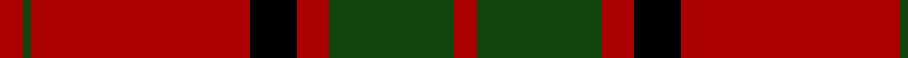

In pattern [RGRKRGR](/patterns/rgrkrgr/).

This was sourced from weddslist.  It is a [7 stripes tartan](/stripes/stripes7/).

Original link http://www.weddslist.com/cgi-bin/tartans/pg.pl?source=tinsel

## Thread count
DR/6 DG2 DR56 K12 DR8 DG32 DR/6

## Palette
Each colour and its ΔE from the base-6 reference it is a variant of.

| Colour | Shade | Base | ΔE (OKLab) |
|---|---|---|---|
| DG | <code style="background-color:#11450D;">#11450D</code> `#11450D` | G <code style="background-color:#006100;">#006100</code> | 0.09 |
| DR | <code style="background-color:#AA0000;">#AA0000</code> `#AA0000` | R <code style="background-color:#CC0000;">#CC0000</code> | 0.07 |
| K | <code style="background-color:#000000;">#000000</code> `#000000` | K <code style="background-color:#000000;">#000000</code> | 0.00 |

# Sample pattern

## Nearest tartans

The nearest existing variants by ΔTartan distance.

1. [Maxwell](/setts/s7/r3g16r4k6r28g1r3~g11450d-k000000-raa0000/) — ΔT 0.00
1. [Maxwell](/setts/s7/r3g16r4k6r28g1r3~g004c00-k000000-rc80000/) — ΔT 0.74
1. [Maxwell](/setts/s7/r3g16r4k6r28g1r3x2~g006818-k101010-rc80000/) — ΔT 0.77
1. [MacKintosh](/setts/s6/r24b6r3g12r4b1x2~b000052-g11450d-raa0000/) — ΔT 0.80
1. [MacKintosh D](/setts/s6/r22b5r2g11r3b1x2~b000052-g11450d-raa0000/) — ΔT 0.81
1. [MacKintosh D](/setts/s6/r22b5r2g11r3b1x2~b000064-g004c00-rc80000/) — ΔT 0.82
1. [MacKintosh](/setts/s6/r24b6r3g12r4b1x2~b000064-g004c00-rc80000/) — ΔT 0.84
1. [Maxwell Ancient](/setts/s7/r3g16r4k6r28g1r3x2~g005020-k101010-rdc0000/) — ΔT 0.90
1. [Maxwell; Maxwell Ancient](/setts/s7/r3g16r4k6r28g1r3x2~g008000-k000000-rc00000/) — ΔT 1.02
1. [Dunbar](/setts/s6/r6g21k8r28k1r4x2~g11450d-k000000-raa0000/) — ΔT 1.03

## Neighbour map

Every grey dot is one of 15726 variants placed by the first two principal components of the ΔTartan feature space (44% of its variance). Red is this tartan; blue dots are its nearest — click one to open its page.

<svg viewBox="0 0 640 380" role="img" style="max-width:100%;height:auto;border:1px solid #e0e0e0;border-radius:4px;display:block" xmlns="http://www.w3.org/2000/svg"><image href="/nn/cloud.v1.png" width="640" height="380"/><a href="/setts/s7/r3g16r4k6r28g1r3~g11450d-k000000-raa0000/"><circle cx="436.5" cy="171.9" r="4" fill="#3465a4"><title>Maxwell</title></circle></a><a href="/setts/s7/r3g16r4k6r28g1r3~g004c00-k000000-rc80000/"><circle cx="419.4" cy="161.5" r="4" fill="#3465a4"><title>Maxwell</title></circle></a><a href="/setts/s7/r3g16r4k6r28g1r3x2~g006818-k101010-rc80000/"><circle cx="437.4" cy="167.4" r="4" fill="#3465a4"><title>Maxwell</title></circle></a><a href="/setts/s6/r24b6r3g12r4b1x2~b000052-g11450d-raa0000/"><circle cx="430.7" cy="195.2" r="4" fill="#3465a4"><title>MacKintosh</title></circle></a><a href="/setts/s6/r22b5r2g11r3b1x2~b000052-g11450d-raa0000/"><circle cx="428.4" cy="193.9" r="4" fill="#3465a4"><title>MacKintosh D</title></circle></a><a href="/setts/s6/r22b5r2g11r3b1x2~b000064-g004c00-rc80000/"><circle cx="408.8" cy="182.4" r="4" fill="#3465a4"><title>MacKintosh D</title></circle></a><a href="/setts/s6/r24b6r3g12r4b1x2~b000064-g004c00-rc80000/"><circle cx="411.2" cy="183.8" r="4" fill="#3465a4"><title>MacKintosh</title></circle></a><a href="/setts/s7/r3g16r4k6r28g1r3x2~g005020-k101010-rdc0000/"><circle cx="429.3" cy="161.7" r="4" fill="#3465a4"><title>Maxwell Ancient</title></circle></a><a href="/setts/s7/r3g16r4k6r28g1r3x2~g008000-k000000-rc00000/"><circle cx="413.1" cy="159.8" r="4" fill="#3465a4"><title>Maxwell; Maxwell Ancient</title></circle></a><a href="/setts/s6/r6g21k8r28k1r4x2~g11450d-k000000-raa0000/"><circle cx="377.8" cy="189.1" r="4" fill="#3465a4"><title>Dunbar</title></circle></a><circle cx="436.5" cy="171.9" r="5" fill="#c00000"/></svg>

ID: /setts/s7/r3g16r4k6r28g1r3x2~g11450d-k000000-raa0000/
