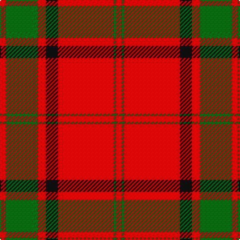

This page is one **sett** — a single exact thread-count. It belongs to the [tartan](/tartans/r3g16r4k6r28g1r3/)
(the same proportion at any scale), whose colour order is pattern [RGRKRGR](/stripes/rgrkrgr/).

Sourced from register-of-tartans.  It is a [7 stripe tartan](/stripes/stripes7/).

Original link https://www.tartanregister.gov.uk/tartanDetails.aspx?ref=2861

## Also known as

This cloth is also recorded under:

- Maxwell; Maxwell Ancient

4 attestations — the source records this cloth was collapsed from (oldest owns this page)

<ul>
<li>01/01/1842 — Maxwell (register-of-tartans, <a href="https://www.tartanregister.gov.uk/tartanDetails.aspx?ref=2861">record</a>)</li>
<li>1842 — Maxwell (Clan) (tartans-authority, <a href="http://www.tartansauthority.com/tartan-ferret/display/1500/">record</a>)</li>
<li>undated — Maxwell; Maxwell Ancient (weddslist, <a href="http://www.weddslist.com/cgi-bin/tartans/pg.pl?source=sts">record</a>)</li>
<li>undated — Maxwell Clan Tartan Tartan Number: 1500. Earliest known date: 1842 Tartans of the Lowland families were not named until the publication the 'Vestiarium Scoticum' in 1842. The authors, the Sobieski Stuart brothers, enjoyed a popular following amongst the Scottish gentry in the early Victorian era, and in the spirit of the times, added mystery, romance and some spurious historical documentation to the subject of tartans. The Maxwells have, nevertheless, a tartan of at least 150 years antiquity, probably designed by persons of great imagination and flair. The Maxwells come from Glasgow and the S.W. of Scotland. See products available Copyright © Blair Urquhart, Comrie, 2015 (house-of-tartan, <a href="http://www.house-of-tartan.scotland.net/house/TartanViewjs.asp?colr=Def&tnam=1500">record</a>)</li>
</ul>

## Register references

External register numbers recorded for this tartan.

- Scottish Register of Tartans: [2861](https://www.tartanregister.gov.uk/tartanDetails.aspx?ref=2861)
- Scottish Tartans Authority (ITI): 1500
- Scottish Tartans World Register: 1500

## Thread count
R/6 G32 R8 K12 R56 G2 R/6

## Palette

Palette: <strong>Tartan Register</strong>
<table><thead><tr><th>Colour</th><th>Threads</th><th>Shade</th><th>Base</th><th>OKLCh</th></tr></thead><tbody><tr><td>R/</td><td style="text-align:right;font-variant-numeric:tabular-nums">6</td><td><code style="background-color:#C80000;">#C80000</code> <small style="color:#888">#C80000</small></td><td>R <code style="background-color:#CC0000;">#CC0000</code></td><td><small style="color:#888">oklch(52.3% 0.215 29.2)</small></td></tr><tr><td>G</td><td style="text-align:right;font-variant-numeric:tabular-nums">32</td><td><code style="background-color:#006818;">#006818</code> <small style="color:#888">#006818</small></td><td>G <code style="background-color:#006100;">#006100</code></td><td><small style="color:#888">oklch(45.0% 0.142 145.0)</small></td></tr><tr><td>R</td><td style="text-align:right;font-variant-numeric:tabular-nums">8</td><td><code style="background-color:#C80000;">#C80000</code> <small style="color:#888">#C80000</small></td><td>R <code style="background-color:#CC0000;">#CC0000</code></td><td><small style="color:#888">oklch(52.3% 0.215 29.2)</small></td></tr><tr><td>K</td><td style="text-align:right;font-variant-numeric:tabular-nums">12</td><td><code style="background-color:#101010;">#101010</code> <small style="color:#888">#101010</small></td><td>K <code style="background-color:#000000;">#000000</code></td><td><small style="color:#888">oklch(17.3% 0.000 89.9)</small></td></tr><tr><td>R</td><td style="text-align:right;font-variant-numeric:tabular-nums">56</td><td><code style="background-color:#C80000;">#C80000</code> <small style="color:#888">#C80000</small></td><td>R <code style="background-color:#CC0000;">#CC0000</code></td><td><small style="color:#888">oklch(52.3% 0.215 29.2)</small></td></tr><tr><td>G</td><td style="text-align:right;font-variant-numeric:tabular-nums">2</td><td><code style="background-color:#006818;">#006818</code> <small style="color:#888">#006818</small></td><td>G <code style="background-color:#006100;">#006100</code></td><td><small style="color:#888">oklch(45.0% 0.142 145.0)</small></td></tr><tr><td>R/</td><td style="text-align:right;font-variant-numeric:tabular-nums">6</td><td><code style="background-color:#C80000;">#C80000</code> <small style="color:#888">#C80000</small></td><td>R <code style="background-color:#CC0000;">#CC0000</code></td><td><small style="color:#888">oklch(52.3% 0.215 29.2)</small></td></tr></tbody></table>

# Sample pattern

## Nearest tartans

The nearest existing variants by ΔTartan distance, with this tartan at the top so the swatches line up against it.

ΔTartan

Tartan

Sett

—

<a href="/ttd/edit/#slug=r3g16r4k6r28g1r3~x2">Maxwell</a> <a class="nn-out" href="/setts/s7/r3g16r4k6r28g1r3~x2/" title="open its dictionary page">↗</a>

0.49

<a href="/ttd/edit/#slug=r3dg16r4k6r28dg1r3~x2">Maxwell Ancient</a> <a class="nn-out" href="/setts/s7/r3dg16r4k6r28dg1r3~x2/" title="open its dictionary page">↗</a>

0.74

<a href="/ttd/edit/#slug=r22db5r2g11r3db1~x2">MacKintosh 1</a> <a class="nn-out" href="/setts/s6/r22db5r2g11r3db1~x2/" title="open its dictionary page">↗</a>

0.76

<a href="/ttd/edit/#slug=r48db2r3dg28r4db2~x2">MacKintosh #3</a> <a class="nn-out" href="/setts/s6/r48db2r3dg28r4db2~x2/" title="open its dictionary page">↗</a>

0.79

<a href="/ttd/edit/#slug=r68db18r9g34r9db3~x2">MacKintosh 3</a> <a class="nn-out" href="/setts/s6/r68db18r9g34r9db3~x2/" title="open its dictionary page">↗</a>

0.83

<a href="/ttd/edit/#slug=r2dg20r2db8r36dg1~x2">Robertson</a> <a class="nn-out" href="/setts/s6/r2dg20r2db8r36dg1~x2/" title="open its dictionary page">↗</a>

0.86

<a href="/ttd/edit/#slug=r68db18r9dg34r9db3~x2">MacKintosh #2</a> <a class="nn-out" href="/setts/s6/r68db18r9dg34r9db3~x2/" title="open its dictionary page">↗</a>

0.87

<a href="/ttd/edit/#slug=r22db5r2dg11r3db1">MacKintosh D</a> <a class="nn-out" href="/setts/s6/r22db5r2dg11r3db1/" title="open its dictionary page">↗</a>

0.88

<a href="/ttd/edit/#slug=r24db6r3dg12r4db1">MacKintosh</a> <a class="nn-out" href="/setts/s6/r24db6r3dg12r4db1/" title="open its dictionary page">↗</a>

0.89

<a href="/ttd/edit/#slug=r48db2r3g28r4db2~x2">MacKintosh 2</a> <a class="nn-out" href="/setts/s6/r48db2r3g28r4db2~x2/" title="open its dictionary page">↗</a>

0.90

<a href="/ttd/edit/#slug=g2r2db1r24db6r3g12r4db1~x2">MacDonald 1</a> <a class="nn-out" href="/setts/s9/g2r2db1r24db6r3g12r4db1~x2/" title="open its dictionary page">↗</a>

## Neighbour map

Every grey dot is one of 14359 variants placed by the first two principal components of the ΔTartan feature space (44% of its variance). Red is this tartan; blue dots are its nearest — click one to open its page.

<svg viewBox="0 0 640 380" role="img" style="max-width:100%;height:auto;border:1px solid #e0e0e0;border-radius:4px;display:block" xmlns="http://www.w3.org/2000/svg"><image href="/nn/cloud.v1.png" width="640" height="380"/><a href="/setts/s7/r3dg16r4k6r28dg1r3~x2/"><circle cx="427.3" cy="156.5" r="4" fill="#3465a4"><title>Maxwell Ancient</title></circle></a><a href="/setts/s6/r22db5r2g11r3db1~x2/"><circle cx="423.9" cy="185.7" r="4" fill="#3465a4"><title>MacKintosh 1</title></circle></a><a href="/setts/s6/r48db2r3dg28r4db2~x2/"><circle cx="459.2" cy="163.0" r="4" fill="#3465a4"><title>MacKintosh #3</title></circle></a><a href="/setts/s6/r68db18r9g34r9db3~x2/"><circle cx="417.9" cy="188.3" r="4" fill="#3465a4"><title>MacKintosh 3</title></circle></a><a href="/setts/s6/r2dg20r2db8r36dg1~x2/"><circle cx="423.6" cy="154.4" r="4" fill="#3465a4"><title>Robertson</title></circle></a><a href="/setts/s6/r68db18r9dg34r9db3~x2/"><circle cx="411.4" cy="181.1" r="4" fill="#3465a4"><title>MacKintosh #2</title></circle></a><a href="/setts/s6/r22db5r2dg11r3db1/"><circle cx="407.5" cy="178.1" r="4" fill="#3465a4"><title>MacKintosh D</title></circle></a><a href="/setts/s6/r24db6r3dg12r4db1/"><circle cx="409.8" cy="179.3" r="4" fill="#3465a4"><title>MacKintosh</title></circle></a><a href="/setts/s6/r48db2r3g28r4db2~x2/"><circle cx="465.6" cy="170.5" r="4" fill="#3465a4"><title>MacKintosh 2</title></circle></a><a href="/setts/s9/g2r2db1r24db6r3g12r4db1~x2/"><circle cx="419.3" cy="154.5" r="4" fill="#3465a4"><title>MacDonald 1</title></circle></a><circle cx="435.6" cy="163.6" r="5" fill="#c00000"/></svg>

ID: /setts/s7/r3g16r4k6r28g1r3~x2/
