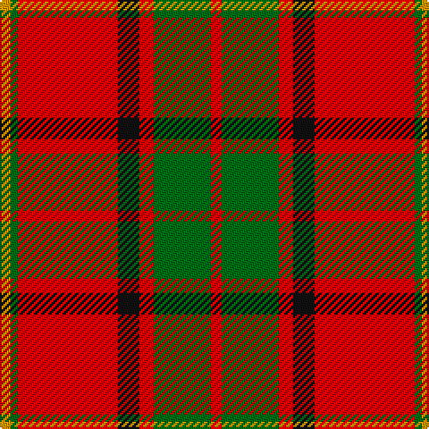

In pattern [RGRKRGY](/patterns/rgrkrgy/).

This was sourced from tartans-authority.  It is a [7 stripes tartan](/stripes/stripes7/).

Original link http://www.tartansauthority.com/tartan-ferret/display/3465/

## Attestations

This cloth appears in 2 source records; the oldest owns this page.

- 2000 — McInally (Name) (tartans-authority, [record](http://www.tartansauthority.com/tartan-ferret/display/3465/))
- undated — McInally (register-of-tartans, [record](https://www.tartanregister.gov.uk/tartanDetails.aspx?ref=5154))

## Thread count
DY/6 G4 R56 K12 R8 G32 R/6

## Palette
Each colour and its ΔE from the base-6 reference it is a variant of.

| Colour | Shade | Base | ΔE (OKLab) |
|---|---|---|---|
| DY | <code style="background-color:#D09800;">#D09800</code> `#D09800` | Y <code style="background-color:#F2BF00;">#F2BF00</code> | 0.12 |
| G | <code style="background-color:#006818;">#006818</code> `#006818` | G <code style="background-color:#006100;">#006100</code> | 0.02 |
| K | <code style="background-color:#101010;">#101010</code> `#101010` | K <code style="background-color:#000000;">#000000</code> | 0.17 |
| R | <code style="background-color:#C80000;">#C80000</code> `#C80000` | R <code style="background-color:#CC0000;">#CC0000</code> | 0.01 |

# Sample pattern

## Nearest tartans

The nearest existing variants by ΔTartan distance.

1. [Chisholm, The](/setts/s8/r12b2w1b2r3g8r3b1x2~b304080-g008000-rc00000-we0e0e0/) — ΔT 0.72
1. [Denny Hunting Clan Tartan Tartan Number: 518. Earliest known date: pre 2003 This tartan is remarkably similar to the Durham sett designed by Wilson's of Bannockburn around 1819. The variation in proportions may point to a deliberate modification suggested by the links between the names. See products available Copyright © Blair Urquhart, Comrie, 2015](/setts/s6/b1r16g6k1g6k1x2~b2c2c80-g006818-k101010-rc80000/) — ΔT 0.74
1. [Wilson's, No 5](/setts/s6/r32b5g17r4g5w2x2~b5480b0-g008000-rc00000-we0e0e0/) — ΔT 0.79
1. [Burnett of Leys Family Tartan Tartan Number: 2355. Earliest known date: Unknown In Scottish Tartan Society Files but source unknown. At present woven by Lochcarron. The entry in the Lyon Court Books does not define the pattern. See products available Copyright © Blair Urquhart, Comrie, 2015](/setts/s8/r2g6y1g6r3g2r16b1x4~b5c8ca8-g006818-rc80000-ye8c000/) — ΔT 0.81
1. [Chisholm (Portrait) The.. Clan Tartan Tartan Number: 532. Earliest known date: 1800 This is without doubt the oldest of the Chisholm tartans, dating from around 1800 and which appears in a portrait of the clan heroine 'Mary Chisholm' of about that date. She was famous for having sided with the clansmen during the clearances. D.C.Stewart says it is a variation of one of the MacIntosh setts, said to have been found in a cave at Achnacarry in 1746. Cockburn Collection No.40 (1800 - 10). Logan (1831) See products available Copyright © Blair Urquhart, Comrie, 2015](/setts/s8/r12b2w1b2r3g8r3b1x2~b2c2c80-g006818-rc80000-we0e0e0/) — ΔT 0.83
1. [MacFie](/setts/s9/w1r12g2r1g16r1g2r12y1~g004c00-rc80000-wd0d0d0-yffc800/) — ΔT 0.84
1. [MacAulay](/setts/s6/k2r16g6r3g8w1x2~g006818-k101010-rc80000-wc0c0c0/) — ΔT 0.84
1. [MacAulay (Clan)](/setts/s6/k2r16g6r3g8w1x4~g006818-k101010-rc80000-we0e0e0/) — ΔT 0.84
1. [MacAulay Tartan Tartan Number: 1164. Earliest known date: 1881 This shorter version tallies with the count published by M'Intyre North in 1881 as having been given him by Logan. There are two Clans of the name associated with districts as far apart as Dumbarton and Lewis and they have no family connection with each other. They are the MacAulays of Ardencaple associated with the MacGregors and the MacAulays of Lewis who are associated with the MacLeods. This sett in its shortened form begins to resemble the MacGregor tartan. See products available Copyright © Blair Urquhart, Comrie, 2015](/setts/s6/k2r16g6r3g8w1x2~g006818-k101010-rc80000-we0e0e0/) — ΔT 0.84
1. [Chisholm, The](/setts/s8/r12b2w1b2r3g8r3b1x4~b1474b4-g006818-rc80000-wfcfcfc/) — ΔT 0.85

## Neighbour map

Every grey dot is one of 15726 variants placed by the first two principal components of the ΔTartan feature space (44% of its variance). Red is this tartan; blue dots are its nearest — click one to open its page.

<svg viewBox="0 0 640 380" role="img" style="max-width:100%;height:auto;border:1px solid #e0e0e0;border-radius:4px;display:block" xmlns="http://www.w3.org/2000/svg"><image href="/nn/cloud.v1.png" width="640" height="380"/><a href="/setts/s8/r12b2w1b2r3g8r3b1x2~b304080-g008000-rc00000-we0e0e0/"><circle cx="324.0" cy="180.2" r="4" fill="#3465a4"><title>Chisholm, The</title></circle></a><a href="/setts/s6/b1r16g6k1g6k1x2~b2c2c80-g006818-k101010-rc80000/"><circle cx="342.8" cy="179.3" r="4" fill="#3465a4"><title>Denny Hunting Clan Tartan Tartan Number: 518. Earliest known date: pre 2003 This tartan is remarkably similar to the Durham sett designed by Wilson's of Bannockburn around 1819. The variation in proportions may point to a deliberate modification suggested by the links between the names. See products available Copyright © Blair Urquhart, Comrie, 2015</title></circle></a><a href="/setts/s6/r32b5g17r4g5w2x2~b5480b0-g008000-rc00000-we0e0e0/"><circle cx="352.4" cy="180.0" r="4" fill="#3465a4"><title>Wilson's, No 5</title></circle></a><a href="/setts/s8/r2g6y1g6r3g2r16b1x4~b5c8ca8-g006818-rc80000-ye8c000/"><circle cx="378.0" cy="170.2" r="4" fill="#3465a4"><title>Burnett of Leys Family Tartan Tartan Number: 2355. Earliest known date: Unknown In Scottish Tartan Society Files but source unknown. At present woven by Lochcarron. The entry in the Lyon Court Books does not define the pattern. See products available Copyright © Blair Urquhart, Comrie, 2015</title></circle></a><a href="/setts/s8/r12b2w1b2r3g8r3b1x2~b2c2c80-g006818-rc80000-we0e0e0/"><circle cx="322.7" cy="178.9" r="4" fill="#3465a4"><title>Chisholm (Portrait) The.. Clan Tartan Tartan Number: 532. Earliest known date: 1800 This is without doubt the oldest of the Chisholm tartans, dating from around 1800 and which appears in a portrait of the clan heroine 'Mary Chisholm' of about that date. She was famous for having sided with the clansmen during the clearances. D.C.Stewart says it is a variation of one of the MacIntosh setts, said to have been found in a cave at Achnacarry in 1746. Cockburn Collection No.40 (1800 - 10). Logan (1831) See products available Copyright © Blair Urquhart, Comrie, 2015</title></circle></a><a href="/setts/s9/w1r12g2r1g16r1g2r12y1~g004c00-rc80000-wd0d0d0-yffc800/"><circle cx="360.0" cy="157.3" r="4" fill="#3465a4"><title>MacFie</title></circle></a><a href="/setts/s6/k2r16g6r3g8w1x2~g006818-k101010-rc80000-wc0c0c0/"><circle cx="335.5" cy="192.1" r="4" fill="#3465a4"><title>MacAulay</title></circle></a><a href="/setts/s6/k2r16g6r3g8w1x4~g006818-k101010-rc80000-we0e0e0/"><circle cx="331.4" cy="190.4" r="4" fill="#3465a4"><title>MacAulay (Clan)</title></circle></a><a href="/setts/s6/k2r16g6r3g8w1x2~g006818-k101010-rc80000-we0e0e0/"><circle cx="331.4" cy="190.4" r="4" fill="#3465a4"><title>MacAulay Tartan Tartan Number: 1164. Earliest known date: 1881 This shorter version tallies with the count published by M'Intyre North in 1881 as having been given him by Logan. There are two Clans of the name associated with districts as far apart as Dumbarton and Lewis and they have no family connection with each other. They are the MacAulays of Ardencaple associated with the MacGregors and the MacAulays of Lewis who are associated with the MacLeods. This sett in its shortened form begins to resemble the MacGregor tartan. See products available Copyright © Blair Urquhart, Comrie, 2015</title></circle></a><a href="/setts/s8/r12b2w1b2r3g8r3b1x4~b1474b4-g006818-rc80000-wfcfcfc/"><circle cx="321.0" cy="178.5" r="4" fill="#3465a4"><title>Chisholm, The</title></circle></a><circle cx="345.5" cy="174.1" r="5" fill="#c00000"/></svg>

ID: /setts/s7/r3g16r4k6r28g2y3x2~g006818-k101010-rc80000-yd09800/
