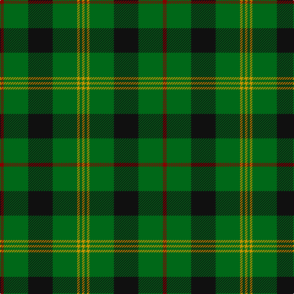

This page is one **sett** — a single exact thread-count. It belongs to the [tartan](/tartans/r3g20k20g20lo2g2lo2/)
(the same proportion at any scale), whose colour order is pattern [RGKGYGY](/stripes/rgkgygy/).

Sourced from register-of-tartans.  It is a [7 stripe tartan](/stripes/stripes7/).

Original link https://www.tartanregister.gov.uk/tartanDetails.aspx?ref=3302

2 attestations — the source records this cloth was collapsed from (oldest owns this page)

<ul>
<li>01/01/1930 — Paton (Personal) (register-of-tartans, <a href="https://www.tartanregister.gov.uk/tartanDetails.aspx?ref=3302">record</a>)</li>
<li>1930s — Paton (Personal) (tartans-authority, <a href="http://www.tartansauthority.com/tartan-ferret/display/2128/">record</a>)</li>
</ul>

## Register references

External register numbers recorded for this tartan.

- Scottish Register of Tartans: [3302](https://www.tartanregister.gov.uk/tartanDetails.aspx?ref=3302)
- Scottish Tartans Authority (ITI): 2128
- Scottish Tartans World Register: 2128

## Thread count
DR/6 G40 K40 G40 DY4 G4 DY/4

## Palette

Palette: <strong>Tartan Register</strong> <small style="color:#888">(3 of 4 colours)</small>
<table><thead><tr><th>Colour</th><th>Threads</th><th>Shade</th><th>Base</th><th>OKLCh</th></tr></thead><tbody><tr><td>DR/</td><td style="text-align:right;font-variant-numeric:tabular-nums">6</td><td><code style="background-color:#880000;">#880000</code> <small style="color:#888">#880000</small></td><td>R <code style="background-color:#CC0000;">#CC0000</code></td><td><small style="color:#888">oklch(39.4% 0.162 29.2)</small></td></tr><tr><td>G</td><td style="text-align:right;font-variant-numeric:tabular-nums">40</td><td><code style="background-color:#006818;">#006818</code> <small style="color:#888">#006818</small></td><td>G <code style="background-color:#006100;">#006100</code></td><td><small style="color:#888">oklch(45.0% 0.142 145.0)</small></td></tr><tr><td>K</td><td style="text-align:right;font-variant-numeric:tabular-nums">40</td><td><code style="background-color:#101010;">#101010</code> <small style="color:#888">#101010</small></td><td>K <code style="background-color:#000000;">#000000</code></td><td><small style="color:#888">oklch(17.3% 0.000 89.9)</small></td></tr><tr><td>G</td><td style="text-align:right;font-variant-numeric:tabular-nums">40</td><td><code style="background-color:#006818;">#006818</code> <small style="color:#888">#006818</small></td><td>G <code style="background-color:#006100;">#006100</code></td><td><small style="color:#888">oklch(45.0% 0.142 145.0)</small></td></tr><tr><td>DY</td><td style="text-align:right;font-variant-numeric:tabular-nums">4</td><td><code style="background-color:#D09800;">#D09800</code> <small style="color:#888">#D09800</small></td><td>Y <code style="background-color:#F2BF00;">#F2BF00</code></td><td><small style="color:#888">oklch(71.4% 0.147 82.1)</small></td></tr><tr><td>G</td><td style="text-align:right;font-variant-numeric:tabular-nums">4</td><td><code style="background-color:#006818;">#006818</code> <small style="color:#888">#006818</small></td><td>G <code style="background-color:#006100;">#006100</code></td><td><small style="color:#888">oklch(45.0% 0.142 145.0)</small></td></tr><tr><td>DY/</td><td style="text-align:right;font-variant-numeric:tabular-nums">4</td><td><code style="background-color:#D09800;">#D09800</code> <small style="color:#888">#D09800</small></td><td>Y <code style="background-color:#F2BF00;">#F2BF00</code></td><td><small style="color:#888">oklch(71.4% 0.147 82.1)</small></td></tr></tbody></table>

# Sample pattern

## Nearest tartans

The nearest existing variants by ΔTartan distance, with this tartan at the top so the swatches line up against it.

ΔTartan

Tartan

Sett

—

<a href="/ttd/edit/#slug=r3g20k20g20lo2g2lo2~x2">Paton (Personal)</a> <a class="nn-out" href="/setts/s7/r3g20k20g20lo2g2lo2~x2/" title="open its dictionary page">↗</a>

0.97

<a href="/ttd/edit/#slug=r3g22db16g14r2g6lo2~x2">Scottish Scouts (1957) (Corporate)</a> <a class="nn-out" href="/setts/s7/r3g22db16g14r2g6lo2~x2/" title="open its dictionary page">↗</a>

1.01

<a href="/ttd/edit/#slug=o5g12dg4r4dg27g3dg4o5">Daks, Muted Loden</a> <a class="nn-out" href="/setts/s8/o5g12dg4r4dg27g3dg4o5/" title="open its dictionary page">↗</a>

1.05

<a href="/ttd/edit/#slug=lo1dg11k6dg3lo1dg1lo1~x4">Angle, Green (Fashion)</a> <a class="nn-out" href="/setts/s7/lo1dg11k6dg3lo1dg1lo1~x4/" title="open its dictionary page">↗</a>

1.10

<a href="/ttd/edit/#slug=g3db8g3k4g15r2~x2">Lauder (Family)</a> <a class="nn-out" href="/setts/s6/g3db8g3k4g15r2~x2/" title="open its dictionary page">↗</a>

1.12

<a href="/ttd/edit/#slug=r3g30k12g6k16ly2~x2">MacArthur (Variant)</a> <a class="nn-out" href="/setts/s6/r3g30k12g6k16ly2~x2/" title="open its dictionary page">↗</a>

1.14

<a href="/ttd/edit/#slug=db1r3g11r2db5g11ly1~x2">MacKintosh, hunting</a> <a class="nn-out" href="/setts/s7/db1r3g11r2db5g11ly1~x2/" title="open its dictionary page">↗</a>

1.17

<a href="/ttd/edit/#slug=ly2g12db6r3g12r4db1~x2">MacKintosh Hunting</a> <a class="nn-out" href="/setts/s7/ly2g12db6r3g12r4db1~x2/" title="open its dictionary page">↗</a>

1.18

<a href="/ttd/edit/#slug=g3w1g12r6g3k3g2~x4">Arkansas</a> <a class="nn-out" href="/setts/s7/g3w1g12r6g3k3g2~x4/" title="open its dictionary page">↗</a>

1.18

<a href="/ttd/edit/#slug=g6k16r3k16g28k4g12w3~x2">MacAulay of Lewis</a> <a class="nn-out" href="/setts/s8/g6k16r3k16g28k4g12w3~x2/" title="open its dictionary page">↗</a>

1.19

<a href="/ttd/edit/#slug=g6dg14r9dt7r9dg54ly6">Tulloch Homes</a> <a class="nn-out" href="/setts/s7/g6dg14r9dt7r9dg54ly6/" title="open its dictionary page">↗</a>

## Neighbour map

Every grey dot is one of 14299 variants placed by the first two principal components of the ΔTartan feature space (44% of its variance). Red is this tartan; blue dots are its nearest — click one to open its page.

<svg viewBox="0 0 640 380" role="img" style="max-width:100%;height:auto;border:1px solid #e0e0e0;border-radius:4px;display:block" xmlns="http://www.w3.org/2000/svg"><image href="/nn/cloud.v1.png" width="640" height="380"/><a href="/setts/s7/r3g22db16g14r2g6lo2~x2/"><circle cx="365.8" cy="226.6" r="4" fill="#3465a4"><title>Scottish Scouts (1957) (Corporate)</title></circle></a><a href="/setts/s8/o5g12dg4r4dg27g3dg4o5/"><circle cx="292.3" cy="207.5" r="4" fill="#3465a4"><title>Daks, Muted Loden</title></circle></a><a href="/setts/s7/lo1dg11k6dg3lo1dg1lo1~x4/"><circle cx="396.8" cy="226.0" r="4" fill="#3465a4"><title>Angle, Green (Fashion)</title></circle></a><a href="/setts/s6/g3db8g3k4g15r2~x2/"><circle cx="329.0" cy="253.4" r="4" fill="#3465a4"><title>Lauder (Family)</title></circle></a><a href="/setts/s6/r3g30k12g6k16ly2~x2/"><circle cx="319.5" cy="213.9" r="4" fill="#3465a4"><title>MacArthur (Variant)</title></circle></a><a href="/setts/s7/db1r3g11r2db5g11ly1~x2/"><circle cx="365.2" cy="217.4" r="4" fill="#3465a4"><title>MacKintosh, hunting</title></circle></a><a href="/setts/s7/ly2g12db6r3g12r4db1~x2/"><circle cx="322.7" cy="216.9" r="4" fill="#3465a4"><title>MacKintosh Hunting</title></circle></a><a href="/setts/s7/g3w1g12r6g3k3g2~x4/"><circle cx="367.1" cy="208.6" r="4" fill="#3465a4"><title>Arkansas</title></circle></a><a href="/setts/s8/g6k16r3k16g28k4g12w3~x2/"><circle cx="280.1" cy="221.8" r="4" fill="#3465a4"><title>MacAulay of Lewis</title></circle></a><a href="/setts/s7/g6dg14r9dt7r9dg54ly6/"><circle cx="352.6" cy="193.5" r="4" fill="#3465a4"><title>Tulloch Homes</title></circle></a><circle cx="347.8" cy="221.4" r="5" fill="#c00000"/></svg>

ID: /setts/s7/r3g20k20g20lo2g2lo2~x2/
