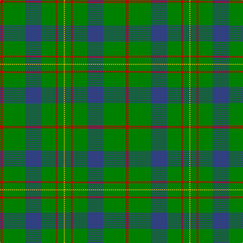

In pattern [RGBGRGY](/stripes/rgbgrgy/).

This was sourced from weddslist.  It is a [7 stripe tartan](/stripes/stripes7/).

Original link http://www.weddslist.com/cgi-bin/tartans/pg.pl?source=sts

## Attestations

This cloth appears in 2 source records; the oldest owns this page.

- undated — Scottish Scouts (weddslist, [record](http://www.weddslist.com/cgi-bin/tartans/pg.pl?source=sts))
- undated — Scottish Scouts Corporate Tartan Tartan Number: 1463. Earliest known date: 1957 This tartan currently in use for Scottish Scouts is based upon the MacLaren, in honour of a MacLaren who gave an estate to the movement. On the blue and green base the strong red overcheck represents the Rover Scouts, the finer red lines, the Scouts and Senior Scouts and yellow the Wolf Cubs. See products available Copyright © Blair Urquhart, Comrie, 2015 (house-of-tartan, [record](http://www.house-of-tartan.scotland.net/house/TartanViewjs.asp?colr=Def&tnam=1463))

## Thread count
R/6 G44 B32 G28 R4 G12 Y/2

## Palette
Each colour and the base-6 reference it is a variant of.

| Colour | Shade | Base |
|---|---|---|
| B | <code style="background-color:#304080;">#304080</code> `oklch(39.4% 0.109 270.2)` <small>#304080</small> | B <code style="background-color:#2A418A;">#2A418A</code> |
| G | <code style="background-color:#008000;">#008000</code> `oklch(52.0% 0.177 142.5)` <small>#008000</small> | G <code style="background-color:#006100;">#006100</code> |
| R | <code style="background-color:#C00000;">#C00000</code> `oklch(50.7% 0.208 29.2)` <small>#C00000</small> | R <code style="background-color:#CC0000;">#CC0000</code> |
| Y | <code style="background-color:#F0C000;">#F0C000</code> `oklch(82.7% 0.169 90.5)` <small>#F0C000</small> | Y <code style="background-color:#F2BF00;">#F2BF00</code> |

# Sample pattern

## Nearest tartans

The nearest existing variants by ΔTartan distance.

1. [MacKintosh, hunting](/setts/s7/db1r3g11r2db5g11ly1~x2/) — ΔT 1.20
1. [Glenlivet](/setts/s8/g18r6g75b6g13dy35g12b6/) — ΔT 1.23
1. [Welsh Assembly (Fashion)](/setts/s8/g5o9g4w5g30r2g4r2~x2/) — ΔT 1.29
1. [McGirr (Letterkenny) David, (Pers.)](/setts/s8/g4r1g15t5r1w5g4r1~x4/) — ΔT 1.35
1. [Gracie](/setts/s5/g47r3g6db35ly3~x2/) — ΔT 1.41
1. [Annapolis Valley](/setts/s6/g30t8g5lb4g5r2~x4/) — ΔT 1.46
1. [St Andrews Hotel, Golf Resort, and SPA](/setts/s6/g50db20k3db2o2db5~x2/) — ΔT 1.49
1. [Welsh Assembly](/setts/s8/g5y9g4w5g30r2g4r2~x2/) — ΔT 1.50
1. [St. Christopher (Corporate)](/setts/s8/dg5r3dg3lo2dg1ly8dg24lo2~x2/) — ΔT 1.53
1. [Scottish Scouts (1957) (Corporate)](/setts/s7/r3g22db16g14r2g6lo2~x2/) — ΔT 1.54

## Neighbour map

Every grey dot is one of 14299 variants placed by the first two principal components of the ΔTartan feature space (44% of its variance). Red is this tartan; blue dots are its nearest — click one to open its page.

<svg viewBox="0 0 640 380" role="img" style="max-width:100%;height:auto;border:1px solid #e0e0e0;border-radius:4px;display:block" xmlns="http://www.w3.org/2000/svg"><image href="/nn/cloud.v1.png" width="640" height="380"/><a href="/setts/s7/db1r3g11r2db5g11ly1~x2/"><circle cx="365.2" cy="217.4" r="4" fill="#3465a4"><title>MacKintosh, hunting</title></circle></a><a href="/setts/s8/g18r6g75b6g13dy35g12b6/"><circle cx="419.4" cy="199.9" r="4" fill="#3465a4"><title>Glenlivet</title></circle></a><a href="/setts/s8/g5o9g4w5g30r2g4r2~x2/"><circle cx="434.0" cy="181.9" r="4" fill="#3465a4"><title>Welsh Assembly (Fashion)</title></circle></a><a href="/setts/s8/g4r1g15t5r1w5g4r1~x4/"><circle cx="353.4" cy="180.5" r="4" fill="#3465a4"><title>McGirr (Letterkenny) David, (Pers.)</title></circle></a><a href="/setts/s5/g47r3g6db35ly3~x2/"><circle cx="364.4" cy="212.4" r="4" fill="#3465a4"><title>Gracie</title></circle></a><a href="/setts/s6/g30t8g5lb4g5r2~x4/"><circle cx="478.3" cy="213.0" r="4" fill="#3465a4"><title>Annapolis Valley</title></circle></a><a href="/setts/s6/g50db20k3db2o2db5~x2/"><circle cx="416.7" cy="173.4" r="4" fill="#3465a4"><title>St Andrews Hotel, Golf Resort, and SPA</title></circle></a><a href="/setts/s8/g5y9g4w5g30r2g4r2~x2/"><circle cx="442.1" cy="186.8" r="4" fill="#3465a4"><title>Welsh Assembly</title></circle></a><a href="/setts/s8/dg5r3dg3lo2dg1ly8dg24lo2~x2/"><circle cx="442.4" cy="158.4" r="4" fill="#3465a4"><title>St. Christopher (Corporate)</title></circle></a><a href="/setts/s7/r3g22db16g14r2g6lo2~x2/"><circle cx="365.8" cy="226.6" r="4" fill="#3465a4"><title>Scottish Scouts (1957) (Corporate)</title></circle></a><circle cx="408.6" cy="202.2" r="5" fill="#c00000"/></svg>

ID: /setts/s7/r3g22db16g14r2g6ly1~x2/
