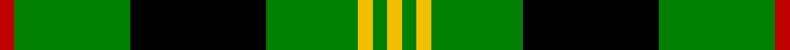

In pattern [RGKGYGY](/stripes/rgkgygy/).

This was sourced from weddslist.  It is a [7 stripe tartan](/stripes/stripes7/).

Original link http://www.weddslist.com/cgi-bin/tartans/pg.pl?source=sts

## Attestations

This cloth appears in 2 source records; the oldest owns this page.

- undated — Paton (weddslist, [record](http://www.weddslist.com/cgi-bin/tartans/pg.pl?source=sts))
- undated — Paton Family Tartan Tartan Number: 2127. Earliest known date: 1930 Discovered in 1993 at P and J Haggart, weavers in Aberfeldy. It was possibly designed by the late Mr John Robertson around the 1930's, but the sample appears to have been woven in 1952. The Paton family associated with the tartan come from Aberdeenshire. Apart from the red stripe this sett resembles the Gordon of Abergeldy previously known as Ancient Gordon. See products available Copyright © Blair Urquhart, Comrie, 2015 (house-of-tartan, [record](http://www.house-of-tartan.scotland.net/house/TartanViewjs.asp?colr=Def&tnam=2127))

## Thread count
R/6 G48 K56 G38 Y6 G6 Y/6

## Palette
Each colour and the base-6 reference it is a variant of.

| Colour | Shade | Base |
|---|---|---|
| G | <code style="background-color:#008000;">#008000</code> `oklch(52.0% 0.177 142.5)` <small>#008000</small> | G <code style="background-color:#006100;">#006100</code> |
| K | <code style="background-color:#000000;">#000000</code> `oklch(0.0% 0.000 0.0)` <small>#000000</small> | K <code style="background-color:#000000;">#000000</code> |
| R | <code style="background-color:#C00000;">#C00000</code> `oklch(50.7% 0.208 29.2)` <small>#C00000</small> | R <code style="background-color:#CC0000;">#CC0000</code> |
| Y | <code style="background-color:#F0C000;">#F0C000</code> `oklch(82.7% 0.169 90.5)` <small>#F0C000</small> | Y <code style="background-color:#F2BF00;">#F2BF00</code> |

# Sample pattern

## Nearest tartans

The nearest existing variants by ΔTartan distance.

1. [MacIver hunting](/setts/s9/w3g27k5g5k32g5k5g27ly3~x2/) — ΔT 0.77
1. [Hartmann](/setts/s8/k4g32k4g4k8w3k8b4~x2/) — ΔT 0.86
1. [Forbes](/setts/s6/r1g16k8g4k4ly1~x2/) — ΔT 1.04
1. [Robert Gordon University](/setts/s5/k7r3k24g28ly3~x2/) — ΔT 1.09
1. [Sin-Cos](/setts/s10/k60g64g5g8g5g64k60ly8k8ly8/) — ΔT 1.20
1. [Cleghorn (Personal)](/setts/s7/g8r3g30k8w3k36w8~x2/) — ΔT 1.34
1. [Innes](/setts/s6/g7k1g7t1k6t1~x2/) — ΔT 1.38
1. [MacIver Hunting](/setts/s9/w2g12k3g3k16g3k3g12ly2~x2/) — ΔT 1.40
1. [Moore Caledonian (Personal)](/setts/s6/r1k6g6ly1g6ly1~x6/) — ΔT 1.40
1. [Fife, Duchess of..](/setts/s6/g30k12g6k6db2k5~x2/) — ΔT 1.46

## Neighbour map

Every grey dot is one of 14299 variants placed by the first two principal components of the ΔTartan feature space (44% of its variance). Red is this tartan; blue dots are its nearest — click one to open its page.

<svg viewBox="0 0 640 380" role="img" style="max-width:100%;height:auto;border:1px solid #e0e0e0;border-radius:4px;display:block" xmlns="http://www.w3.org/2000/svg"><image href="/nn/cloud.v1.png" width="640" height="380"/><a href="/setts/s9/w3g27k5g5k32g5k5g27ly3~x2/"><circle cx="286.7" cy="184.6" r="4" fill="#3465a4"><title>MacIver hunting</title></circle></a><a href="/setts/s8/k4g32k4g4k8w3k8b4~x2/"><circle cx="270.6" cy="175.3" r="4" fill="#3465a4"><title>Hartmann</title></circle></a><a href="/setts/s6/r1g16k8g4k4ly1~x2/"><circle cx="318.7" cy="189.2" r="4" fill="#3465a4"><title>Forbes</title></circle></a><a href="/setts/s5/k7r3k24g28ly3~x2/"><circle cx="233.3" cy="214.7" r="4" fill="#3465a4"><title>Robert Gordon University</title></circle></a><a href="/setts/s10/k60g64g5g8g5g64k60ly8k8ly8/"><circle cx="238.8" cy="170.3" r="4" fill="#3465a4"><title>Sin-Cos</title></circle></a><a href="/setts/s7/g8r3g30k8w3k36w8~x2/"><circle cx="223.2" cy="184.7" r="4" fill="#3465a4"><title>Cleghorn (Personal)</title></circle></a><a href="/setts/s6/g7k1g7t1k6t1~x2/"><circle cx="298.4" cy="249.9" r="4" fill="#3465a4"><title>Innes</title></circle></a><a href="/setts/s9/w2g12k3g3k16g3k3g12ly2~x2/"><circle cx="273.8" cy="205.1" r="4" fill="#3465a4"><title>MacIver Hunting</title></circle></a><a href="/setts/s6/r1k6g6ly1g6ly1~x6/"><circle cx="262.6" cy="243.2" r="4" fill="#3465a4"><title>Moore Caledonian (Personal)</title></circle></a><a href="/setts/s6/g30k12g6k6db2k5~x2/"><circle cx="344.2" cy="210.9" r="4" fill="#3465a4"><title>Fife, Duchess of..</title></circle></a><circle cx="263.1" cy="198.7" r="5" fill="#c00000"/></svg>

ID: /setts/s7/r3g24k28g19ly3g3ly3~x2/
