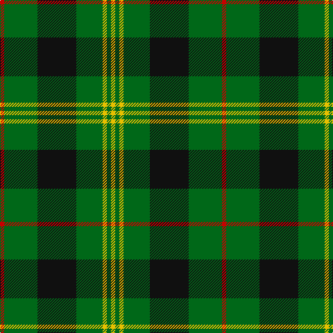

In pattern [RGKGYGY](/patterns/rgkgygy/).

This was sourced from house-of-tartan.  It is a [7 stripes tartan](/stripes/stripes7/).

Original link http://www.house-of-tartan.scotland.net/house/TartanViewjs.asp?colr=Def&tnam=2127

## Thread count
R/6 G48 K56 G38 Y6 G6 Y/6

## Palette
Each colour and its ΔE from the base-6 reference it is a variant of.

| Colour | Shade | Base | ΔE (OKLab) |
|---|---|---|---|
| G | <code style="background-color:#006818;">#006818</code> `#006818` | G <code style="background-color:#006100;">#006100</code> | 0.02 |
| K | <code style="background-color:#101010;">#101010</code> `#101010` | K <code style="background-color:#000000;">#000000</code> | 0.17 |
| R | <code style="background-color:#C80000;">#C80000</code> `#C80000` | R <code style="background-color:#CC0000;">#CC0000</code> | 0.01 |
| Y | <code style="background-color:#E8C000;">#E8C000</code> `#E8C000` | Y <code style="background-color:#F2BF00;">#F2BF00</code> | 0.02 |

# Sample pattern

## Nearest tartans

The nearest existing variants by ΔTartan distance.

1. [MacAulay of Lewis](/setts/s8/g6k16r3k16g28k4g12w3~g006818-k101010-rc80000-wf8f8f8~x2/) — ΔT 0.74
1. [Daks, Muted Loden](/setts/s8/r5g12ga4ra4ga27g3ga4r5~g30a010-ga003000-r806050-rac00000/) — ΔT 0.80
1. [Paton (Personal)](/setts/s7/r3g20k20g20y2g2y2~g006818-k101010-r880000-yd09800~x2/) — ΔT 0.85
1. [MacIver Hunting](/setts/s9/w2g12k3g3k16g3k3g12y2~g507830-k101010-we0e0e0-yd8b000~x2/) — ΔT 0.86
1. [Hartmann (Personal)](/setts/s8/b4k8w3k8g4k4g32k4~b2888c4-g006818-k101010-we0e0e0~x2/) — ΔT 0.86
1. [Lauder](/setts/s6/g3b8g3k4g15r2~b304080-g008000-k000000-rc00000~x2/) — ΔT 0.93
1. [MacArthur (Variant)](/setts/s6/r3g30k12g6k16y2~g006818-k101010-rc80000-ye8c000~x2/) — ΔT 0.98
1. [MacKintosh Hunting](/setts/s7/y2g12b6r3g12r4b1~b000064-g004c00-rc80000-yffff00~x2/) — ΔT 1.01
1. [Moore Caledonian (Personal)](/setts/s6/r1k6g6y1g6y1~g006818-k101010-rc8002c-yfccc00~x6/) — ΔT 1.04
1. [Keppoch](/setts/s7/k5g2k5g2b8g25w4~b2c2c80-g006818-k101010-wf8f8f8~x2/) — ΔT 1.11

## Neighbour map

Every grey dot is one of 15726 variants placed by the first two principal components of the ΔTartan feature space (44% of its variance). Red is this tartan; blue dots are its nearest — click one to open its page.

<svg viewBox="0 0 640 380" role="img" style="max-width:100%;height:auto;border:1px solid #e0e0e0;border-radius:4px;display:block" xmlns="http://www.w3.org/2000/svg"><image href="/nn/cloud.v1.png" width="640" height="380"/><a href="/setts/s8/g6k16r3k16g28k4g12w3~g006818-k101010-rc80000-wf8f8f8~x2/"><circle cx="277.3" cy="221.6" r="4" fill="#3465a4"><title>MacAulay of Lewis</title></circle></a><a href="/setts/s8/r5g12ga4ra4ga27g3ga4r5~g30a010-ga003000-r806050-rac00000/"><circle cx="289.9" cy="205.7" r="4" fill="#3465a4"><title>Daks, Muted Loden</title></circle></a><a href="/setts/s7/r3g20k20g20y2g2y2~g006818-k101010-r880000-yd09800~x2/"><circle cx="345.4" cy="220.2" r="4" fill="#3465a4"><title>Paton (Personal)</title></circle></a><a href="/setts/s9/w2g12k3g3k16g3k3g12y2~g507830-k101010-we0e0e0-yd8b000~x2/"><circle cx="271.2" cy="206.6" r="4" fill="#3465a4"><title>MacIver Hunting</title></circle></a><a href="/setts/s8/b4k8w3k8g4k4g32k4~b2888c4-g006818-k101010-we0e0e0~x2/"><circle cx="302.1" cy="190.1" r="4" fill="#3465a4"><title>Hartmann (Personal)</title></circle></a><a href="/setts/s6/g3b8g3k4g15r2~b304080-g008000-k000000-rc00000~x2/"><circle cx="285.5" cy="234.4" r="4" fill="#3465a4"><title>Lauder</title></circle></a><a href="/setts/s6/r3g30k12g6k16y2~g006818-k101010-rc80000-ye8c000~x2/"><circle cx="316.8" cy="213.2" r="4" fill="#3465a4"><title>MacArthur (Variant)</title></circle></a><a href="/setts/s7/y2g12b6r3g12r4b1~b000064-g004c00-rc80000-yffff00~x2/"><circle cx="300.1" cy="211.3" r="4" fill="#3465a4"><title>MacKintosh Hunting</title></circle></a><a href="/setts/s6/r1k6g6y1g6y1~g006818-k101010-rc8002c-yfccc00~x6/"><circle cx="260.0" cy="244.9" r="4" fill="#3465a4"><title>Moore Caledonian (Personal)</title></circle></a><a href="/setts/s7/k5g2k5g2b8g25w4~b2c2c80-g006818-k101010-wf8f8f8~x2/"><circle cx="294.3" cy="187.4" r="4" fill="#3465a4"><title>Keppoch</title></circle></a><circle cx="294.2" cy="213.2" r="5" fill="#c00000"/></svg>

ID: /setts/s7/r3g24k28g19y3g3y3~g006818-k101010-rc80000-ye8c000~x2/
