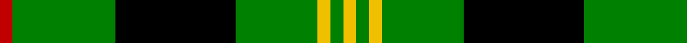
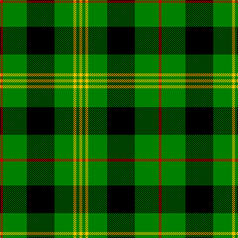

In pattern [RGKGYGY](/patterns/rgkgygy/).

This was sourced from weddslist.  It is a [7 stripes tartan](/stripes/stripes7/).

Original link http://www.weddslist.com/cgi-bin/tartans/pg.pl?source=sts

## Thread count
R/6 G48 K56 G38 Y6 G6 Y/6

## Palette
Each colour and its ΔE from the base-6 reference it is a variant of.

| Colour | Shade | Base | ΔE (OKLab) |
|---|---|---|---|
| G | <code style="background-color:#008000;">#008000</code> `#008000` | G <code style="background-color:#006100;">#006100</code> | 0.10 |
| K | <code style="background-color:#000000;">#000000</code> `#000000` | K <code style="background-color:#000000;">#000000</code> | 0.00 |
| R | <code style="background-color:#C00000;">#C00000</code> `#C00000` | R <code style="background-color:#CC0000;">#CC0000</code> | 0.03 |
| Y | <code style="background-color:#F0C000;">#F0C000</code> `#F0C000` | Y <code style="background-color:#F2BF00;">#F2BF00</code> | 0.00 |

# Sample pattern

## Nearest tartans

The nearest existing variants by ΔTartan distance.

1. [MacIver hunting](/setts/s9/w3g27k5g5k32g5k5g27y3~g008000-k000000-we0e0e0-yf0c000~x2/) — ΔT 0.77
1. [Hartmann](/setts/s8/b4k8w3k8g4k4g32k4~b8080d0-g008000-k000000-we0e0e0~x2/) — ΔT 0.86
1. [MacArthur, ?](/setts/s6/r3g30k12g6k16y2~g008000-k000000-rc00000-yf0c000~x2/) — ΔT 0.97
1. [Forbes](/setts/s6/r1g16k8g4k4y1~g008000-k000000-rc00000-yf0c000~x2/) — ΔT 1.04
1. [Robert Gordon University](/setts/s5/k7r3k24g28y3~g30a010-k000000-rc00000-yf0c000~x2/) — ΔT 1.09
1. [Sin-Cos](/setts/s10/k60g64ga5g8ga5g64k60y8k8y8~g228b22-ga006400-k000000-yffd700/) — ΔT 1.21
1. [Paton Family Tartan Tartan Number: 2127. Earliest known date: 1930 Discovered in 1993 at P and J Haggart, weavers in Aberfeldy. It was possibly designed by the late Mr John Robertson around the 1930's, but the sample appears to have been woven in 1952. The Paton family associated with the tartan come from Aberdeenshire. Apart from the red stripe this sett resembles the Gordon of Abergeldy previously known as Ancient Gordon. See products available Copyright © Blair Urquhart, Comrie, 2015](/setts/s7/r3g24k28g19y3g3y3~g006818-k101010-rc80000-ye8c000~x2/) — ΔT 1.23
1. [Fitzpatrick](/setts/s9/g5y1g3y2g8k8b1k8g1~b304080-g008000-k000000-yf0c000~x4/) — ΔT 1.23
1. [Cleghorn (Personal)](/setts/s7/g8r3g30k8w3k36w8~g007800-k000000-r8c0000-wf0f0f0~x2/) — ΔT 1.35
1. [Innes](/setts/s6/g7k1g7b1k6b1~b5480b0-g008000-k000000~x2/) — ΔT 1.37

## Neighbour map

Every grey dot is one of 15726 variants placed by the first two principal components of the ΔTartan feature space (44% of its variance). Red is this tartan; blue dots are its nearest — click one to open its page.

<svg viewBox="0 0 640 380" role="img" style="max-width:100%;height:auto;border:1px solid #e0e0e0;border-radius:4px;display:block" xmlns="http://www.w3.org/2000/svg"><image href="/nn/cloud.v1.png" width="640" height="380"/><a href="/setts/s9/w3g27k5g5k32g5k5g27y3~g008000-k000000-we0e0e0-yf0c000~x2/"><circle cx="283.3" cy="188.0" r="4" fill="#3465a4"><title>MacIver hunting</title></circle></a><a href="/setts/s8/b4k8w3k8g4k4g32k4~b8080d0-g008000-k000000-we0e0e0~x2/"><circle cx="266.9" cy="178.3" r="4" fill="#3465a4"><title>Hartmann</title></circle></a><a href="/setts/s6/r3g30k12g6k16y2~g008000-k000000-rc00000-yf0c000~x2/"><circle cx="274.3" cy="199.8" r="4" fill="#3465a4"><title>MacArthur, ?</title></circle></a><a href="/setts/s6/r1g16k8g4k4y1~g008000-k000000-rc00000-yf0c000~x2/"><circle cx="315.5" cy="193.1" r="4" fill="#3465a4"><title>Forbes</title></circle></a><a href="/setts/s5/k7r3k24g28y3~g30a010-k000000-rc00000-yf0c000~x2/"><circle cx="229.9" cy="219.0" r="4" fill="#3465a4"><title>Robert Gordon University</title></circle></a><a href="/setts/s10/k60g64ga5g8ga5g64k60y8k8y8~g228b22-ga006400-k000000-yffd700/"><circle cx="235.1" cy="172.9" r="4" fill="#3465a4"><title>Sin-Cos</title></circle></a><a href="/setts/s7/r3g24k28g19y3g3y3~g006818-k101010-rc80000-ye8c000~x2/"><circle cx="294.2" cy="213.2" r="4" fill="#3465a4"><title>Paton Family Tartan Tartan Number: 2127. Earliest known date: 1930 Discovered in 1993 at P and J Haggart, weavers in Aberfeldy. It was possibly designed by the late Mr John Robertson around the 1930's, but the sample appears to have been woven in 1952. The Paton family associated with the tartan come from Aberdeenshire. Apart from the red stripe this sett resembles the Gordon of Abergeldy previously known as Ancient Gordon. See products available Copyright © Blair Urquhart, Comrie, 2015</title></circle></a><a href="/setts/s9/g5y1g3y2g8k8b1k8g1~b304080-g008000-k000000-yf0c000~x4/"><circle cx="197.2" cy="210.8" r="4" fill="#3465a4"><title>Fitzpatrick</title></circle></a><a href="/setts/s7/g8r3g30k8w3k36w8~g007800-k000000-r8c0000-wf0f0f0~x2/"><circle cx="219.5" cy="187.9" r="4" fill="#3465a4"><title>Cleghorn (Personal)</title></circle></a><a href="/setts/s6/g7k1g7b1k6b1~b5480b0-g008000-k000000~x2/"><circle cx="295.1" cy="254.0" r="4" fill="#3465a4"><title>Innes</title></circle></a><circle cx="259.9" cy="202.4" r="5" fill="#c00000"/></svg>

ID: /setts/s7/r3g24k28g19y3g3y3~g008000-k000000-rc00000-yf0c000~x2/
