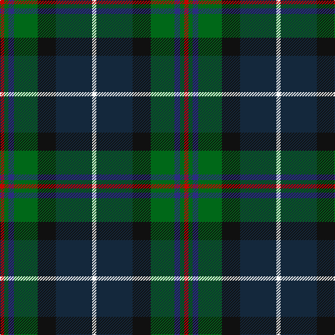

This page is one **sett** — a single exact thread-count. It belongs to the [tartan](/tartans/r3g3db4g17k13dn26w3/)
(the same proportion at any scale), whose colour order is pattern [RGBGKBW](/stripes/rgbgkbw/).

Sourced from tartans-authority.  It is a [7 stripe tartan](/stripes/stripes7/).

Original link http://www.tartansauthority.com/tartan-ferret/display/5403/

## Also known as

This cloth is also recorded under:

- Royal Burgh of Peebles

2 attestations — the source records this cloth was collapsed from (oldest owns this page)

<ul>
<li>1999 — Royal Burgh of Peebles (District) (tartans-authority, <a href="http://www.tartansauthority.com/tartan-ferret/display/5403/">record</a>)</li>
<li>01/01/2000 — Peebles Beltane Centenary (register-of-tartans, <a href="https://www.tartanregister.gov.uk/tartanDetails.aspx?ref=3311">record</a>)</li>
</ul>

## Register references

External register numbers recorded for this tartan.

- Scottish Register of Tartans: [3311](https://www.tartanregister.gov.uk/tartanDetails.aspx?ref=3311)
- Scottish Tartans Authority (ITI): 5403
- Scottish Tartans World Register: 2963

## Thread count
R/6 G6 DB8 G34 K26 DN52 W/6

## Palette
Each colour and the base-6 reference it is a variant of.

| Colour | Shade | Base |
|---|---|---|
| DB | <code style="background-color:#2C2C80;">#2C2C80</code> `oklch(35.0% 0.138 276.6)` <small>#2C2C80</small> | B <code style="background-color:#2A418A;">#2A418A</code> |
| DN | <code style="background-color:#14283C;">#14283C</code> `oklch(27.1% 0.046 249.9)` <small>#14283C</small> | B <code style="background-color:#2A418A;">#2A418A</code> |
| G | <code style="background-color:#006818;">#006818</code> `oklch(45.0% 0.142 145.0)` <small>#006818</small> | G <code style="background-color:#006100;">#006100</code> |
| K | <code style="background-color:#101010;">#101010</code> `oklch(17.3% 0.000 89.9)` <small>#101010</small> | K <code style="background-color:#000000;">#000000</code> |
| R | <code style="background-color:#C80000;">#C80000</code> `oklch(52.3% 0.215 29.2)` <small>#C80000</small> | R <code style="background-color:#CC0000;">#CC0000</code> |
| W | <code style="background-color:#F8F8F8;">#F8F8F8</code> `oklch(97.9% 0.000 89.9)` <small>#F8F8F8</small> | W <code style="background-color:#F7F7F7;">#F7F7F7</code> |

# Sample pattern

## Nearest tartans

The nearest existing variants by ΔTartan distance, with this tartan at the top so the swatches line up against it.

ΔTartan

Tartan

Sett

—

<a href="/ttd/edit/#slug=r3g3db4g17k13dt26w3~x2">Royal Burgh of Peebles (District)</a> <a class="nn-out" href="/setts/s7/r3g3db4g17k13dt26w3~x2/" title="open its dictionary page">↗</a>

0.67

<a href="/ttd/edit/#slug=db3r2db18k6dg18ly2g3~x2">McComb</a> <a class="nn-out" href="/setts/s7/db3r2db18k6dg18ly2g3~x2/" title="open its dictionary page">↗</a>

0.70

<a href="/ttd/edit/#slug=r2k6ly1dg12ly1db6lr2~x4">James (Personal)</a> <a class="nn-out" href="/setts/s7/r2k6ly1dg12ly1db6lr2~x4/" title="open its dictionary page">↗</a>

0.79

<a href="/ttd/edit/#slug=db3r2db18k6g18ly2g3~x2">McComb (Personal)</a> <a class="nn-out" href="/setts/s7/db3r2db18k6g18ly2g3~x2/" title="open its dictionary page">↗</a>

0.81

<a href="/ttd/edit/#slug=g16lb3g3k10db12r2k3~x2">MacLean, Donald Personal Tartan Tartan Number: 3440. Earliest known date: pre 2002 From Pendleton Woolen Mills of Oregon, owners of the only copy of Clans Originaux. EBW 8.11.02. This is the same as MacTaggart #408 and #409!!! See products available Copyright © Blair Urquhart, Comrie, 2015</a> <a class="nn-out" href="/setts/s7/g16lb3g3k10db12r2k3~x2/" title="open its dictionary page">↗</a>

0.88

<a href="/ttd/edit/#slug=r3g2db27k19g27dp2ly3~x2">Christian Hunting (Personal)</a> <a class="nn-out" href="/setts/s7/r3g2db27k19g27dp2ly3~x2/" title="open its dictionary page">↗</a>

0.92

<a href="/ttd/edit/#slug=k29r3dt24n6k8w4n8o6~x2">Yates (Personal)</a> <a class="nn-out" href="/setts/s8/k29r3dt24n6k8w4n8o6~x2/" title="open its dictionary page">↗</a>

0.93

<a href="/ttd/edit/#slug=r3dg20k2n11k2db20lr2~x2">Grandfather Mountain Games (District</a> <a class="nn-out" href="/setts/s7/r3dg20k2n11k2db20lr2~x2/" title="open its dictionary page">↗</a>

0.95

<a href="/ttd/edit/#slug=r3g2r3g18k14w2db16g3~x2">Mantle (Personal)</a> <a class="nn-out" href="/setts/s8/r3g2r3g18k14w2db16g3~x2/" title="open its dictionary page">↗</a>

0.95

<a href="/ttd/edit/#slug=r2k8ly1k8g13db13lo1r2~x2">Sey (Name)</a> <a class="nn-out" href="/setts/s8/r2k8ly1k8g13db13lo1r2~x2/" title="open its dictionary page">↗</a>

0.98

<a href="/ttd/edit/#slug=r3m3dt16k2dt2g16r3g2w2~x2">Chinzei Keiai School</a> <a class="nn-out" href="/setts/s9/r3m3dt16k2dt2g16r3g2w2~x2/" title="open its dictionary page">↗</a>

## Neighbour map

Every grey dot is one of 14299 variants placed by the first two principal components of the ΔTartan feature space (44% of its variance). Red is this tartan; blue dots are its nearest — click one to open its page.

<svg viewBox="0 0 640 380" role="img" style="max-width:100%;height:auto;border:1px solid #e0e0e0;border-radius:4px;display:block" xmlns="http://www.w3.org/2000/svg"><image href="/nn/cloud.v1.png" width="640" height="380"/><a href="/setts/s7/db3r2db18k6dg18ly2g3~x2/"><circle cx="177.3" cy="181.7" r="4" fill="#3465a4"><title>McComb</title></circle></a><a href="/setts/s7/r2k6ly1dg12ly1db6lr2~x4/"><circle cx="163.5" cy="169.8" r="4" fill="#3465a4"><title>James (Personal)</title></circle></a><a href="/setts/s7/db3r2db18k6g18ly2g3~x2/"><circle cx="185.0" cy="184.3" r="4" fill="#3465a4"><title>McComb (Personal)</title></circle></a><a href="/setts/s7/g16lb3g3k10db12r2k3~x2/"><circle cx="129.8" cy="196.3" r="4" fill="#3465a4"><title>MacLean, Donald Personal Tartan Tartan Number: 3440. Earliest known date: pre 2002 From Pendleton Woolen Mills of Oregon, owners of the only copy of Clans Originaux. EBW 8.11.02. This is the same as MacTaggart #408 and #409!!! See products available Copyright © Blair Urquhart, Comrie, 2015</title></circle></a><a href="/setts/s7/r3g2db27k19g27dp2ly3~x2/"><circle cx="175.0" cy="166.8" r="4" fill="#3465a4"><title>Christian Hunting (Personal)</title></circle></a><a href="/setts/s8/k29r3dt24n6k8w4n8o6~x2/"><circle cx="174.7" cy="178.6" r="4" fill="#3465a4"><title>Yates (Personal)</title></circle></a><a href="/setts/s7/r3dg20k2n11k2db20lr2~x2/"><circle cx="155.2" cy="183.6" r="4" fill="#3465a4"><title>Grandfather Mountain Games (District</title></circle></a><a href="/setts/s8/r3g2r3g18k14w2db16g3~x2/"><circle cx="174.6" cy="195.8" r="4" fill="#3465a4"><title>Mantle (Personal)</title></circle></a><a href="/setts/s8/r2k8ly1k8g13db13lo1r2~x2/"><circle cx="148.0" cy="169.1" r="4" fill="#3465a4"><title>Sey (Name)</title></circle></a><a href="/setts/s9/r3m3dt16k2dt2g16r3g2w2~x2/"><circle cx="169.9" cy="166.5" r="4" fill="#3465a4"><title>Chinzei Keiai School</title></circle></a><circle cx="155.6" cy="190.3" r="5" fill="#c00000"/></svg>

ID: /setts/s7/r3g3db4g17k13dt26w3~x2/
