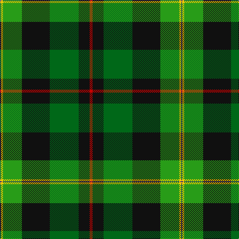

**Bands:** [BYGKGKR](/stripes/bygkgkr/) · **Stripes:** [DB LY G K G K R](/stripes/stripes7/) DB LY G K G K R

This was sourced from tartans-authority.  It is a [7 band tartan](/bands/bands7/).

Original link http://www.tartansauthority.com/tartan-ferret/display/11051/

## Thread count
DB/2 Y4 G38 K56 Ga58 K22 R/6

## Palette
Each colour and its ΔE from the base-6 reference it is a variant of.

| Colour | Shade | Base | ΔE (OKLab) |
|---|---|---|---|
| DB | <code style="background-color:#2C2C80;">#2C2C80</code> `#2C2C80` | B <code style="background-color:#2A418A;">#2A418A</code> | 0.06 |
| G | <code style="background-color:#289C18;">#289C18</code> `#289C18` | G <code style="background-color:#006100;">#006100</code> | 0.19 |
| Ga | <code style="background-color:#006818;">#006818</code> `#006818` | G <code style="background-color:#006100;">#006100</code> | 0.02 |
| K | <code style="background-color:#101010;">#101010</code> `#101010` | K <code style="background-color:#000000;">#000000</code> | 0.17 |
| R | <code style="background-color:#C80000;">#C80000</code> `#C80000` | R <code style="background-color:#CC0000;">#CC0000</code> | 0.01 |
| Y | <code style="background-color:#FCCC00;">#FCCC00</code> `#FCCC00` | Y <code style="background-color:#F2BF00;">#F2BF00</code> | 0.04 |

# Sample pattern

## Nearest tartans

The nearest existing variants by ΔTartan distance.

1. [PMMC](/setts/s7/r3k11dg29k28g19ly2b1~x2/) — ΔT 0.30
1. [Cates Hunting (Clan)](/setts/s9/dg23r7g25ly5dg17k5ly1w1r1~x2/) — ΔT 1.09
1. [Cates Hunting](/setts/s9/dg23r7dg25ly5dg17k5ly1w1r1~x2/) — ΔT 1.14
1. [Tooth](/setts/s8/g5ly1r2g25k14db19w4g2~x2/) — ΔT 1.14
1. [McGeachie (Personal)](/setts/s8/ly1k6g32k12r12b9k6w1~x2/) — ΔT 1.17
1. [Hughes](/setts/s7/g20dg14db9ly2db9k1w2~x4/) — ΔT 1.23
1. [Leinster Ancestry](/setts/s9/k4dg33k18lo10g19lo3dg15k1ly3~x2/) — ΔT 1.29
1. [Chiti, Cristiano (Personal)](/setts/s6/dg20dg11lb6r2dp3lb1~x2/) — ΔT 1.32
1. [Lawson, William](/setts/s8/lo3dg22dg13k15w3k16dg1r3~x2/) — ΔT 1.33
1. [Colquhoun](/setts/s7/db4k2db16w1k8g24r4~x2/) — ΔT 1.39

## Neighbour map

Every grey dot is one of 14313 variants placed by the first two principal components of the ΔTartan feature space (44% of its variance). Red is this tartan; blue dots are its nearest — click one to open its page.

<svg viewBox="0 0 640 380" role="img" style="max-width:100%;height:auto;border:1px solid #e0e0e0;border-radius:4px;display:block" xmlns="http://www.w3.org/2000/svg"><image href="/nn/cloud.v1.png" width="640" height="380"/><a href="/setts/s7/r3k11dg29k28g19ly2b1~x2/"><circle cx="212.7" cy="141.8" r="4" fill="#3465a4"><title>PMMC</title></circle></a><a href="/setts/s9/dg23r7g25ly5dg17k5ly1w1r1~x2/"><circle cx="248.7" cy="134.3" r="4" fill="#3465a4"><title>Cates Hunting (Clan)</title></circle></a><a href="/setts/s9/dg23r7dg25ly5dg17k5ly1w1r1~x2/"><circle cx="247.1" cy="133.6" r="4" fill="#3465a4"><title>Cates Hunting</title></circle></a><a href="/setts/s8/g5ly1r2g25k14db19w4g2~x2/"><circle cx="194.3" cy="120.7" r="4" fill="#3465a4"><title>Tooth</title></circle></a><a href="/setts/s8/ly1k6g32k12r12b9k6w1~x2/"><circle cx="212.2" cy="119.7" r="4" fill="#3465a4"><title>McGeachie (Personal)</title></circle></a><a href="/setts/s7/g20dg14db9ly2db9k1w2~x4/"><circle cx="167.0" cy="160.0" r="4" fill="#3465a4"><title>Hughes</title></circle></a><a href="/setts/s9/k4dg33k18lo10g19lo3dg15k1ly3~x2/"><circle cx="248.3" cy="146.7" r="4" fill="#3465a4"><title>Leinster Ancestry</title></circle></a><a href="/setts/s6/dg20dg11lb6r2dp3lb1~x2/"><circle cx="245.1" cy="169.8" r="4" fill="#3465a4"><title>Chiti, Cristiano (Personal)</title></circle></a><a href="/setts/s8/lo3dg22dg13k15w3k16dg1r3~x2/"><circle cx="204.5" cy="162.0" r="4" fill="#3465a4"><title>Lawson, William</title></circle></a><a href="/setts/s7/db4k2db16w1k8g24r4~x2/"><circle cx="212.9" cy="148.7" r="4" fill="#3465a4"><title>Colquhoun</title></circle></a><circle cx="212.4" cy="141.8" r="5" fill="#c00000"/></svg>

ID: /setts/s7/r3k11g29k28g19ly2db1~x2/
