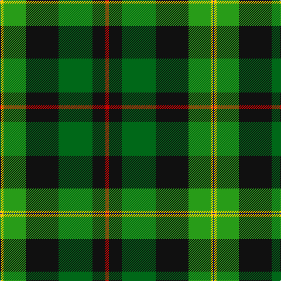

In pattern [BYGKGKR](/patterns/bygkgkr/).

This was sourced from tartans-authority.  It is a [7 stripes tartan](/stripes/stripes7/).

Original link http://www.tartansauthority.com/tartan-ferret/display/11051/

## Thread count
DB/2 Y4 G38 K56 Ga58 K22 R/6

## Palette
Each colour and its ΔE from the base-6 reference it is a variant of.

| Colour | Shade | Base | ΔE (OKLab) |
|---|---|---|---|
| DB | <code style="background-color:#2C2C80;">#2C2C80</code> `#2C2C80` | B <code style="background-color:#2A418A;">#2A418A</code> | 0.06 |
| G | <code style="background-color:#289C18;">#289C18</code> `#289C18` | G <code style="background-color:#006100;">#006100</code> | 0.19 |
| Ga | <code style="background-color:#006818;">#006818</code> `#006818` | G <code style="background-color:#006100;">#006100</code> | 0.02 |
| K | <code style="background-color:#101010;">#101010</code> `#101010` | K <code style="background-color:#000000;">#000000</code> | 0.17 |
| R | <code style="background-color:#C80000;">#C80000</code> `#C80000` | R <code style="background-color:#CC0000;">#CC0000</code> | 0.01 |
| Y | <code style="background-color:#FCCC00;">#FCCC00</code> `#FCCC00` | Y <code style="background-color:#F2BF00;">#F2BF00</code> | 0.04 |

# Sample pattern

## Nearest tartans

The nearest existing variants by ΔTartan distance.

1. [PMMC](/setts/s7/r3k11g29k28ga19y2b1~b0000ff-g005020-ga289c18-k101010-rff0000-yffe600~x2/) — ΔT 0.30
1. [Cates Hunting (Clan)](/setts/s9/g23r7ga25y5g17k5y1w1r1~g003820-ga006818-k101010-rc80000-wf8f8f8-ye8c000~x2/) — ΔT 1.09
1. [Cates Hunting](/setts/s9/g23r7ga25y5g17k5y1w1r1~g002814-ga005020-k101010-rdc0000-we0e0e0-ye8c000~x2/) — ΔT 1.14
1. [Tooth](/setts/s8/g5y1r2g25k14b19w4g2~b304080-g008000-k000000-rc00000-we0e0e0-yf0c000~x2/) — ΔT 1.15
1. [McGeachie (Personal)](/setts/s8/w1k6b9r12k12g32k6y1~b3850c8-g006818-k101010-rc80000-we0e0e0-ye8c000~x2/) — ΔT 1.16
1. [Hughes](/setts/s7/g20ga14b9y2b9k1w2~b304080-g008000-ga003000-k000000-we0e0e0-yf0c000~x4/) — ΔT 1.23
1. [Tooth Family Tartan Tartan Number: 922. Earliest known date: 1980 STS collection. See products available Copyright © Blair Urquhart, Comrie, 2015](/setts/s8/g5y1r2g25k14b19w4g2~b2c2c80-g006818-k101010-rc80000-we0e0e0-ye8c000~x2/) — ΔT 1.25
1. [Leinster Ancestry](/setts/s9/k4g33k18y10ga19y3g15k1ya3~g1f5123-ga338513-k101010-yc4950c-yaf5c70d~x2/) — ΔT 1.29
1. [Chiti, Cristiano (Personal)](/setts/s6/g20ga11w6r2b3w1~b780078-g004c00-ga002814-r880000-wc0c0c0~x2/) — ΔT 1.32
1. [Lawson, William](/setts/s8/r3g1k16w3k15ga13g22y3~g005020-ga003c14-k101010-rdc0000-we0e0e0-yc89600~x2/) — ΔT 1.33

## Neighbour map

Every grey dot is one of 15726 variants placed by the first two principal components of the ΔTartan feature space (44% of its variance). Red is this tartan; blue dots are its nearest — click one to open its page.

<svg viewBox="0 0 640 380" role="img" style="max-width:100%;height:auto;border:1px solid #e0e0e0;border-radius:4px;display:block" xmlns="http://www.w3.org/2000/svg"><image href="/nn/cloud.v1.png" width="640" height="380"/><a href="/setts/s7/r3k11g29k28ga19y2b1~b0000ff-g005020-ga289c18-k101010-rff0000-yffe600~x2/"><circle cx="209.6" cy="139.0" r="4" fill="#3465a4"><title>PMMC</title></circle></a><a href="/setts/s9/g23r7ga25y5g17k5y1w1r1~g003820-ga006818-k101010-rc80000-wf8f8f8-ye8c000~x2/"><circle cx="246.0" cy="129.8" r="4" fill="#3465a4"><title>Cates Hunting (Clan)</title></circle></a><a href="/setts/s9/g23r7ga25y5g17k5y1w1r1~g002814-ga005020-k101010-rdc0000-we0e0e0-ye8c000~x2/"><circle cx="244.5" cy="129.5" r="4" fill="#3465a4"><title>Cates Hunting</title></circle></a><a href="/setts/s8/g5y1r2g25k14b19w4g2~b304080-g008000-k000000-rc00000-we0e0e0-yf0c000~x2/"><circle cx="190.7" cy="120.0" r="4" fill="#3465a4"><title>Tooth</title></circle></a><a href="/setts/s8/w1k6b9r12k12g32k6y1~b3850c8-g006818-k101010-rc80000-we0e0e0-ye8c000~x2/"><circle cx="209.3" cy="117.1" r="4" fill="#3465a4"><title>McGeachie (Personal)</title></circle></a><a href="/setts/s7/g20ga14b9y2b9k1w2~b304080-g008000-ga003000-k000000-we0e0e0-yf0c000~x4/"><circle cx="163.5" cy="155.3" r="4" fill="#3465a4"><title>Hughes</title></circle></a><a href="/setts/s8/g5y1r2g25k14b19w4g2~b2c2c80-g006818-k101010-rc80000-we0e0e0-ye8c000~x2/"><circle cx="217.1" cy="129.3" r="4" fill="#3465a4"><title>Tooth Family Tartan Tartan Number: 922. Earliest known date: 1980 STS collection. See products available Copyright © Blair Urquhart, Comrie, 2015</title></circle></a><a href="/setts/s9/k4g33k18y10ga19y3g15k1ya3~g1f5123-ga338513-k101010-yc4950c-yaf5c70d~x2/"><circle cx="245.6" cy="142.6" r="4" fill="#3465a4"><title>Leinster Ancestry</title></circle></a><a href="/setts/s6/g20ga11w6r2b3w1~b780078-g004c00-ga002814-r880000-wc0c0c0~x2/"><circle cx="242.2" cy="167.7" r="4" fill="#3465a4"><title>Chiti, Cristiano (Personal)</title></circle></a><a href="/setts/s8/r3g1k16w3k15ga13g22y3~g005020-ga003c14-k101010-rdc0000-we0e0e0-yc89600~x2/"><circle cx="201.7" cy="156.4" r="4" fill="#3465a4"><title>Lawson, William</title></circle></a><circle cx="209.2" cy="139.0" r="5" fill="#c00000"/></svg>

ID: /setts/s7/r3k11g29k28ga19y2b1~b2c2c80-g006818-ga289c18-k101010-rc80000-yfccc00~x2/
