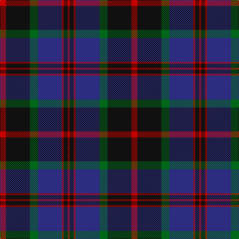

In pattern [RKGBRKR](/patterns/rkgbrkr/).

This was sourced from register-of-tartans.  It is a [7 stripes tartan](/stripes/stripes7/).

Original link https://www.tartanregister.gov.uk/tartanDetails.aspx?ref=3649

## Attestations

This cloth appears in 2 source records; the oldest owns this page.

- 01/02/2006 — Sandberg (register-of-tartans, [record](https://www.tartanregister.gov.uk/tartanDetails.aspx?ref=3649))
- 2006 February — Sandberg (Name) (tartans-authority, [record](http://www.tartansauthority.com/tartan-ferret/display/6860/))

## Thread count
R/12 K48 G16 DB48 R4 K8 R/4

## Palette
Each colour and its ΔE from the base-6 reference it is a variant of.

| Colour | Shade | Base | ΔE (OKLab) |
|---|---|---|---|
| DB | <code style="background-color:#2C2C80;">#2C2C80</code> `#2C2C80` | B <code style="background-color:#2A418A;">#2A418A</code> | 0.06 |
| G | <code style="background-color:#006818;">#006818</code> `#006818` | G <code style="background-color:#006100;">#006100</code> | 0.02 |
| K | <code style="background-color:#101010;">#101010</code> `#101010` | K <code style="background-color:#000000;">#000000</code> | 0.17 |
| R | <code style="background-color:#C80000;">#C80000</code> `#C80000` | R <code style="background-color:#CC0000;">#CC0000</code> | 0.01 |

# Sample pattern

## Nearest tartans

The nearest existing variants by ΔTartan distance.

1. [Hakkarain Personal Finnish Tartan Tartan Number: 6110. Earliest known date: 2003 A personal tartan designed by Jari Hakkarainen of Porvoo in Finland. See products available Copyright © Blair Urquhart, Comrie, 2015](/setts/s6/b37r18k37ra2k2ra2~b202060-k101010-r888888-rac80000~x2/) — ΔT 0.85
1. [Unidentified #61](/setts/s8/b3ba1g5b3r9b1r1b2~b000064-ba00008c-g007800-r8c0000~x4/) — ΔT 0.88
1. [Forbes #5](/setts/s9/b28k3b6k3b6k20g28k3w6~b2c4084-g503c14-k101010-we0e0e0~x2/) — ΔT 0.88
1. [Wilson's No.100](/setts/s6/g3b17k18y2g17k3~b5a008c-g005020-k101010-ye8c000~x2/) — ΔT 0.97
1. [Bootneck 350](/setts/s8/k6r4k19g4b25r5g3y2~b202060-g285800-k101010-rc80000-ye8c000~x2/) — ΔT 0.98
1. [Swallow Hotels (Corporate)](/setts/s9/k4g21k10r2k10b21k4b4k4~b2c2c80-g408060-k101010-rc80000~x2/) — ΔT 0.99
1. [Black Watch (Coarse Kilt)](/setts/s7/r4k4b24k24g24k2r3~b202060-g006818-k101010-rc80000~x2/) — ΔT 1.01
1. [National Galleries of Scotland](/setts/s7/k7g22k22b6r2b15r2~b1c0070-g006818-k101010-rc80000~x2/) — ΔT 1.01
1. [Gammell (1978) (Personal)](/setts/s7/b3r2b22k11g22r2g3~b1c0070-g006818-k101010-rc80000~x2/) — ΔT 1.01
1. [Caledonian Hotel (Corporate)](/setts/s8/b9ba1b1ba1b1ba7k7r2~b5c5c5c-ba1c0070-k101010-r880000~x4/) — ΔT 1.09

## Neighbour map

Every grey dot is one of 15726 variants placed by the first two principal components of the ΔTartan feature space (44% of its variance). Red is this tartan; blue dots are its nearest — click one to open its page.

<svg viewBox="0 0 640 380" role="img" style="max-width:100%;height:auto;border:1px solid #e0e0e0;border-radius:4px;display:block" xmlns="http://www.w3.org/2000/svg"><image href="/nn/cloud.v1.png" width="640" height="380"/><a href="/setts/s6/b37r18k37ra2k2ra2~b202060-k101010-r888888-rac80000~x2/"><circle cx="270.0" cy="192.3" r="4" fill="#3465a4"><title>Hakkarain Personal Finnish Tartan Tartan Number: 6110. Earliest known date: 2003 A personal tartan designed by Jari Hakkarainen of Porvoo in Finland. See products available Copyright © Blair Urquhart, Comrie, 2015</title></circle></a><a href="/setts/s8/b3ba1g5b3r9b1r1b2~b000064-ba00008c-g007800-r8c0000~x4/"><circle cx="215.3" cy="206.5" r="4" fill="#3465a4"><title>Unidentified #61</title></circle></a><a href="/setts/s9/b28k3b6k3b6k20g28k3w6~b2c4084-g503c14-k101010-we0e0e0~x2/"><circle cx="216.0" cy="202.9" r="4" fill="#3465a4"><title>Forbes #5</title></circle></a><a href="/setts/s6/g3b17k18y2g17k3~b5a008c-g005020-k101010-ye8c000~x2/"><circle cx="201.3" cy="235.5" r="4" fill="#3465a4"><title>Wilson's No.100</title></circle></a><a href="/setts/s8/k6r4k19g4b25r5g3y2~b202060-g285800-k101010-rc80000-ye8c000~x2/"><circle cx="209.4" cy="176.2" r="4" fill="#3465a4"><title>Bootneck 350</title></circle></a><a href="/setts/s9/k4g21k10r2k10b21k4b4k4~b2c2c80-g408060-k101010-rc80000~x2/"><circle cx="221.6" cy="209.5" r="4" fill="#3465a4"><title>Swallow Hotels (Corporate)</title></circle></a><a href="/setts/s7/r4k4b24k24g24k2r3~b202060-g006818-k101010-rc80000~x2/"><circle cx="217.4" cy="212.7" r="4" fill="#3465a4"><title>Black Watch (Coarse Kilt)</title></circle></a><a href="/setts/s7/k7g22k22b6r2b15r2~b1c0070-g006818-k101010-rc80000~x2/"><circle cx="215.2" cy="224.7" r="4" fill="#3465a4"><title>National Galleries of Scotland</title></circle></a><a href="/setts/s7/b3r2b22k11g22r2g3~b1c0070-g006818-k101010-rc80000~x2/"><circle cx="228.1" cy="206.8" r="4" fill="#3465a4"><title>Gammell (1978) (Personal)</title></circle></a><a href="/setts/s8/b9ba1b1ba1b1ba7k7r2~b5c5c5c-ba1c0070-k101010-r880000~x4/"><circle cx="237.1" cy="218.0" r="4" fill="#3465a4"><title>Caledonian Hotel (Corporate)</title></circle></a><circle cx="241.0" cy="202.8" r="5" fill="#c00000"/></svg>

ID: /setts/s7/r3k12g4b12r1k2r1~b2c2c80-g006818-k101010-rc80000~x4/
