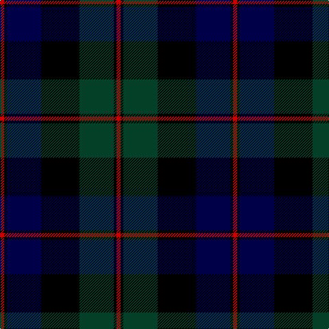

In pattern [RKBKGKR](/patterns/rkbkgkr/).

This was sourced from register-of-tartans.  It is a [7 stripes tartan](/stripes/stripes7/).

Original link https://www.tartanregister.gov.uk/tartanDetails.aspx?ref=694

## Thread count
R/6 K4 DB50 K56 DG50 K4 R/6

## Palette
Each colour and its ΔE from the base-6 reference it is a variant of.

| Colour | Shade | Base | ΔE (OKLab) |
|---|---|---|---|
| DB | <code style="background-color:#000048;">#000048</code> `#000048` | B <code style="background-color:#2A418A;">#2A418A</code> | 0.22 |
| DG | <code style="background-color:#044028;">#044028</code> `#044028` | G <code style="background-color:#006100;">#006100</code> | 0.13 |
| K | <code style="background-color:#000000;">#000000</code> `#000000` | K <code style="background-color:#000000;">#000000</code> | 0.00 |
| R | <code style="background-color:#C80000;">#C80000</code> `#C80000` | R <code style="background-color:#CC0000;">#CC0000</code> | 0.01 |

# Sample pattern

## Nearest tartans

The nearest existing variants by ΔTartan distance.

1. [Graham of Menteith](/setts/s6/g16b2g1k12ba12k1~b4367ae-ba000052-g11450d-k000000~x2/) — ΔT 0.80
1. [Gunn](/setts/s6/g2b12g1k12g12r2~b000052-g11450d-k000000-raa0000~x2/) — ΔT 0.83
1. [Ferguson of Balquhidder](/setts/s6/g2b12r1k12g12k2~b000052-g11450d-k000000-raa0000~x2/) — ΔT 0.86
1. [Ferguson of Balquhidder](/setts/s6/g2b12r1k12g12k2~b000052-g11450d-k000000-raa0000/) — ΔT 0.86
1. [Ferguson of Balquhidder](/setts/s6/g2b12r1k12g12k2~b00004c-g004c00-k000000-rc80000/) — ΔT 0.94
1. [Gunn](/setts/s6/g2b12g1k12g12r2~b000064-g004c00-k000000-rc80000~x2/) — ΔT 1.01
1. [Urquhart D](/setts/s9/r3b6k1b1k1b1k6g9k2~b000052-g11450d-k000000-raa0000~x2/) — ΔT 1.02
1. [MacThomas](/setts/s7/b3ba2b21k11g21ba2g3~b000052-ba59110d-g11450d-k000000~x2/) — ΔT 1.07
1. [MacThomas](/setts/s7/b3ba2b21k11g21ba2g3~b000052-ba59110d-g11450d-k000000/) — ΔT 1.07
1. [Abercrombie D](/setts/s9/b14k2b2k2b2k7g7y1g14~b000052-g11450d-k000000-yaaaaaa~x2/) — ΔT 1.07

## Neighbour map

Every grey dot is one of 15726 variants placed by the first two principal components of the ΔTartan feature space (44% of its variance). Red is this tartan; blue dots are its nearest — click one to open its page.

<svg viewBox="0 0 640 380" role="img" style="max-width:100%;height:auto;border:1px solid #e0e0e0;border-radius:4px;display:block" xmlns="http://www.w3.org/2000/svg"><image href="/nn/cloud.v1.png" width="640" height="380"/><a href="/setts/s6/g16b2g1k12ba12k1~b4367ae-ba000052-g11450d-k000000~x2/"><circle cx="239.2" cy="215.3" r="4" fill="#3465a4"><title>Graham of Menteith</title></circle></a><a href="/setts/s6/g2b12g1k12g12r2~b000052-g11450d-k000000-raa0000~x2/"><circle cx="214.4" cy="231.0" r="4" fill="#3465a4"><title>Gunn</title></circle></a><a href="/setts/s6/g2b12r1k12g12k2~b000052-g11450d-k000000-raa0000~x2/"><circle cx="214.9" cy="234.2" r="4" fill="#3465a4"><title>Ferguson of Balquhidder</title></circle></a><a href="/setts/s6/g2b12r1k12g12k2~b000052-g11450d-k000000-raa0000/"><circle cx="214.9" cy="234.2" r="4" fill="#3465a4"><title>Ferguson of Balquhidder</title></circle></a><a href="/setts/s6/g2b12r1k12g12k2~b00004c-g004c00-k000000-rc80000/"><circle cx="206.0" cy="231.0" r="4" fill="#3465a4"><title>Ferguson of Balquhidder</title></circle></a><a href="/setts/s6/g2b12g1k12g12r2~b000064-g004c00-k000000-rc80000~x2/"><circle cx="199.8" cy="225.3" r="4" fill="#3465a4"><title>Gunn</title></circle></a><a href="/setts/s9/r3b6k1b1k1b1k6g9k2~b000052-g11450d-k000000-raa0000~x2/"><circle cx="175.7" cy="210.5" r="4" fill="#3465a4"><title>Urquhart D</title></circle></a><a href="/setts/s7/b3ba2b21k11g21ba2g3~b000052-ba59110d-g11450d-k000000~x2/"><circle cx="246.9" cy="225.1" r="4" fill="#3465a4"><title>MacThomas</title></circle></a><a href="/setts/s7/b3ba2b21k11g21ba2g3~b000052-ba59110d-g11450d-k000000/"><circle cx="246.9" cy="225.1" r="4" fill="#3465a4"><title>MacThomas</title></circle></a><a href="/setts/s9/b14k2b2k2b2k7g7y1g14~b000052-g11450d-k000000-yaaaaaa~x2/"><circle cx="249.0" cy="202.2" r="4" fill="#3465a4"><title>Abercrombie D</title></circle></a><circle cx="227.3" cy="203.9" r="5" fill="#c00000"/></svg>

ID: /setts/s7/r3k2b25k28g25k2r3~b000048-g044028-k000000-rc80000~x2/
