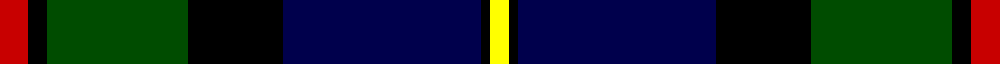
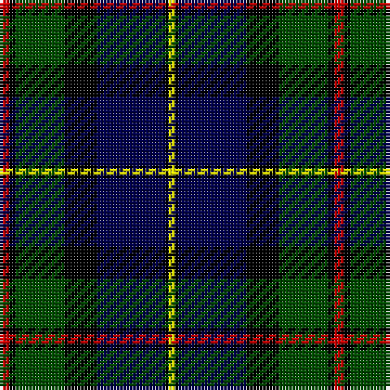

In pattern [RKGKBKY](/stripes/rkgkbky/).

This was sourced from weddslist.  It is a [7 stripe tartan](/stripes/stripes7/).

Original link http://www.weddslist.com/cgi-bin/tartans/pg.pl?source=rb

## Thread count
R/3 K2 G15 K10 DB21 K1 Y/2

## Palette
Each colour and the base-6 reference it is a variant of.

| Colour | Shade | Base |
|---|---|---|
| DB | <code style="background-color:#00004C;">#00004C</code> `oklch(18.8% 0.130 264.1)` <small>#00004C</small> | B <code style="background-color:#2A418A;">#2A418A</code> |
| G | <code style="background-color:#004C00;">#004C00</code> `oklch(36.1% 0.123 142.5)` <small>#004C00</small> | G <code style="background-color:#006100;">#006100</code> |
| K | <code style="background-color:#000000;">#000000</code> `oklch(0.0% 0.000 0.0)` <small>#000000</small> | K <code style="background-color:#000000;">#000000</code> |
| R | <code style="background-color:#C80000;">#C80000</code> `oklch(52.3% 0.215 29.2)` <small>#C80000</small> | R <code style="background-color:#CC0000;">#CC0000</code> |
| Y | <code style="background-color:#FFFF00;">#FFFF00</code> `oklch(96.8% 0.211 109.8)` <small>#FFFF00</small> | Y <code style="background-color:#F2BF00;">#F2BF00</code> |

# Sample pattern

## Nearest tartans

The nearest existing variants by ΔTartan distance, with this tartan at the top so the swatches line up against it.

ΔTartan

Tartan

Sett

—

<a href="/ttd/edit/#slug=r3k2dg15k10db21k1ly2">MacLeod</a> <a class="nn-out" href="/setts/s7/r3k2dg15k10db21k1ly2/" title="open its dictionary page">↗</a>

0.65

<a href="/ttd/edit/#slug=db4k2db16lb1k8dg24r4">Colquhoun VS</a> <a class="nn-out" href="/setts/s7/db4k2db16lb1k8dg24r4/" title="open its dictionary page">↗</a>

0.80

<a href="/ttd/edit/#slug=db24ly2k8dg16k1dg3k1dg3r4~x2">Ogilvy Hunting</a> <a class="nn-out" href="/setts/s9/db24ly2k8dg16k1dg3k1dg3r4~x2/" title="open its dictionary page">↗</a>

0.82

<a href="/ttd/edit/#slug=db24k8dg8r2dg8k1lb2">Fergusson</a> <a class="nn-out" href="/setts/s7/db24k8dg8r2dg8k1lb2/" title="open its dictionary page">↗</a>

0.86

<a href="/ttd/edit/#slug=db24k8dg8r2dg8k1ly2">MacLaren</a> <a class="nn-out" href="/setts/s7/db24k8dg8r2dg8k1ly2/" title="open its dictionary page">↗</a>

0.98

<a href="/ttd/edit/#slug=lo6g28r4k20r3db45k5~x2">Nery</a> <a class="nn-out" href="/setts/s7/lo6g28r4k20r3db45k5~x2/" title="open its dictionary page">↗</a>

0.98

<a href="/ttd/edit/#slug=db28ly1db2k16dg24k1dg2r3~x2">Ogilvy VS</a> <a class="nn-out" href="/setts/s8/db28ly1db2k16dg24k1dg2r3~x2/" title="open its dictionary page">↗</a>

0.99

<a href="/ttd/edit/#slug=k2r1g15k15db15ly1k2~x2">MacCaskill</a> <a class="nn-out" href="/setts/s7/k2r1g15k15db15ly1k2~x2/" title="open its dictionary page">↗</a>

0.99

<a href="/ttd/edit/#slug=db4k2db16lr1k8dg24r4~x2">Colqhoun VS</a> <a class="nn-out" href="/setts/s7/db4k2db16lr1k8dg24r4~x2/" title="open its dictionary page">↗</a>

1.06

<a href="/ttd/edit/#slug=k1r1k18g12db18g1db1~x2">Meoni (Personal)</a> <a class="nn-out" href="/setts/s7/k1r1k18g12db18g1db1~x2/" title="open its dictionary page">↗</a>

1.07

<a href="/ttd/edit/#slug=ly1k3dg15k14db16r2lb1~x2">MacNeil</a> <a class="nn-out" href="/setts/s7/ly1k3dg15k14db16r2lb1~x2/" title="open its dictionary page">↗</a>

## Neighbour map

Every grey dot is one of 14299 variants placed by the first two principal components of the ΔTartan feature space (44% of its variance). Red is this tartan; blue dots are its nearest — click one to open its page.

<svg viewBox="0 0 640 380" role="img" style="max-width:100%;height:auto;border:1px solid #e0e0e0;border-radius:4px;display:block" xmlns="http://www.w3.org/2000/svg"><image href="/nn/cloud.v1.png" width="640" height="380"/><a href="/setts/s7/db4k2db16lb1k8dg24r4/"><circle cx="232.7" cy="163.1" r="4" fill="#3465a4"><title>Colquhoun VS</title></circle></a><a href="/setts/s9/db24ly2k8dg16k1dg3k1dg3r4~x2/"><circle cx="225.8" cy="139.3" r="4" fill="#3465a4"><title>Ogilvy Hunting</title></circle></a><a href="/setts/s7/db24k8dg8r2dg8k1lb2/"><circle cx="254.2" cy="162.3" r="4" fill="#3465a4"><title>Fergusson</title></circle></a><a href="/setts/s7/db24k8dg8r2dg8k1ly2/"><circle cx="249.8" cy="159.7" r="4" fill="#3465a4"><title>MacLaren</title></circle></a><a href="/setts/s7/lo6g28r4k20r3db45k5~x2/"><circle cx="183.2" cy="167.7" r="4" fill="#3465a4"><title>Nery</title></circle></a><a href="/setts/s8/db28ly1db2k16dg24k1dg2r3~x2/"><circle cx="250.2" cy="147.2" r="4" fill="#3465a4"><title>Ogilvy VS</title></circle></a><a href="/setts/s7/k2r1g15k15db15ly1k2~x2/"><circle cx="178.3" cy="167.3" r="4" fill="#3465a4"><title>MacCaskill</title></circle></a><a href="/setts/s7/db4k2db16lr1k8dg24r4~x2/"><circle cx="248.6" cy="171.1" r="4" fill="#3465a4"><title>Colqhoun VS</title></circle></a><a href="/setts/s7/k1r1k18g12db18g1db1~x2/"><circle cx="232.1" cy="177.8" r="4" fill="#3465a4"><title>Meoni (Personal)</title></circle></a><a href="/setts/s7/ly1k3dg15k14db16r2lb1~x2/"><circle cx="150.7" cy="160.3" r="4" fill="#3465a4"><title>MacNeil</title></circle></a><circle cx="203.0" cy="161.7" r="5" fill="#c00000"/></svg>

ID: /setts/s7/r3k2dg15k10db21k1ly2/
