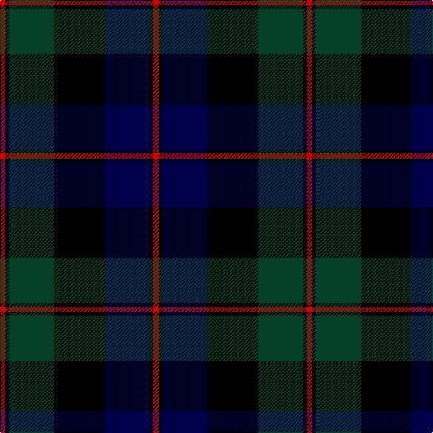

In pattern [RKBKGKR](/stripes/rkbkgkr/).

This was sourced from register-of-tartans.  It is a [7 stripe tartan](/stripes/stripes7/).

Original link https://www.tartanregister.gov.uk/tartanDetails.aspx?ref=694

## Register references

External register numbers recorded for this tartan.

- Scottish Register of Tartans: [694](https://www.tartanregister.gov.uk/tartanDetails.aspx?ref=694)
- Scottish Tartans Authority (ITI): 4545

## Thread count
R/6 K4 DG50 K56 DB50 K4 R/6

## Palette
Each colour and the base-6 reference it is a variant of.

| Colour | Shade | Base |
|---|---|---|
| DB | <code style="background-color:#000048;">#000048</code> `oklch(18.2% 0.126 264.1)` <small>#000048</small> | B <code style="background-color:#2A418A;">#2A418A</code> |
| DG | <code style="background-color:#044028;">#044028</code> `oklch(32.9% 0.072 160.0)` <small>#044028</small> | G <code style="background-color:#006100;">#006100</code> |
| K | <code style="background-color:#000000;">#000000</code> `oklch(0.0% 0.000 0.0)` <small>#000000</small> | K <code style="background-color:#000000;">#000000</code> |
| R | <code style="background-color:#C80000;">#C80000</code> `oklch(52.3% 0.215 29.2)` <small>#C80000</small> | R <code style="background-color:#CC0000;">#CC0000</code> |

# Sample pattern

## Nearest tartans

The nearest existing variants by ΔTartan distance.

1. [Graham of Menteith](/setts/s6/dg16b2dg1k12db12k1~x2/) — ΔT 0.81
1. [Gunn](/setts/s6/dg2db12dg1k12dg12r2~x2/) — ΔT 0.83
1. [Gunn](/setts/s6/dg2db12dg1k12dg12r2/) — ΔT 1.02
1. [MacThomas](/setts/s7/dg3dr2dg21k11db21dr2db3~x2/) — ΔT 1.07
1. [MacThomas](/setts/s7/dg3dr2dg21k11db21dr2db3/) — ΔT 1.07
1. [Abercrombie D](/setts/s9/dg14lr1dg7k7db2k2db2k2db14~x2/) — ΔT 1.07
1. [Abercrombie D](/setts/s9/dg14lr1dg7k7db2k2db2k2db14/) — ΔT 1.07
1. [Scotch House 2000, original](/setts/s8/db22r3db2r3db2k17dg18o4~x2/) — ΔT 1.12
1. [MacThomas LC](/setts/s7/dg5dp3dg32k16db32dp3db5/) — ΔT 1.12
1. [MacLeod](/setts/s7/r3k2dg15k10db20k2ly2~x2/) — ΔT 1.14

## Neighbour map

Every grey dot is one of 14299 variants placed by the first two principal components of the ΔTartan feature space (44% of its variance). Red is this tartan; blue dots are its nearest — click one to open its page.

<svg viewBox="0 0 640 380" role="img" style="max-width:100%;height:auto;border:1px solid #e0e0e0;border-radius:4px;display:block" xmlns="http://www.w3.org/2000/svg"><image href="/nn/cloud.v1.png" width="640" height="380"/><a href="/setts/s6/dg16b2dg1k12db12k1~x2/"><circle cx="243.0" cy="220.0" r="4" fill="#3465a4"><title>Graham of Menteith</title></circle></a><a href="/setts/s6/dg2db12dg1k12dg12r2~x2/"><circle cx="218.1" cy="235.5" r="4" fill="#3465a4"><title>Gunn</title></circle></a><a href="/setts/s6/dg2db12dg1k12dg12r2/"><circle cx="203.8" cy="228.4" r="4" fill="#3465a4"><title>Gunn</title></circle></a><a href="/setts/s7/dg3dr2dg21k11db21dr2db3~x2/"><circle cx="250.5" cy="232.0" r="4" fill="#3465a4"><title>MacThomas</title></circle></a><a href="/setts/s7/dg3dr2dg21k11db21dr2db3/"><circle cx="250.5" cy="232.0" r="4" fill="#3465a4"><title>MacThomas</title></circle></a><a href="/setts/s9/dg14lr1dg7k7db2k2db2k2db14~x2/"><circle cx="252.8" cy="207.4" r="4" fill="#3465a4"><title>Abercrombie D</title></circle></a><a href="/setts/s9/dg14lr1dg7k7db2k2db2k2db14/"><circle cx="252.8" cy="207.4" r="4" fill="#3465a4"><title>Abercrombie D</title></circle></a><a href="/setts/s8/db22r3db2r3db2k17dg18o4~x2/"><circle cx="178.9" cy="189.8" r="4" fill="#3465a4"><title>Scotch House 2000, original</title></circle></a><a href="/setts/s7/dg5dp3dg32k16db32dp3db5/"><circle cx="234.9" cy="223.5" r="4" fill="#3465a4"><title>MacThomas LC</title></circle></a><a href="/setts/s7/r3k2dg15k10db20k2ly2~x2/"><circle cx="182.3" cy="200.6" r="4" fill="#3465a4"><title>MacLeod</title></circle></a><circle cx="231.1" cy="208.5" r="5" fill="#c00000"/></svg>

ID: /setts/s7/r3k2dg25k28db25k2r3~x2/
