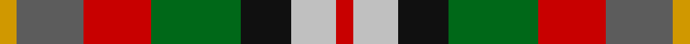

In pattern [RWKGRBY](/stripes/rwkgrby/).

This was sourced from tartans-authority.  It is a [7 stripe tartan](/stripes/stripes7/).

Original link http://www.tartansauthority.com/tartan-ferret/display/3033/

## Also known as

This cloth is also recorded under:

- Alabama Fancy

## Attestations

This cloth appears in 2 source records; the oldest owns this page.

- pre 2002 — Alabama (Fashion) (tartans-authority, [record](http://www.tartansauthority.com/tartan-ferret/display/3033/))
- undated — Alabama Fancy Tartan Tartan Number: 3033. Earliest known date: 2002 No details known possibly a fashion tartan. See products available Copyright © Blair Urquhart, Comrie, 2015 (house-of-tartan, [record](http://www.house-of-tartan.scotland.net/house/TartanViewjs.asp?colr=Def&tnam=3033))

## Thread count
DY/6 N24 R24 G32 K18 Na16 R/6

## Palette
Each colour and the base-6 reference it is a variant of.

| Colour | Shade | Base |
|---|---|---|
| DY | <code style="background-color:#D09800;">#D09800</code> `oklch(71.4% 0.147 82.1)` <small>#D09800</small> | Y <code style="background-color:#F2BF00;">#F2BF00</code> |
| G | <code style="background-color:#006818;">#006818</code> `oklch(45.0% 0.142 145.0)` <small>#006818</small> | G <code style="background-color:#006100;">#006100</code> |
| K | <code style="background-color:#101010;">#101010</code> `oklch(17.3% 0.000 89.9)` <small>#101010</small> | K <code style="background-color:#000000;">#000000</code> |
| N | <code style="background-color:#5C5C5C;">#5C5C5C</code> `oklch(47.5% 0.000 89.9)` <small>#5C5C5C</small> | B <code style="background-color:#2A418A;">#2A418A</code> |
| Na | <code style="background-color:#C0C0C0;">#C0C0C0</code> `oklch(80.8% 0.000 89.9)` <small>#C0C0C0</small> | W <code style="background-color:#F7F7F7;">#F7F7F7</code> |
| R | <code style="background-color:#C80000;">#C80000</code> `oklch(52.3% 0.215 29.2)` <small>#C80000</small> | R <code style="background-color:#CC0000;">#CC0000</code> |

# Sample pattern

## Nearest tartans

The nearest existing variants by ΔTartan distance, with this tartan at the top so the swatches line up against it.

ΔTartan

Tartan

Sett

—

<a href="/ttd/edit/#slug=r3lb8k9g16r12n12lo3~x2">Alabama (Fashion)</a> <a class="nn-out" href="/setts/s7/r3lb8k9g16r12n12lo3~x2/" title="open its dictionary page">↗</a>

0.88

<a href="/ttd/edit/#slug=lo6r8k4w6y16k13lr19k5~x2">Kilkenny County Crest (Fashion)</a> <a class="nn-out" href="/setts/s8/lo6r8k4w6y16k13lr19k5~x2/" title="open its dictionary page">↗</a>

0.94

<a href="/ttd/edit/#slug=dy19g23ly3db15r11w5~x2">Mekos, The</a> <a class="nn-out" href="/setts/s6/dy19g23ly3db15r11w5~x2/" title="open its dictionary page">↗</a>

1.02

<a href="/ttd/edit/#slug=r1lo4dr3r1dr3lr1g3db3lr1~x4">Isle of Arran (Personal)</a> <a class="nn-out" href="/setts/s9/r1lo4dr3r1dr3lr1g3db3lr1~x4/" title="open its dictionary page">↗</a>

1.11

<a href="/ttd/edit/#slug=r8lo4ly3g6t6dp1~x5">Pride, The Tartan of</a> <a class="nn-out" href="/setts/s6/r8lo4ly3g6t6dp1~x5/" title="open its dictionary page">↗</a>

1.16

<a href="/ttd/edit/#slug=w5y4b1y4r4b1dg4ly1~x2">Devon Rural Skills Trust</a> <a class="nn-out" href="/setts/s8/w5y4b1y4r4b1dg4ly1~x2/" title="open its dictionary page">↗</a>

1.23

<a href="/ttd/edit/#slug=r1dy3g5lo5dt5t1~x4">Loch Fyne</a> <a class="nn-out" href="/setts/s6/r1dy3g5lo5dt5t1~x4/" title="open its dictionary page">↗</a>

1.26

<a href="/ttd/edit/#slug=r10lr36k24r30lo8k16w18db16lo9">Tipperary County Crest (Fashion)</a> <a class="nn-out" href="/setts/s9/r10lr36k24r30lo8k16w18db16lo9/" title="open its dictionary page">↗</a>

1.29

<a href="/ttd/edit/#slug=g13w2g10k5r13k3r5dt15o5~x2">Glen Chalmadale</a> <a class="nn-out" href="/setts/s9/g13w2g10k5r13k3r5dt15o5~x2/" title="open its dictionary page">↗</a>

1.32

<a href="/ttd/edit/#slug=g8y8t7r5o2k2o2k2o2~x2">Somerset</a> <a class="nn-out" href="/setts/s9/g8y8t7r5o2k2o2k2o2~x2/" title="open its dictionary page">↗</a>

1.32

<a href="/ttd/edit/#slug=lb3g6lb1db1r5db2o5db1lb3~x4">Wombles 7 (Corporate)</a> <a class="nn-out" href="/setts/s9/lb3g6lb1db1r5db2o5db1lb3~x4/" title="open its dictionary page">↗</a>

## Neighbour map

Every grey dot is one of 14299 variants placed by the first two principal components of the ΔTartan feature space (44% of its variance). Red is this tartan; blue dots are its nearest — click one to open its page.

<svg viewBox="0 0 640 380" role="img" style="max-width:100%;height:auto;border:1px solid #e0e0e0;border-radius:4px;display:block" xmlns="http://www.w3.org/2000/svg"><image href="/nn/cloud.v1.png" width="640" height="380"/><a href="/setts/s8/lo6r8k4w6y16k13lr19k5~x2/"><circle cx="20.9" cy="203.2" r="4" fill="#3465a4"><title>Kilkenny County Crest (Fashion)</title></circle></a><a href="/setts/s6/dy19g23ly3db15r11w5~x2/"><circle cx="70.6" cy="205.9" r="4" fill="#3465a4"><title>Mekos, The</title></circle></a><a href="/setts/s9/r1lo4dr3r1dr3lr1g3db3lr1~x4/"><circle cx="16.4" cy="210.6" r="4" fill="#3465a4"><title>Isle of Arran (Personal)</title></circle></a><a href="/setts/s6/r8lo4ly3g6t6dp1~x5/"><circle cx="64.8" cy="208.4" r="4" fill="#3465a4"><title>Pride, The Tartan of</title></circle></a><a href="/setts/s8/w5y4b1y4r4b1dg4ly1~x2/"><circle cx="44.9" cy="202.9" r="4" fill="#3465a4"><title>Devon Rural Skills Trust</title></circle></a><a href="/setts/s6/r1dy3g5lo5dt5t1~x4/"><circle cx="48.2" cy="236.3" r="4" fill="#3465a4"><title>Loch Fyne</title></circle></a><a href="/setts/s9/r10lr36k24r30lo8k16w18db16lo9/"><circle cx="14.0" cy="200.8" r="4" fill="#3465a4"><title>Tipperary County Crest (Fashion)</title></circle></a><a href="/setts/s9/g13w2g10k5r13k3r5dt15o5~x2/"><circle cx="91.3" cy="197.2" r="4" fill="#3465a4"><title>Glen Chalmadale</title></circle></a><a href="/setts/s9/g8y8t7r5o2k2o2k2o2~x2/"><circle cx="14.0" cy="210.5" r="4" fill="#3465a4"><title>Somerset</title></circle></a><a href="/setts/s9/lb3g6lb1db1r5db2o5db1lb3~x4/"><circle cx="51.1" cy="199.2" r="4" fill="#3465a4"><title>Wombles 7 (Corporate)</title></circle></a><circle cx="25.7" cy="217.5" r="5" fill="#c00000"/></svg>

ID: /setts/s7/r3lb8k9g16r12n12lo3~x2/
