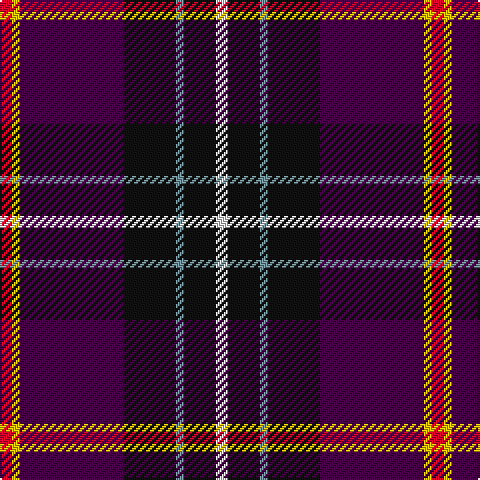

This page is one **sett** — a single exact thread-count. It belongs to the [tartan](/tartans/r3ly2dp26k13y2k8w3/)
(the same proportion at any scale), whose colour order is pattern [RYBKGKW](/stripes/rybkgkw/).

Sourced from tartans-authority.  It is a [7 stripe tartan](/stripes/stripes7/).

Original link http://www.tartansauthority.com/tartan-ferret/display/4084/

## Register references

External register numbers recorded for this tartan.

- Scottish Tartans Authority (ITI): 4084

## Thread count
R/6 Y4 DP52 K26 LG4 K16 LN/6

## Palette

Palette: <strong>Tartan Register</strong> <small style="color:#888">(5 of 6 colours)</small>
<table><thead><tr><th>Colour</th><th>Threads</th><th>Shade</th><th>Base</th><th>OKLCh</th></tr></thead><tbody><tr><td>R/</td><td style="text-align:right;font-variant-numeric:tabular-nums">6</td><td><code style="background-color:#C8002C;">#C8002C</code> <small style="color:#888">#C8002C</small></td><td>R <code style="background-color:#CC0000;">#CC0000</code></td><td><small style="color:#888">oklch(52.6% 0.212 22.0)</small></td></tr><tr><td>Y</td><td style="text-align:right;font-variant-numeric:tabular-nums">4</td><td><code style="background-color:#E8C000;">#E8C000</code> <small style="color:#888">#E8C000</small></td><td>Y <code style="background-color:#F2BF00;">#F2BF00</code></td><td><small style="color:#888">oklch(81.9% 0.168 93.7)</small></td></tr><tr><td>DP</td><td style="text-align:right;font-variant-numeric:tabular-nums">52</td><td><code style="background-color:#440044;">#440044</code> <small style="color:#888">#440044</small></td><td>B <code style="background-color:#2A418A;">#2A418A</code></td><td><small style="color:#888">oklch(27.1% 0.125 328.4)</small></td></tr><tr><td>K</td><td style="text-align:right;font-variant-numeric:tabular-nums">26</td><td><code style="background-color:#101010;">#101010</code> <small style="color:#888">#101010</small></td><td>K <code style="background-color:#000000;">#000000</code></td><td><small style="color:#888">oklch(17.3% 0.000 89.9)</small></td></tr><tr><td>LG</td><td style="text-align:right;font-variant-numeric:tabular-nums">4</td><td><code style="background-color:#709098;">#709098</code> <small style="color:#888">#709098</small></td><td>G <code style="background-color:#006100;">#006100</code></td><td><small style="color:#888">oklch(63.2% 0.038 214.7)</small></td></tr><tr><td>K</td><td style="text-align:right;font-variant-numeric:tabular-nums">16</td><td><code style="background-color:#101010;">#101010</code> <small style="color:#888">#101010</small></td><td>K <code style="background-color:#000000;">#000000</code></td><td><small style="color:#888">oklch(17.3% 0.000 89.9)</small></td></tr><tr><td>LN/</td><td style="text-align:right;font-variant-numeric:tabular-nums">6</td><td><code style="background-color:#E0E0E0;">#E0E0E0</code> <small style="color:#888">#E0E0E0</small></td><td>W <code style="background-color:#F7F7F7;">#F7F7F7</code></td><td><small style="color:#888">oklch(90.7% 0.000 89.9)</small></td></tr></tbody></table>

# Sample pattern

## Nearest tartans

The nearest existing variants by ΔTartan distance, with this tartan at the top so the swatches line up against it.

ΔTartan

Tartan

Sett

—

<a href="/ttd/edit/#slug=r3ly2dp26k13y2k8w3~x2">Curnow of Kernow (Personal)</a> <a class="nn-out" href="/setts/s7/r3ly2dp26k13y2k8w3~x2/" title="open its dictionary page">↗</a>

1.11

<a href="/ttd/edit/#slug=k2db2r16dbi2ly1dbi13w2~x2">Wishart, dress</a> <a class="nn-out" href="/setts/s7/k2db2r16dbi2ly1dbi13w2~x2/" title="open its dictionary page">↗</a>

1.23

<a href="/ttd/edit/#slug=k7dbi4r31db3ly2db27lb4~x2">Wishart Dress (Clan)</a> <a class="nn-out" href="/setts/s7/k7dbi4r31db3ly2db27lb4~x2/" title="open its dictionary page">↗</a>

1.25

<a href="/ttd/edit/#slug=r4ly2r34db10y4db4t4db23w3~x2">Heirloom Red Alba (Fashion)</a> <a class="nn-out" href="/setts/s9/r4ly2r34db10y4db4t4db23w3~x2/" title="open its dictionary page">↗</a>

1.28

<a href="/ttd/edit/#slug=db40r4k16w3dy8ri4dy3ri8k10~x2">United Arrows House Check</a> <a class="nn-out" href="/setts/s9/db40r4k16w3dy8ri4dy3ri8k10~x2/" title="open its dictionary page">↗</a>

1.28

<a href="/ttd/edit/#slug=dp26ly2r3ly2dp26k13y2k8w3k8y2k13~x2">Curnow of Kernow (Personal)</a> <a class="nn-out" href="/setts/s12/dp26ly2r3ly2dp26k13y2k8w3k8y2k13~x2/" title="open its dictionary page">↗</a>

1.28

<a href="/ttd/edit/#slug=k35p2k3dp13g8w4g8dp8~x2">SheBoom</a> <a class="nn-out" href="/setts/s8/k35p2k3dp13g8w4g8dp8~x2/" title="open its dictionary page">↗</a>

1.30

<a href="/ttd/edit/#slug=dg10w2dt10lo5db35r6~x2">Hatfield &amp; Mize (Personal)</a> <a class="nn-out" href="/setts/s6/dg10w2dt10lo5db35r6~x2/" title="open its dictionary page">↗</a>

1.31

<a href="/ttd/edit/#slug=k4dg2w2dp22k16r8k3r4k3ly4k3~x2">Hines Snr, Raymond Lee (Personal)</a> <a class="nn-out" href="/setts/s11/k4dg2w2dp22k16r8k3r4k3ly4k3~x2/" title="open its dictionary page">↗</a>

1.32

<a href="/ttd/edit/#slug=k3g1o1dt6n2dt1n1dt1o10lb1~x4">Crieff Primary School</a> <a class="nn-out" href="/setts/s10/k3g1o1dt6n2dt1n1dt1o10lb1~x4/" title="open its dictionary page">↗</a>

1.32

<a href="/ttd/edit/#slug=k35m2k3dp13g8w4g8dp8~x2">Sheboom</a> <a class="nn-out" href="/setts/s8/k35m2k3dp13g8w4g8dp8~x2/" title="open its dictionary page">↗</a>

## Neighbour map

Every grey dot is one of 14359 variants placed by the first two principal components of the ΔTartan feature space (44% of its variance). Red is this tartan; blue dots are its nearest — click one to open its page.

<svg viewBox="0 0 640 380" role="img" style="max-width:100%;height:auto;border:1px solid #e0e0e0;border-radius:4px;display:block" xmlns="http://www.w3.org/2000/svg"><image href="/nn/cloud.v1.png" width="640" height="380"/><a href="/setts/s7/k2db2r16dbi2ly1dbi13w2~x2/"><circle cx="210.4" cy="122.7" r="4" fill="#3465a4"><title>Wishart, dress</title></circle></a><a href="/setts/s7/k7dbi4r31db3ly2db27lb4~x2/"><circle cx="199.4" cy="127.5" r="4" fill="#3465a4"><title>Wishart Dress (Clan)</title></circle></a><a href="/setts/s9/r4ly2r34db10y4db4t4db23w3~x2/"><circle cx="252.0" cy="124.3" r="4" fill="#3465a4"><title>Heirloom Red Alba (Fashion)</title></circle></a><a href="/setts/s9/db40r4k16w3dy8ri4dy3ri8k10~x2/"><circle cx="206.6" cy="148.7" r="4" fill="#3465a4"><title>United Arrows House Check</title></circle></a><a href="/setts/s12/dp26ly2r3ly2dp26k13y2k8w3k8y2k13~x2/"><circle cx="255.9" cy="144.1" r="4" fill="#3465a4"><title>Curnow of Kernow (Personal)</title></circle></a><a href="/setts/s8/k35p2k3dp13g8w4g8dp8~x2/"><circle cx="243.3" cy="149.9" r="4" fill="#3465a4"><title>SheBoom</title></circle></a><a href="/setts/s6/dg10w2dt10lo5db35r6~x2/"><circle cx="254.0" cy="157.2" r="4" fill="#3465a4"><title>Hatfield &amp; Mize (Personal)</title></circle></a><a href="/setts/s11/k4dg2w2dp22k16r8k3r4k3ly4k3~x2/"><circle cx="193.9" cy="146.3" r="4" fill="#3465a4"><title>Hines Snr, Raymond Lee (Personal)</title></circle></a><a href="/setts/s10/k3g1o1dt6n2dt1n1dt1o10lb1~x4/"><circle cx="191.6" cy="148.4" r="4" fill="#3465a4"><title>Crieff Primary School</title></circle></a><a href="/setts/s8/k35m2k3dp13g8w4g8dp8~x2/"><circle cx="239.1" cy="147.6" r="4" fill="#3465a4"><title>Sheboom</title></circle></a><circle cx="234.9" cy="152.1" r="5" fill="#c00000"/></svg>

ID: /setts/s7/r3ly2dp26k13y2k8w3~x2/
