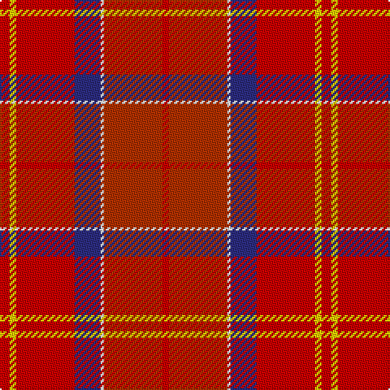

This page is one **sett** — a single exact thread-count. It belongs to the [tartan](/tartans/r3ly2r18db8w1ri18r2/)
(the same proportion at any scale), whose colour order is pattern [RRWBRYR](/stripes/rrwbryr/).

Sourced from tartans-authority.  It is a [7 stripe tartan](/stripes/stripes7/).

Original link http://www.tartansauthority.com/tartan-ferret/display/8732/

## Register references

External register numbers recorded for this tartan.

- Scottish Register of Tartans: [8732](https://www.tartanregister.gov.uk/tartanDetails?ref=8732)
- Scottish Tartans Authority (ITI): 8732

## Thread count
R/6 Y4 R36 DB16 W2 Ra36 R/4

## Palette

Palette: <strong>Tartan Register</strong>
<table><thead><tr><th>Colour</th><th>Threads</th><th>Shade</th><th>Base</th><th>OKLCh</th></tr></thead><tbody><tr><td>R/</td><td style="text-align:right;font-variant-numeric:tabular-nums">6</td><td><code style="background-color:#C80000;">#C80000</code> <small style="color:#888">#C80000</small></td><td>R <code style="background-color:#CC0000;">#CC0000</code></td><td><small style="color:#888">oklch(52.3% 0.215 29.2)</small></td></tr><tr><td>Y</td><td style="text-align:right;font-variant-numeric:tabular-nums">4</td><td><code style="background-color:#FCCC00;">#FCCC00</code> <small style="color:#888">#FCCC00</small></td><td>Y <code style="background-color:#F2BF00;">#F2BF00</code></td><td><small style="color:#888">oklch(86.2% 0.176 91.5)</small></td></tr><tr><td>R</td><td style="text-align:right;font-variant-numeric:tabular-nums">36</td><td><code style="background-color:#C80000;">#C80000</code> <small style="color:#888">#C80000</small></td><td>R <code style="background-color:#CC0000;">#CC0000</code></td><td><small style="color:#888">oklch(52.3% 0.215 29.2)</small></td></tr><tr><td>DB</td><td style="text-align:right;font-variant-numeric:tabular-nums">16</td><td><code style="background-color:#2C2C80;">#2C2C80</code> <small style="color:#888">#2C2C80</small></td><td>B <code style="background-color:#2A418A;">#2A418A</code></td><td><small style="color:#888">oklch(35.0% 0.138 276.6)</small></td></tr><tr><td>W</td><td style="text-align:right;font-variant-numeric:tabular-nums">2</td><td><code style="background-color:#FCFCFC;">#FCFCFC</code> <small style="color:#888">#FCFCFC</small></td><td>W <code style="background-color:#F7F7F7;">#F7F7F7</code></td><td><small style="color:#888">oklch(99.1% 0.000 89.9)</small></td></tr><tr><td>Ra</td><td style="text-align:right;font-variant-numeric:tabular-nums">36</td><td><code style="background-color:#B03000;">#B03000</code> <small style="color:#888">#B03000</small></td><td>R <code style="background-color:#CC0000;">#CC0000</code></td><td><small style="color:#888">oklch(50.3% 0.171 36.3)</small></td></tr><tr><td>R/</td><td style="text-align:right;font-variant-numeric:tabular-nums">4</td><td><code style="background-color:#C80000;">#C80000</code> <small style="color:#888">#C80000</small></td><td>R <code style="background-color:#CC0000;">#CC0000</code></td><td><small style="color:#888">oklch(52.3% 0.215 29.2)</small></td></tr></tbody></table>

# Sample pattern

## Nearest tartans

The nearest existing variants by ΔTartan distance, with this tartan at the top so the swatches line up against it.

ΔTartan

Tartan

Sett

—

<a href="/ttd/edit/#slug=r3ly2r18db8w1ri18r2~x2">Barbour - Cardinal Red</a> <a class="nn-out" href="/setts/s7/r3ly2r18db8w1ri18r2~x2/" title="open its dictionary page">↗</a>

1.40

<a href="/ttd/edit/#slug=k7w2dg2o31r35lo2~x2">Mason (Personal)</a> <a class="nn-out" href="/setts/s6/k7w2dg2o31r35lo2~x2/" title="open its dictionary page">↗</a>

1.53

<a href="/ttd/edit/#slug=w2k1r28k3ri28k1w2~x2">Aberdeen F.C. Corporate Tartan Tartan Number: 2057. Earliest known date: 1990 The tartan of the Aberdeen Football Club launched on 12th April, 1990. See products available Copyright © Blair Urquhart, Comrie, 2015</a> <a class="nn-out" href="/setts/s7/w2k1r28k3ri28k1w2~x2/" title="open its dictionary page">↗</a>

1.54

<a href="/ttd/edit/#slug=do5r21lo21w2db1~x2">Haughey (2015)</a> <a class="nn-out" href="/setts/s5/do5r21lo21w2db1~x2/" title="open its dictionary page">↗</a>

1.63

<a href="/ttd/edit/#slug=k7w2dg2r31ri35lo2~x2">Mason, David Elsworth (Personal)</a> <a class="nn-out" href="/setts/s6/k7w2dg2r31ri35lo2~x2/" title="open its dictionary page">↗</a>

1.66

<a href="/ttd/edit/#slug=ri8riii22r2riii8r4riii6r6riii3r48riii6dr48rii8">Ferguson Red, George (Personal)</a> <a class="nn-out" href="/setts/s12/ri8riii22r2riii8r4riii6r6riii3r48riii6dr48rii8/" title="open its dictionary page">↗</a>

1.67

<a href="/ttd/edit/#slug=rii1ri4r10lo2w1~x4">Love (Fashion)</a> <a class="nn-out" href="/setts/s5/rii1ri4r10lo2w1~x4/" title="open its dictionary page">↗</a>

1.70

<a href="/ttd/edit/#slug=k2g6dy4t1r18dy5lo1~x4">Snelgrove (Name)</a> <a class="nn-out" href="/setts/s7/k2g6dy4t1r18dy5lo1~x4/" title="open its dictionary page">↗</a>

1.74

<a href="/ttd/edit/#slug=m1dp4r10o2w1~x4">Love</a> <a class="nn-out" href="/setts/s5/m1dp4r10o2w1~x4/" title="open its dictionary page">↗</a>

1.76

<a href="/ttd/edit/#slug=rii26ri5m12ly1g1r3~x2">Roseate Sunrise</a> <a class="nn-out" href="/setts/s6/rii26ri5m12ly1g1r3~x2/" title="open its dictionary page">↗</a>

1.79

<a href="/ttd/edit/#slug=dg4r32n9dr6n2dr3n2dr12lr3~x2">Rose VS</a> <a class="nn-out" href="/setts/s9/dg4r32n9dr6n2dr3n2dr12lr3~x2/" title="open its dictionary page">↗</a>

## Neighbour map

Every grey dot is one of 14359 variants placed by the first two principal components of the ΔTartan feature space (44% of its variance). Red is this tartan; blue dots are its nearest — click one to open its page.

<svg viewBox="0 0 640 380" role="img" style="max-width:100%;height:auto;border:1px solid #e0e0e0;border-radius:4px;display:block" xmlns="http://www.w3.org/2000/svg"><image href="/nn/cloud.v1.png" width="640" height="380"/><a href="/setts/s6/k7w2dg2o31r35lo2~x2/"><circle cx="304.0" cy="150.5" r="4" fill="#3465a4"><title>Mason (Personal)</title></circle></a><a href="/setts/s7/w2k1r28k3ri28k1w2~x2/"><circle cx="367.0" cy="139.7" r="4" fill="#3465a4"><title>Aberdeen F.C. Corporate Tartan Tartan Number: 2057. Earliest known date: 1990 The tartan of the Aberdeen Football Club launched on 12th April, 1990. See products available Copyright © Blair Urquhart, Comrie, 2015</title></circle></a><a href="/setts/s5/do5r21lo21w2db1~x2/"><circle cx="301.0" cy="162.3" r="4" fill="#3465a4"><title>Haughey (2015)</title></circle></a><a href="/setts/s6/k7w2dg2r31ri35lo2~x2/"><circle cx="280.7" cy="133.0" r="4" fill="#3465a4"><title>Mason, David Elsworth (Personal)</title></circle></a><a href="/setts/s12/ri8riii22r2riii8r4riii6r6riii3r48riii6dr48rii8/"><circle cx="274.8" cy="114.6" r="4" fill="#3465a4"><title>Ferguson Red, George (Personal)</title></circle></a><a href="/setts/s5/rii1ri4r10lo2w1~x4/"><circle cx="347.7" cy="197.1" r="4" fill="#3465a4"><title>Love (Fashion)</title></circle></a><a href="/setts/s7/k2g6dy4t1r18dy5lo1~x4/"><circle cx="287.5" cy="139.2" r="4" fill="#3465a4"><title>Snelgrove (Name)</title></circle></a><a href="/setts/s5/m1dp4r10o2w1~x4/"><circle cx="324.8" cy="196.2" r="4" fill="#3465a4"><title>Love</title></circle></a><a href="/setts/s6/rii26ri5m12ly1g1r3~x2/"><circle cx="349.7" cy="122.6" r="4" fill="#3465a4"><title>Roseate Sunrise</title></circle></a><a href="/setts/s9/dg4r32n9dr6n2dr3n2dr12lr3~x2/"><circle cx="329.9" cy="171.3" r="4" fill="#3465a4"><title>Rose VS</title></circle></a><circle cx="304.0" cy="162.7" r="5" fill="#c00000"/></svg>

ID: /setts/s7/r3ly2r18db8w1ri18r2~x2/
