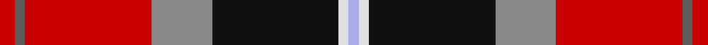
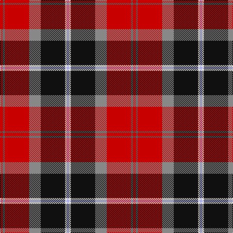

This page is one **sett** — a single exact thread-count. It belongs to the [tartan](/tartans/r3n2r25o12k25w2lb2/)
(the same proportion at any scale), whose colour order is pattern [RBRRKWW](/stripes/rbrrkww/).

Sourced from tartans-authority.  It is a [7 stripe tartan](/stripes/stripes7/).

Original link http://www.tartansauthority.com/tartan-ferret/display/7847/

## Also known as

This cloth is also recorded under:

- Bombeiros Voluntarios De Galicia (Co

2 attestations — the source records this cloth was collapsed from (oldest owns this page)

<ul>
<li>Feb 2008 — Bombeiros Voluntarios De Galicia (Co (tartans-authority, <a href="http://www.tartansauthority.com/tartan-ferret/display/7847/">record</a>)</li>
<li>undated — Bombeiros Voluntarios De Galicia (register-of-tartans, <a href="https://www.tartanregister.gov.uk/tartanDetails.aspx?ref=5799">record</a>)</li>
</ul>

## Register references

External register numbers recorded for this tartan.

- Scottish Register of Tartans: [5799](https://www.tartanregister.gov.uk/tartanDetails.aspx?ref=5799)
- Scottish Tartans Authority (ITI): 7847

## Thread count
R/6 N4 R50 Na24 K50 LN4 LP/4

## Palette

Palette: <strong>Tartan Register</strong> <small style="color:#888">(5 of 6 colours)</small>
<table><thead><tr><th>Colour</th><th>Threads</th><th>Shade</th><th>Base</th><th>OKLCh</th></tr></thead><tbody><tr><td>R/</td><td style="text-align:right;font-variant-numeric:tabular-nums">6</td><td><code style="background-color:#C80000;">#C80000</code> <small style="color:#888">#C80000</small></td><td>R <code style="background-color:#CC0000;">#CC0000</code></td><td><small style="color:#888">oklch(52.3% 0.215 29.2)</small></td></tr><tr><td>N</td><td style="text-align:right;font-variant-numeric:tabular-nums">4</td><td><code style="background-color:#5C5C5C;">#5C5C5C</code> <small style="color:#888">#5C5C5C</small></td><td>B <code style="background-color:#2A418A;">#2A418A</code></td><td><small style="color:#888">oklch(47.5% 0.000 89.9)</small></td></tr><tr><td>R</td><td style="text-align:right;font-variant-numeric:tabular-nums">50</td><td><code style="background-color:#C80000;">#C80000</code> <small style="color:#888">#C80000</small></td><td>R <code style="background-color:#CC0000;">#CC0000</code></td><td><small style="color:#888">oklch(52.3% 0.215 29.2)</small></td></tr><tr><td>Na</td><td style="text-align:right;font-variant-numeric:tabular-nums">24</td><td><code style="background-color:#888888;">#888888</code> <small style="color:#888">#888888</small></td><td>R <code style="background-color:#CC0000;">#CC0000</code></td><td><small style="color:#888">oklch(62.7% 0.000 89.9)</small></td></tr><tr><td>K</td><td style="text-align:right;font-variant-numeric:tabular-nums">50</td><td><code style="background-color:#101010;">#101010</code> <small style="color:#888">#101010</small></td><td>K <code style="background-color:#000000;">#000000</code></td><td><small style="color:#888">oklch(17.3% 0.000 89.9)</small></td></tr><tr><td>LN</td><td style="text-align:right;font-variant-numeric:tabular-nums">4</td><td><code style="background-color:#E0E0E0;">#E0E0E0</code> <small style="color:#888">#E0E0E0</small></td><td>W <code style="background-color:#F7F7F7;">#F7F7F7</code></td><td><small style="color:#888">oklch(90.7% 0.000 89.9)</small></td></tr><tr><td>LP/</td><td style="text-align:right;font-variant-numeric:tabular-nums">4</td><td><code style="background-color:#A8ACE8;">#A8ACE8</code> <small style="color:#888">#A8ACE8</small></td><td>W <code style="background-color:#F7F7F7;">#F7F7F7</code></td><td><small style="color:#888">oklch(76.3% 0.086 281.2)</small></td></tr></tbody></table>

# Sample pattern

## Nearest tartans

The nearest existing variants by ΔTartan distance, with this tartan at the top so the swatches line up against it.

ΔTartan

Tartan

Sett

—

<a href="/ttd/edit/#slug=r3n2r25o12k25w2lb2~x2">Bombeiros Voluntarios De Galicia (Co</a> <a class="nn-out" href="/setts/s7/r3n2r25o12k25w2lb2~x2/" title="open its dictionary page">↗</a>

0.71

<a href="/ttd/edit/#slug=r30db12k6dg12ly2dg3w2~x2">Hewitt</a> <a class="nn-out" href="/setts/s7/r30db12k6dg12ly2dg3w2~x2/" title="open its dictionary page">↗</a>

0.92

<a href="/ttd/edit/#slug=r30db12k3g12ly2g3w2~x2">Hewitt (Name)</a> <a class="nn-out" href="/setts/s7/r30db12k3g12ly2g3w2~x2/" title="open its dictionary page">↗</a>

0.93

<a href="/ttd/edit/#slug=gi3g3r22k5db22ly2~x2">MacLeod Society of Scotland</a> <a class="nn-out" href="/setts/s6/gi3g3r22k5db22ly2~x2/" title="open its dictionary page">↗</a>

0.99

<a href="/ttd/edit/#slug=k7dbi4r31db3ly2db27lb4~x2">Wishart Dress (Clan)</a> <a class="nn-out" href="/setts/s7/k7dbi4r31db3ly2db27lb4~x2/" title="open its dictionary page">↗</a>

1.03

<a href="/ttd/edit/#slug=w3g2r21k26db18k2db3ly3~x2">Loch Etive</a> <a class="nn-out" href="/setts/s8/w3g2r21k26db18k2db3ly3~x2/" title="open its dictionary page">↗</a>

1.05

<a href="/ttd/edit/#slug=k2dbi2r16db2ly1db13w2~x2">Wishart Dress Family Tartan Tartan Number: 2105. Earliest known date: 1990 The Wisharts of Pittarrow and Logie Wishart were a lowland family dating from around the 12th Century. The family's origins are unknown, but the name Guiscard, Wiscard, Wishart, meaning 'cunning' is Norman-French. We have also sought to associate the Wishart tartan with that of another family by virtue of the marriage of a Sir John Wishart to Jean, daughter of William Douglas, 9th Earl of Angus in the 16th Century. The Wishart tartan combines the Wallace and Douglas tartans, in an original new sett which was designed by Dr David Wishart with the assistance of the Scottish College of Textiles in Galashiels. (D. Wishart, 1990) See products available Copyright © Blair Urquhart, Comrie, 2015</a> <a class="nn-out" href="/setts/s7/k2dbi2r16db2ly1db13w2~x2/" title="open its dictionary page">↗</a>

1.05

<a href="/ttd/edit/#slug=r3k20w2dy11o21ly2o2~x2">Barbour</a> <a class="nn-out" href="/setts/s7/r3k20w2dy11o21ly2o2~x2/" title="open its dictionary page">↗</a>

1.07

<a href="/ttd/edit/#slug=r63w4k4dp18ly4dg50~x2">Gordon of Abergeldie (Portrait)</a> <a class="nn-out" href="/setts/s6/r63w4k4dp18ly4dg50~x2/" title="open its dictionary page">↗</a>

1.08

<a href="/ttd/edit/#slug=o4ly2o21dy11w2k20r3~x2">Barbour - Classic</a> <a class="nn-out" href="/setts/s7/o4ly2o21dy11w2k20r3~x2/" title="open its dictionary page">↗</a>

1.10

<a href="/ttd/edit/#slug=k3g1r1db6n2db1n1db1r10w1~x4">Crieff Primary School</a> <a class="nn-out" href="/setts/s10/k3g1r1db6n2db1n1db1r10w1~x4/" title="open its dictionary page">↗</a>

## Neighbour map

Every grey dot is one of 14359 variants placed by the first two principal components of the ΔTartan feature space (44% of its variance). Red is this tartan; blue dots are its nearest — click one to open its page.

<svg viewBox="0 0 640 380" role="img" style="max-width:100%;height:auto;border:1px solid #e0e0e0;border-radius:4px;display:block" xmlns="http://www.w3.org/2000/svg"><image href="/nn/cloud.v1.png" width="640" height="380"/><a href="/setts/s7/r30db12k6dg12ly2dg3w2~x2/"><circle cx="206.9" cy="131.9" r="4" fill="#3465a4"><title>Hewitt</title></circle></a><a href="/setts/s7/r30db12k3g12ly2g3w2~x2/"><circle cx="230.1" cy="130.2" r="4" fill="#3465a4"><title>Hewitt (Name)</title></circle></a><a href="/setts/s6/gi3g3r22k5db22ly2~x2/"><circle cx="187.6" cy="158.6" r="4" fill="#3465a4"><title>MacLeod Society of Scotland</title></circle></a><a href="/setts/s7/k7dbi4r31db3ly2db27lb4~x2/"><circle cx="199.4" cy="127.5" r="4" fill="#3465a4"><title>Wishart Dress (Clan)</title></circle></a><a href="/setts/s8/w3g2r21k26db18k2db3ly3~x2/"><circle cx="152.9" cy="133.2" r="4" fill="#3465a4"><title>Loch Etive</title></circle></a><a href="/setts/s7/k2dbi2r16db2ly1db13w2~x2/"><circle cx="225.4" cy="125.1" r="4" fill="#3465a4"><title>Wishart Dress Family Tartan Tartan Number: 2105. Earliest known date: 1990 The Wisharts of Pittarrow and Logie Wishart were a lowland family dating from around the 12th Century. The family's origins are unknown, but the name Guiscard, Wiscard, Wishart, meaning 'cunning' is Norman-French. We have also sought to associate the Wishart tartan with that of another family by virtue of the marriage of a Sir John Wishart to Jean, daughter of William Douglas, 9th Earl of Angus in the 16th Century. The Wishart tartan combines the Wallace and Douglas tartans, in an original new sett which was designed by Dr David Wishart with the assistance of the Scottish College of Textiles in Galashiels. (D. Wishart, 1990) See products available Copyright © Blair Urquhart, Comrie, 2015</title></circle></a><a href="/setts/s7/r3k20w2dy11o21ly2o2~x2/"><circle cx="166.7" cy="157.0" r="4" fill="#3465a4"><title>Barbour</title></circle></a><a href="/setts/s6/r63w4k4dp18ly4dg50~x2/"><circle cx="241.6" cy="141.6" r="4" fill="#3465a4"><title>Gordon of Abergeldie (Portrait)</title></circle></a><a href="/setts/s7/o4ly2o21dy11w2k20r3~x2/"><circle cx="172.0" cy="161.5" r="4" fill="#3465a4"><title>Barbour - Classic</title></circle></a><a href="/setts/s10/k3g1r1db6n2db1n1db1r10w1~x4/"><circle cx="178.8" cy="129.4" r="4" fill="#3465a4"><title>Crieff Primary School</title></circle></a><circle cx="185.7" cy="136.1" r="5" fill="#c00000"/></svg>

ID: /setts/s7/r3n2r25o12k25w2lb2~x2/
