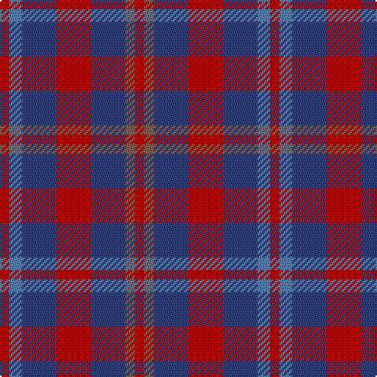

This page is one **sett** — a single exact thread-count. It belongs to the [tartan](/tartans/r3ba4b11r11b11lt3r3/)
(the same proportion at any scale), whose colour order is pattern [RBBRBRR](/stripes/rbbrbrr/).

Sourced from weddslist.  It is a [7 stripe tartan](/stripes/stripes7/).

Original link http://www.weddslist.com/cgi-bin/tartans/pg.pl?source=sts

## Thread count
R/6 Ba8 B22 R22 B22 LT6 R/6

## Palette
Each colour and the base-6 reference it is a variant of.

| Colour | Shade | Base |
|---|---|---|
| B | <code style="background-color:#304080;">#304080</code> `oklch(39.4% 0.109 270.2)` <small>#304080</small> | B <code style="background-color:#2A418A;">#2A418A</code> |
| Ba | <code style="background-color:#5480B0;">#5480B0</code> `oklch(58.8% 0.089 251.5)` <small>#5480B0</small> | B <code style="background-color:#2A418A;">#2A418A</code> |
| LT | <code style="background-color:#806050;">#806050</code> `oklch(51.7% 0.049 47.8)` <small>#806050</small> | R <code style="background-color:#CC0000;">#CC0000</code> |
| R | <code style="background-color:#C00000;">#C00000</code> `oklch(50.7% 0.208 29.2)` <small>#C00000</small> | R <code style="background-color:#CC0000;">#CC0000</code> |

# Sample pattern

## Nearest tartans

The nearest existing variants by ΔTartan distance, with this tartan at the top so the swatches line up against it.

ΔTartan

Tartan

Sett

—

<a href="/ttd/edit/#slug=r3t4db11r11db11o3r3~x2">Stewart, Fragment</a> <a class="nn-out" href="/setts/s7/r3t4db11r11db11o3r3~x2/" title="open its dictionary page">↗</a>

1.76

<a href="/ttd/edit/#slug=r4n3n12db8n2r4">Bristol Gramar School Check (School)</a> <a class="nn-out" href="/setts/s6/r4n3n12db8n2r4/" title="open its dictionary page">↗</a>

1.76

<a href="/ttd/edit/#slug=r1db3dr1g3dr5lb1~x4">Lanark (Fashion #1)</a> <a class="nn-out" href="/setts/s6/r1db3dr1g3dr5lb1~x4/" title="open its dictionary page">↗</a>

1.78

<a href="/ttd/edit/#slug=r5o3r19dr6o5dr6n12n5n12n3~x2">Roscommon</a> <a class="nn-out" href="/setts/s10/r5o3r19dr6o5dr6n12n5n12n3~x2/" title="open its dictionary page">↗</a>

1.81

<a href="/ttd/edit/#slug=db13r4db4r9db14r4db14g15r8g8r4~x2">McCaslin</a> <a class="nn-out" href="/setts/s11/db13r4db4r9db14r4db14g15r8g8r4~x2/" title="open its dictionary page">↗</a>

1.82

<a href="/ttd/edit/#slug=db1r3db1r3db6g1~x4">Robbins</a> <a class="nn-out" href="/setts/s6/db1r3db1r3db6g1~x4/" title="open its dictionary page">↗</a>

1.82

<a href="/ttd/edit/#slug=dg2dr12db11lo6dy6dr12dg2~x2">Heather MacRae</a> <a class="nn-out" href="/setts/s7/dg2dr12db11lo6dy6dr12dg2~x2/" title="open its dictionary page">↗</a>

1.87

<a href="/ttd/edit/#slug=db1m3db1m3db6g1~x4">Robbins Family Tartan Tartan Number: 412. Earliest known date: 1985 See products available Copyright © Blair Urquhart, Comrie, 2015</a> <a class="nn-out" href="/setts/s6/db1m3db1m3db6g1~x4/" title="open its dictionary page">↗</a>

1.88

<a href="/setts/s8/n11k4r4lo4n11~x4/">Ikelman #3 (Personal)</a>

1.88

<a href="/ttd/edit/#slug=g5dp2db5dp10ly2~x2">Bryson (2000)</a> <a class="nn-out" href="/setts/s5/g5dp2db5dp10ly2~x2/" title="open its dictionary page">↗</a>

1.90

<a href="/ttd/edit/#slug=r10db4r4db4r23n19db19n4~x2">Chindecella Ruadh (Personal)</a> <a class="nn-out" href="/setts/s8/r10db4r4db4r23n19db19n4~x2/" title="open its dictionary page">↗</a>

## Neighbour map

Every grey dot is one of 14299 variants placed by the first two principal components of the ΔTartan feature space (44% of its variance). Red is this tartan; blue dots are its nearest — click one to open its page.

<svg viewBox="0 0 640 380" role="img" style="max-width:100%;height:auto;border:1px solid #e0e0e0;border-radius:4px;display:block" xmlns="http://www.w3.org/2000/svg"><image href="/nn/cloud.v1.png" width="640" height="380"/><a href="/setts/s6/r4n3n12db8n2r4/"><circle cx="197.5" cy="265.4" r="4" fill="#3465a4"><title>Bristol Gramar School Check (School)</title></circle></a><a href="/setts/s6/r1db3dr1g3dr5lb1~x4/"><circle cx="181.0" cy="246.1" r="4" fill="#3465a4"><title>Lanark (Fashion #1)</title></circle></a><a href="/setts/s10/r5o3r19dr6o5dr6n12n5n12n3~x2/"><circle cx="232.2" cy="235.8" r="4" fill="#3465a4"><title>Roscommon</title></circle></a><a href="/setts/s11/db13r4db4r9db14r4db14g15r8g8r4~x2/"><circle cx="201.9" cy="275.0" r="4" fill="#3465a4"><title>McCaslin</title></circle></a><a href="/setts/s6/db1r3db1r3db6g1~x4/"><circle cx="364.8" cy="287.0" r="4" fill="#3465a4"><title>Robbins</title></circle></a><a href="/setts/s7/dg2dr12db11lo6dy6dr12dg2~x2/"><circle cx="228.1" cy="257.6" r="4" fill="#3465a4"><title>Heather MacRae</title></circle></a><a href="/setts/s6/db1m3db1m3db6g1~x4/"><circle cx="355.5" cy="280.1" r="4" fill="#3465a4"><title>Robbins Family Tartan Tartan Number: 412. Earliest known date: 1985 See products available Copyright © Blair Urquhart, Comrie, 2015</title></circle></a><a href="/setts/s8/n11k4r4lo4n11~x4/"><circle cx="174.4" cy="276.4" r="4" fill="#3465a4"><title>Ikelman #3 (Personal)</title></circle></a><a href="/setts/s5/g5dp2db5dp10ly2~x2/"><circle cx="218.3" cy="261.6" r="4" fill="#3465a4"><title>Bryson (2000)</title></circle></a><a href="/setts/s8/r10db4r4db4r23n19db19n4~x2/"><circle cx="290.6" cy="277.5" r="4" fill="#3465a4"><title>Chindecella Ruadh (Personal)</title></circle></a><circle cx="244.4" cy="276.6" r="5" fill="#c00000"/></svg>

ID: /setts/s7/r3t4db11r11db11o3r3~x2/
