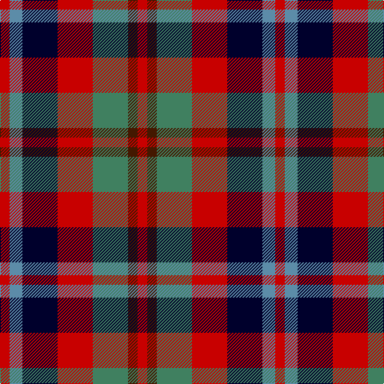

This page is one **sett** — a single exact thread-count. It belongs to the [tartan](/tartans/r3t4k11r11g11do3r3/)
(the same proportion at any scale), whose colour order is pattern [RBGRKBR](/stripes/rbgrkbr/).

Sourced from register-of-tartans.  It is a [7 stripe tartan](/stripes/stripes7/).

Original link https://www.tartanregister.gov.uk/tartanDetails.aspx?ref=3932

## Also known as

This cloth is also recorded under:

- Stewart /Stuart- Fragment Cf 1452 & 1445

2 attestations — the source records this cloth was collapsed from (oldest owns this page)

<ul>
<li>01/01/2002 — Stewart /Stuart- Fragment Cf 1452 & 1445 (register-of-tartans, <a href="https://www.tartanregister.gov.uk/tartanDetails.aspx?ref=3932">record</a>)</li>
<li>pre 2002 — Stewart (Artefact) (tartans-authority, <a href="http://www.tartansauthority.com/tartan-ferret/display/1316/">record</a>)</li>
</ul>

## Register references

External register numbers recorded for this tartan.

- Scottish Register of Tartans: [3932](https://www.tartanregister.gov.uk/tartanDetails.aspx?ref=3932)
- Scottish Tartans Authority (ITI): 1316
- Scottish Tartans World Register: 1316

## Thread count
R/12 B16 DBa44 R44 G44 DR12 R/12

## Palette

Palette: <strong>Tartan Register</strong> <small style="color:#888">(6 of 8 colours)</small>
<table><thead><tr><th>Colour</th><th>Threads</th><th>Shade</th><th>Base</th><th>OKLCh</th></tr></thead><tbody><tr><td>R/</td><td style="text-align:right;font-variant-numeric:tabular-nums">12</td><td><code style="background-color:#C80000;">#C80000</code> <small style="color:#888">#C80000</small></td><td>R <code style="background-color:#CC0000;">#CC0000</code></td><td><small style="color:#888">oklch(52.3% 0.215 29.2)</small></td></tr><tr><td>B</td><td style="text-align:right;font-variant-numeric:tabular-nums">16</td><td><code style="background-color:#5C8CA8;">#5C8CA8</code> <small style="color:#888">#5C8CA8</small></td><td>B <code style="background-color:#2A418A;">#2A418A</code></td><td><small style="color:#888">oklch(61.7% 0.067 235.0)</small></td></tr><tr><td>DBa</td><td style="text-align:right;font-variant-numeric:tabular-nums">44</td><td><code style="background-color:#00002C;">#00002C</code> <small style="color:#888">#00002C</small></td><td>K <code style="background-color:#000000;">#000000</code></td><td><small style="color:#888">oklch(13.2% 0.092 264.1)</small></td></tr><tr><td>R</td><td style="text-align:right;font-variant-numeric:tabular-nums">44</td><td><code style="background-color:#C80000;">#C80000</code> <small style="color:#888">#C80000</small></td><td>R <code style="background-color:#CC0000;">#CC0000</code></td><td><small style="color:#888">oklch(52.3% 0.215 29.2)</small></td></tr><tr><td>G</td><td style="text-align:right;font-variant-numeric:tabular-nums">44</td><td><code style="background-color:#408060;">#408060</code> <small style="color:#888">#408060</small></td><td>G <code style="background-color:#006100;">#006100</code></td><td><small style="color:#888">oklch(54.8% 0.084 160.1)</small></td></tr><tr><td>DR</td><td style="text-align:right;font-variant-numeric:tabular-nums">12</td><td><code style="background-color:#441800;">#441800</code> <small style="color:#888">#441800</small></td><td>B <code style="background-color:#2A418A;">#2A418A</code></td><td><small style="color:#888">oklch(27.3% 0.076 46.3)</small></td></tr><tr><td>R/</td><td style="text-align:right;font-variant-numeric:tabular-nums">12</td><td><code style="background-color:#C80000;">#C80000</code> <small style="color:#888">#C80000</small></td><td>R <code style="background-color:#CC0000;">#CC0000</code></td><td><small style="color:#888">oklch(52.3% 0.215 29.2)</small></td></tr></tbody></table>

# Sample pattern

## Nearest tartans

The nearest existing variants by ΔTartan distance, with this tartan at the top so the swatches line up against it.

ΔTartan

Tartan

Sett

—

<a href="/ttd/edit/#slug=r3t4k11r11g11do3r3~x4">Stewart /Stuart- Fragment Cf 1452 &amp; 1445</a> <a class="nn-out" href="/setts/s7/r3t4k11r11g11do3r3~x4/" title="open its dictionary page">↗</a>

0.92

<a href="/ttd/edit/#slug=lo2db4k1db4m4lo4db1~x8">Isle of Gigha (District)</a> <a class="nn-out" href="/setts/s7/lo2db4k1db4m4lo4db1~x8/" title="open its dictionary page">↗</a>

1.07

<a href="/ttd/edit/#slug=dp13r8lb5dg24lb5r10lb5r10~x2">Chaudhri (Name)</a> <a class="nn-out" href="/setts/s8/dp13r8lb5dg24lb5r10lb5r10~x2/" title="open its dictionary page">↗</a>

1.18

<a href="/ttd/edit/#slug=dt6lo2r6lb3k2lo6dt10r2dt3r2~x4">Commonwealth</a> <a class="nn-out" href="/setts/s10/dt6lo2r6lb3k2lo6dt10r2dt3r2~x4/" title="open its dictionary page">↗</a>

1.25

<a href="/ttd/edit/#slug=o6w2k4dy12k4w2o6r3~x2">Strathblane</a> <a class="nn-out" href="/setts/s8/o6w2k4dy12k4w2o6r3~x2/" title="open its dictionary page">↗</a>

1.26

<a href="/ttd/edit/#slug=db16r14g16ly3g16r14db16w3~x2">Forrester (James) (Personal)</a> <a class="nn-out" href="/setts/s8/db16r14g16ly3g16r14db16w3~x2/" title="open its dictionary page">↗</a>

1.27

<a href="/ttd/edit/#slug=k3ly2k3ri8k8r8dg2r3~x4">Davis</a> <a class="nn-out" href="/setts/s8/k3ly2k3ri8k8r8dg2r3~x4/" title="open its dictionary page">↗</a>

1.27

<a href="/ttd/edit/#slug=dti3dt5n2dg5r11w3~x4">Nicolson of Lewis (Clan?)</a> <a class="nn-out" href="/setts/s6/dti3dt5n2dg5r11w3~x4/" title="open its dictionary page">↗</a>

1.27

<a href="/setts/s8/g4r3t1k1t3~x4/">Wilson's No.214</a>

1.27

<a href="/ttd/edit/#slug=dp13n8w5dg24w5n10w5n10~x2">Chaudhri, Zafar Iqbal</a> <a class="nn-out" href="/setts/s8/dp13n8w5dg24w5n10w5n10~x2/" title="open its dictionary page">↗</a>

1.32

<a href="/ttd/edit/#slug=r2ly1r5k4g5w1~x4">Aboyne II (Fashion)</a> <a class="nn-out" href="/setts/s6/r2ly1r5k4g5w1~x4/" title="open its dictionary page">↗</a>

## Neighbour map

Every grey dot is one of 14359 variants placed by the first two principal components of the ΔTartan feature space (44% of its variance). Red is this tartan; blue dots are its nearest — click one to open its page.

<svg viewBox="0 0 640 380" role="img" style="max-width:100%;height:auto;border:1px solid #e0e0e0;border-radius:4px;display:block" xmlns="http://www.w3.org/2000/svg"><image href="/nn/cloud.v1.png" width="640" height="380"/><a href="/setts/s7/lo2db4k1db4m4lo4db1~x8/"><circle cx="115.1" cy="251.3" r="4" fill="#3465a4"><title>Isle of Gigha (District)</title></circle></a><a href="/setts/s8/dp13r8lb5dg24lb5r10lb5r10~x2/"><circle cx="119.8" cy="232.4" r="4" fill="#3465a4"><title>Chaudhri (Name)</title></circle></a><a href="/setts/s10/dt6lo2r6lb3k2lo6dt10r2dt3r2~x4/"><circle cx="149.2" cy="210.9" r="4" fill="#3465a4"><title>Commonwealth</title></circle></a><a href="/setts/s8/o6w2k4dy12k4w2o6r3~x2/"><circle cx="87.3" cy="207.3" r="4" fill="#3465a4"><title>Strathblane</title></circle></a><a href="/setts/s8/db16r14g16ly3g16r14db16w3~x2/"><circle cx="92.7" cy="241.1" r="4" fill="#3465a4"><title>Forrester (James) (Personal)</title></circle></a><a href="/setts/s8/k3ly2k3ri8k8r8dg2r3~x4/"><circle cx="124.6" cy="232.3" r="4" fill="#3465a4"><title>Davis</title></circle></a><a href="/setts/s6/dti3dt5n2dg5r11w3~x4/"><circle cx="99.0" cy="208.7" r="4" fill="#3465a4"><title>Nicolson of Lewis (Clan?)</title></circle></a><a href="/setts/s8/g4r3t1k1t3~x4/"><circle cx="117.0" cy="251.3" r="4" fill="#3465a4"><title>Wilson's No.214</title></circle></a><a href="/setts/s8/dp13n8w5dg24w5n10w5n10~x2/"><circle cx="108.3" cy="232.5" r="4" fill="#3465a4"><title>Chaudhri, Zafar Iqbal</title></circle></a><a href="/setts/s6/r2ly1r5k4g5w1~x4/"><circle cx="112.9" cy="223.0" r="4" fill="#3465a4"><title>Aboyne II (Fashion)</title></circle></a><circle cx="97.2" cy="234.8" r="5" fill="#c00000"/></svg>

ID: /setts/s7/r3t4k11r11g11do3r3~x4/
