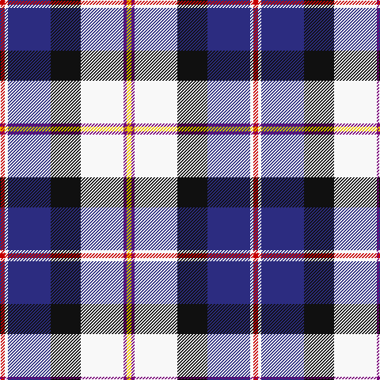

In pattern [RWBKWBY](/patterns/rwbkwby/).

This was sourced from register-of-tartans.  It is a [7 stripes tartan](/stripes/stripes7/).

Original link https://www.tartanregister.gov.uk/tartanDetails.aspx?ref=646

## Attestations

This cloth appears in 2 source records; the oldest owns this page.

- 01/01/2005 — Christian Dress (Personal) (register-of-tartans, [record](https://www.tartanregister.gov.uk/tartanDetails.aspx?ref=646))
- 2005 January — Christian Dress (Personal) (tartans-authority, [record](http://www.tartansauthority.com/tartan-ferret/display/6831/))

## Thread count
R/6 W4 DB54 K38 W54 P4 Y/6

## Palette
Each colour and its ΔE from the base-6 reference it is a variant of.

| Colour | Shade | Base | ΔE (OKLab) |
|---|---|---|---|
| DB | <code style="background-color:#2C2C80;">#2C2C80</code> `#2C2C80` | B <code style="background-color:#2A418A;">#2A418A</code> | 0.06 |
| K | <code style="background-color:#101010;">#101010</code> `#101010` | K <code style="background-color:#000000;">#000000</code> | 0.17 |
| P | <code style="background-color:#780078;">#780078</code> `#780078` | B <code style="background-color:#2A418A;">#2A418A</code> | 0.17 |
| R | <code style="background-color:#C80000;">#C80000</code> `#C80000` | R <code style="background-color:#CC0000;">#CC0000</code> | 0.01 |
| W | <code style="background-color:#F8F8F8;">#F8F8F8</code> `#F8F8F8` | W <code style="background-color:#F7F7F7;">#F7F7F7</code> | 0.00 |
| Y | <code style="background-color:#E8C000;">#E8C000</code> `#E8C000` | Y <code style="background-color:#F2BF00;">#F2BF00</code> | 0.02 |

# Sample pattern

## Nearest tartans

The nearest existing variants by ΔTartan distance.

1. [Dignan](/setts/s7/y2r1b16k5ba2w11ba1x4~b5480b0-ba800080-k000000-rc00000-we0e0e0-yf0c000/) — ΔT 0.84
1. [Haymarket Dress Blue Trade Tartan Tartan Number: 713. Earliest known date: pre 1992 One of a number of dress tartans produced by Hugh Macpherson, a kiltmaker in Edinburgh, whose shop is a short walk from Haymarket railway station. See products available Copyright © Blair Urquhart, Comrie, 2015](/setts/s9/g5b22g6k10w24y2b2w2r2x2~b2c2c80-g006818-k101010-rc80000-we0e0e0-ye8c000/) — ΔT 0.85
1. [Pipers' Trail Dance, The](/setts/s6/k6w49b50ba6bb8y4~b202060-ba780078-bb2c2c80-k101010-wfcfcfc-yfccc00/) — ΔT 0.88
1. [Davidson (Wedding) (Personal)](/setts/s7/r2b14k6g1w12g1w2x4~b2c2c80-g006818-k101010-rc80000-wfcfcfc/) — ΔT 0.90
1. [Minnesota Dress](/setts/s9/b4k2w3k2ba30g9k4w20y3x2~b780078-ba2c2c80-g289c18-k101010-we0e0e0-ye8c000/) — ΔT 0.92
1. [Davidson, Bride's](/setts/s7/r2b14k6g1w12g1w2x4~b304080-g008000-k000000-rc00000-we0e0e0/) — ΔT 0.95
1. [Culloden Dress](/setts/s8/r6b3ba24y2k23w23k2w6x2~b5c8ca8-ba780078-k101010-rc80000-wfcfcfc-ye8c000/) — ΔT 1.03
1. [Haymarket, dress Blue](/setts/s9/g5b22g6k10w24y2b2w2r2x2~b304080-g008000-k000000-rc00000-we0e0e0-yf0c000/) — ΔT 1.04
1. [Gillies, dress Blue](/setts/s10/y6k2b15r5b9k13w25ba2w3ba2x2~b5480b0-ba304080-k000000-rc00000-we0e0e0-yf0c000/) — ΔT 1.08
1. [Culloden Dress Ancient](/setts/s8/r6b2ba21w3g19w26g3w5x2~b2c4084-ba5a008c-g002814-rdc0000-we0e0e0/) — ΔT 1.09

## Neighbour map

Every grey dot is one of 15726 variants placed by the first two principal components of the ΔTartan feature space (44% of its variance). Red is this tartan; blue dots are its nearest — click one to open its page.

<svg viewBox="0 0 640 380" role="img" style="max-width:100%;height:auto;border:1px solid #e0e0e0;border-radius:4px;display:block" xmlns="http://www.w3.org/2000/svg"><image href="/nn/cloud.v1.png" width="640" height="380"/><a href="/setts/s7/y2r1b16k5ba2w11ba1x4~b5480b0-ba800080-k000000-rc00000-we0e0e0-yf0c000/"><circle cx="157.0" cy="117.7" r="4" fill="#3465a4"><title>Dignan</title></circle></a><a href="/setts/s9/g5b22g6k10w24y2b2w2r2x2~b2c2c80-g006818-k101010-rc80000-we0e0e0-ye8c000/"><circle cx="106.9" cy="119.7" r="4" fill="#3465a4"><title>Haymarket Dress Blue Trade Tartan Tartan Number: 713. Earliest known date: pre 1992 One of a number of dress tartans produced by Hugh Macpherson, a kiltmaker in Edinburgh, whose shop is a short walk from Haymarket railway station. See products available Copyright © Blair Urquhart, Comrie, 2015</title></circle></a><a href="/setts/s6/k6w49b50ba6bb8y4~b202060-ba780078-bb2c2c80-k101010-wfcfcfc-yfccc00/"><circle cx="156.2" cy="131.7" r="4" fill="#3465a4"><title>Pipers' Trail Dance, The</title></circle></a><a href="/setts/s7/r2b14k6g1w12g1w2x4~b2c2c80-g006818-k101010-rc80000-wfcfcfc/"><circle cx="146.2" cy="141.7" r="4" fill="#3465a4"><title>Davidson (Wedding) (Personal)</title></circle></a><a href="/setts/s9/b4k2w3k2ba30g9k4w20y3x2~b780078-ba2c2c80-g289c18-k101010-we0e0e0-ye8c000/"><circle cx="139.3" cy="106.4" r="4" fill="#3465a4"><title>Minnesota Dress</title></circle></a><a href="/setts/s7/r2b14k6g1w12g1w2x4~b304080-g008000-k000000-rc00000-we0e0e0/"><circle cx="148.3" cy="144.9" r="4" fill="#3465a4"><title>Davidson, Bride's</title></circle></a><a href="/setts/s8/r6b3ba24y2k23w23k2w6x2~b5c8ca8-ba780078-k101010-rc80000-wfcfcfc-ye8c000/"><circle cx="95.0" cy="125.2" r="4" fill="#3465a4"><title>Culloden Dress</title></circle></a><a href="/setts/s9/g5b22g6k10w24y2b2w2r2x2~b304080-g008000-k000000-rc00000-we0e0e0-yf0c000/"><circle cx="101.7" cy="118.5" r="4" fill="#3465a4"><title>Haymarket, dress Blue</title></circle></a><a href="/setts/s10/y6k2b15r5b9k13w25ba2w3ba2x2~b5480b0-ba304080-k000000-rc00000-we0e0e0-yf0c000/"><circle cx="84.4" cy="116.1" r="4" fill="#3465a4"><title>Gillies, dress Blue</title></circle></a><a href="/setts/s8/r6b2ba21w3g19w26g3w5x2~b2c4084-ba5a008c-g002814-rdc0000-we0e0e0/"><circle cx="149.9" cy="144.5" r="4" fill="#3465a4"><title>Culloden Dress Ancient</title></circle></a><circle cx="116.3" cy="126.4" r="5" fill="#c00000"/></svg>

ID: /setts/s7/r3w2b27k19w27ba2y3x2~b2c2c80-ba780078-k101010-rc80000-wf8f8f8-ye8c000/
