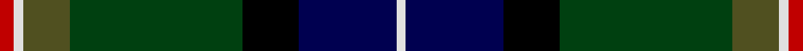
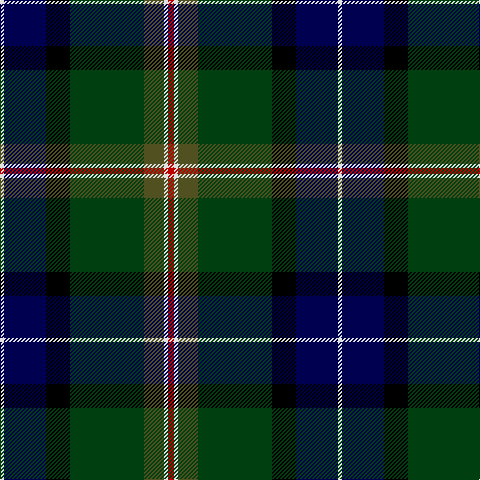

This page is one **sett** — a single exact thread-count. It belongs to the [tartan](/tartans/r3w2dy10dg37k12db21w2/)
(the same proportion at any scale), whose colour order is pattern [RWGGKBW](/stripes/rwggkbw/).

Sourced from weddslist.  It is a [7 stripe tartan](/stripes/stripes7/).

Original link http://www.weddslist.com/cgi-bin/tartans/pg.pl?source=sts

## Thread count
R/6 LN4 T20 DG74 K24 DB42 LN/4

## Palette

Palette: <strong>Tartan Register</strong> <small style="color:#888">(2 of 6 colours)</small>
<table><thead><tr><th>Colour</th><th>Threads</th><th>Shade</th><th>Base</th><th>OKLCh</th></tr></thead><tbody><tr><td>R/</td><td style="text-align:right;font-variant-numeric:tabular-nums">6</td><td><code style="background-color:#C00000;">#C00000</code> <small style="color:#888">#C00000</small></td><td>R <code style="background-color:#CC0000;">#CC0000</code></td><td><small style="color:#888">oklch(50.7% 0.208 29.2)</small></td></tr><tr><td>LN</td><td style="text-align:right;font-variant-numeric:tabular-nums">4</td><td><code style="background-color:#E0E0E0;">#E0E0E0</code> <small style="color:#888">#E0E0E0</small></td><td>W <code style="background-color:#F7F7F7;">#F7F7F7</code></td><td><small style="color:#888">oklch(90.7% 0.000 89.9)</small></td></tr><tr><td>T</td><td style="text-align:right;font-variant-numeric:tabular-nums">20</td><td><code style="background-color:#505020;">#505020</code> <small style="color:#888">#505020</small></td><td>G <code style="background-color:#006100;">#006100</code></td><td><small style="color:#888">oklch(42.0% 0.068 109.0)</small></td></tr><tr><td>DG</td><td style="text-align:right;font-variant-numeric:tabular-nums">74</td><td><code style="background-color:#004010;">#004010</code> <small style="color:#888">#004010</small></td><td>G <code style="background-color:#006100;">#006100</code></td><td><small style="color:#888">oklch(32.3% 0.098 146.3)</small></td></tr><tr><td>K</td><td style="text-align:right;font-variant-numeric:tabular-nums">24</td><td><code style="background-color:#000000;">#000000</code> <small style="color:#888">#000000</small></td><td>K <code style="background-color:#000000;">#000000</code></td><td><small style="color:#888">oklch(0.0% 0.000 0.0)</small></td></tr><tr><td>DB</td><td style="text-align:right;font-variant-numeric:tabular-nums">42</td><td><code style="background-color:#000050;">#000050</code> <small style="color:#888">#000050</small></td><td>B <code style="background-color:#2A418A;">#2A418A</code></td><td><small style="color:#888">oklch(19.5% 0.135 264.1)</small></td></tr><tr><td>LN/</td><td style="text-align:right;font-variant-numeric:tabular-nums">4</td><td><code style="background-color:#E0E0E0;">#E0E0E0</code> <small style="color:#888">#E0E0E0</small></td><td>W <code style="background-color:#F7F7F7;">#F7F7F7</code></td><td><small style="color:#888">oklch(90.7% 0.000 89.9)</small></td></tr></tbody></table>

# Sample pattern

## Nearest tartans

The nearest existing variants by ΔTartan distance, with this tartan at the top so the swatches line up against it.

ΔTartan

Tartan

Sett

—

<a href="/ttd/edit/#slug=r3w2dy10dg37k12db21w2~x2">Jones, The</a> <a class="nn-out" href="/setts/s7/r3w2dy10dg37k12db21w2~x2/" title="open its dictionary page">↗</a>

0.78

<a href="/ttd/edit/#slug=w5k26ly2dg24dt7k3r3~x2">Cornish Hunting District Tartan Tartan Number: 1568. Earliest known date: 1984 The Cornish Hunting tartan was first produced in 1984, and was marketed by the firm, Cornovi Creations, Cornwall. It is based on the Cornish National tartan designed by E.E. Morton-Nance, who regarded tartan as the heritage of all Celts, not Scots alone. (P Smith and G Teall, District Tartans, 1992) The hunting sett replaces the 'National' yellow with dark green and the azure with a darker shade of blue. Cornish Hunting is a registered design (No. 514267). See products available Copyright © Blair Urquhart, Comrie, 2015</a> <a class="nn-out" href="/setts/s7/w5k26ly2dg24dt7k3r3~x2/" title="open its dictionary page">↗</a>

0.87

<a href="/ttd/edit/#slug=k2w2k8lo8db24dg13k3m1~x2">Froben, Christian (Personal)</a> <a class="nn-out" href="/setts/s8/k2w2k8lo8db24dg13k3m1~x2/" title="open its dictionary page">↗</a>

0.89

<a href="/ttd/edit/#slug=w2r3db33k33g33k6ly2~x2">MacNeil - 1840 (Chief's sett)</a> <a class="nn-out" href="/setts/s7/w2r3db33k33g33k6ly2~x2/" title="open its dictionary page">↗</a>

0.98

<a href="/ttd/edit/#slug=dg42ly2g16dt7k16r5~x2">Waterford Irish County Tartan Tartan Number: 2255. Earliest known date: 1993 One of a series of Irish District tartans designed by Polly Wittering of the House of Edgar, with colours reminiscent of the Country with soft warm colours dominating. See products available Copyright © Blair Urquhart, Comrie, 2015</a> <a class="nn-out" href="/setts/s6/dg42ly2g16dt7k16r5~x2/" title="open its dictionary page">↗</a>

1.02

<a href="/ttd/edit/#slug=r5k12ly2dg25ly2db12t5~x2">James</a> <a class="nn-out" href="/setts/s7/r5k12ly2dg25ly2db12t5~x2/" title="open its dictionary page">↗</a>

1.10

<a href="/ttd/edit/#slug=r2k6ly1dg12ly1db6lr2~x4">James (Personal)</a> <a class="nn-out" href="/setts/s7/r2k6ly1dg12ly1db6lr2~x4/" title="open its dictionary page">↗</a>

1.10

<a href="/setts/s6/g36ly3dy5db18ki10k18~x2/">Dobson Name Tartan Tartan Number: 10943. Earliest known date: 2013 Designed by Kelly Dobson Matson for the personal use of the Dobson Family, Palm Bay, Florida, a family of bagpipers, who wish to wear their own tartan while they play. The colours are favoured colours chosen by the majority of the family. See products available Copyright © Blair Urquhart, Comrie, 2015</a>

1.11

<a href="/ttd/edit/#slug=db4k2db16lb1k8dg24r4">Colquhoun VS</a> <a class="nn-out" href="/setts/s7/db4k2db16lb1k8dg24r4/" title="open its dictionary page">↗</a>

1.12

<a href="/ttd/edit/#slug=db5k10db48k72w12dg48r5">Colquhoun (Clan)</a> <a class="nn-out" href="/setts/s7/db5k10db48k72w12dg48r5/" title="open its dictionary page">↗</a>

1.12

<a href="/ttd/edit/#slug=r3g2db27k19g27dp2ly3~x2">Christian Hunting (Personal)</a> <a class="nn-out" href="/setts/s7/r3g2db27k19g27dp2ly3~x2/" title="open its dictionary page">↗</a>

## Neighbour map

Every grey dot is one of 14359 variants placed by the first two principal components of the ΔTartan feature space (44% of its variance). Red is this tartan; blue dots are its nearest — click one to open its page.

<svg viewBox="0 0 640 380" role="img" style="max-width:100%;height:auto;border:1px solid #e0e0e0;border-radius:4px;display:block" xmlns="http://www.w3.org/2000/svg"><image href="/nn/cloud.v1.png" width="640" height="380"/><a href="/setts/s7/w5k26ly2dg24dt7k3r3~x2/"><circle cx="196.0" cy="164.2" r="4" fill="#3465a4"><title>Cornish Hunting District Tartan Tartan Number: 1568. Earliest known date: 1984 The Cornish Hunting tartan was first produced in 1984, and was marketed by the firm, Cornovi Creations, Cornwall. It is based on the Cornish National tartan designed by E.E. Morton-Nance, who regarded tartan as the heritage of all Celts, not Scots alone. (P Smith and G Teall, District Tartans, 1992) The hunting sett replaces the 'National' yellow with dark green and the azure with a darker shade of blue. Cornish Hunting is a registered design (No. 514267). See products available Copyright © Blair Urquhart, Comrie, 2015</title></circle></a><a href="/setts/s8/k2w2k8lo8db24dg13k3m1~x2/"><circle cx="187.6" cy="131.2" r="4" fill="#3465a4"><title>Froben, Christian (Personal)</title></circle></a><a href="/setts/s7/w2r3db33k33g33k6ly2~x2/"><circle cx="182.3" cy="161.3" r="4" fill="#3465a4"><title>MacNeil - 1840 (Chief's sett)</title></circle></a><a href="/setts/s6/dg42ly2g16dt7k16r5~x2/"><circle cx="250.5" cy="171.5" r="4" fill="#3465a4"><title>Waterford Irish County Tartan Tartan Number: 2255. Earliest known date: 1993 One of a series of Irish District tartans designed by Polly Wittering of the House of Edgar, with colours reminiscent of the Country with soft warm colours dominating. See products available Copyright © Blair Urquhart, Comrie, 2015</title></circle></a><a href="/setts/s7/r5k12ly2dg25ly2db12t5~x2/"><circle cx="143.2" cy="166.2" r="4" fill="#3465a4"><title>James</title></circle></a><a href="/setts/s7/r2k6ly1dg12ly1db6lr2~x4/"><circle cx="163.4" cy="170.7" r="4" fill="#3465a4"><title>James (Personal)</title></circle></a><a href="/setts/s6/g36ly3dy5db18ki10k18~x2/"><circle cx="148.6" cy="191.6" r="4" fill="#3465a4"><title>Dobson Name Tartan Tartan Number: 10943. Earliest known date: 2013 Designed by Kelly Dobson Matson for the personal use of the Dobson Family, Palm Bay, Florida, a family of bagpipers, who wish to wear their own tartan while they play. The colours are favoured colours chosen by the majority of the family. See products available Copyright © Blair Urquhart, Comrie, 2015</title></circle></a><a href="/setts/s7/db4k2db16lb1k8dg24r4/"><circle cx="232.5" cy="163.9" r="4" fill="#3465a4"><title>Colquhoun VS</title></circle></a><a href="/setts/s7/db5k10db48k72w12dg48r5/"><circle cx="207.4" cy="182.8" r="4" fill="#3465a4"><title>Colquhoun (Clan)</title></circle></a><a href="/setts/s7/r3g2db27k19g27dp2ly3~x2/"><circle cx="174.9" cy="167.6" r="4" fill="#3465a4"><title>Christian Hunting (Personal)</title></circle></a><circle cx="199.2" cy="154.7" r="5" fill="#c00000"/></svg>

ID: /setts/s7/r3w2dy10dg37k12db21w2~x2/
