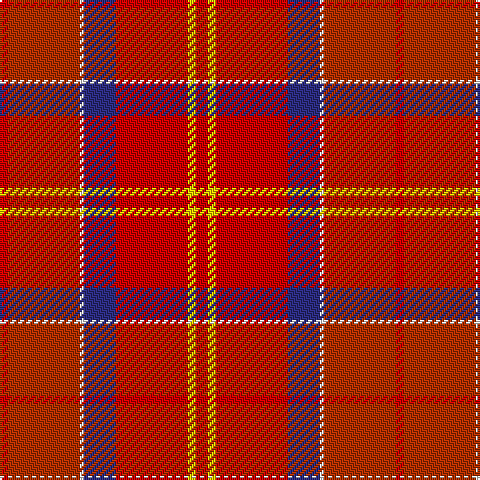

In pattern [RRWBRYR](/patterns/rrwbryr/).

This was sourced from tartans-authority.  It is a [7 stripes tartan](/stripes/stripes7/).

Original link http://www.tartansauthority.com/tartan-ferret/display/8732/

## Thread count
R/4 Ra36 W2 DB16 R36 Y4 R/6

## Palette
Each colour and its ΔE from the base-6 reference it is a variant of.

| Colour | Shade | Base | ΔE (OKLab) |
|---|---|---|---|
| DB | <code style="background-color:#2C2C80;">#2C2C80</code> `#2C2C80` | B <code style="background-color:#2A418A;">#2A418A</code> | 0.06 |
| R | <code style="background-color:#C80000;">#C80000</code> `#C80000` | R <code style="background-color:#CC0000;">#CC0000</code> | 0.01 |
| Ra | <code style="background-color:#B03000;">#B03000</code> `#B03000` | R <code style="background-color:#CC0000;">#CC0000</code> | 0.06 |
| W | <code style="background-color:#FCFCFC;">#FCFCFC</code> `#FCFCFC` | W <code style="background-color:#F7F7F7;">#F7F7F7</code> | 0.01 |
| Y | <code style="background-color:#FCCC00;">#FCCC00</code> `#FCCC00` | Y <code style="background-color:#F2BF00;">#F2BF00</code> | 0.04 |

# Sample pattern

## Nearest tartans

The nearest existing variants by ΔTartan distance.

1. [Mason (Personal)](/setts/s6/k7w2g2r31ra35y2x2~g003820-k101010-rb84c00-ra880000-we0e0e0-ybc8c00/) — ΔT 1.40
1. [Aberdeen F.C. Corporate Tartan Tartan Number: 2057. Earliest known date: 1990 The tartan of the Aberdeen Football Club launched on 12th April, 1990. See products available Copyright © Blair Urquhart, Comrie, 2015](/setts/s7/w2k1r28k3ra28k1w2x2~k101010-r901c38-rac80000-we0e0e0/) — ΔT 1.53
1. [Haughey (2015)](/setts/s5/b5r21y21w2ba1x2~b4c3428-ba000080-rdc0000-wf8f8f8-yd87c00/) — ΔT 1.55
1. [Mason, David Elsworth (Personal)](/setts/s6/k7w2g2r31ra35y2x2~g0b3d2e-k010512-rda412d-ra89051b-wddd5af-yebaa57/) — ΔT 1.64
1. [Ferguson Red, George (Personal)](/setts/s12/r8b48ra6rb48ra3rb6ra6rb4ra8rb2ra22rc8~b680028-r880000-rae87878-rbc80000-rcd05054/) — ΔT 1.66
1. [Love (Fashion)](/setts/s5/r1ra4rb10y2w1x4~re87878-ra880000-rbc80000-we0e0e0-ybc8c00/) — ΔT 1.68
1. [Snelgrove (Name)](/setts/s7/k2g6ga4b1r18ga5y1x4~b2888c4-g006818-ga642000-k101010-rc80000-ybc8c00/) — ΔT 1.70
1. [Love](/setts/s5/r1b4ra10rb2w1x4~b531039-ra35879-ra970f0f-rbad681d-wffffff/) — ΔT 1.74
1. [Roseate Sunrise](/setts/s6/r26ra5rb12y1g1rc3x2~g649848-re87878-ra960000-rb781c38-rcc82828-yc4bc68/) — ΔT 1.76
1. [Rose VS](/setts/s9/g4r32b9ba6b2ba3b2ba12y3x2~b6e5058-ba59110d-g11450d-raa0000-yaaaaaa/) — ΔT 1.79

## Neighbour map

Every grey dot is one of 15726 variants placed by the first two principal components of the ΔTartan feature space (44% of its variance). Red is this tartan; blue dots are its nearest — click one to open its page.

<svg viewBox="0 0 640 380" role="img" style="max-width:100%;height:auto;border:1px solid #e0e0e0;border-radius:4px;display:block" xmlns="http://www.w3.org/2000/svg"><image href="/nn/cloud.v1.png" width="640" height="380"/><a href="/setts/s6/k7w2g2r31ra35y2x2~g003820-k101010-rb84c00-ra880000-we0e0e0-ybc8c00/"><circle cx="305.4" cy="146.7" r="4" fill="#3465a4"><title>Mason (Personal)</title></circle></a><a href="/setts/s7/w2k1r28k3ra28k1w2x2~k101010-r901c38-rac80000-we0e0e0/"><circle cx="369.0" cy="138.2" r="4" fill="#3465a4"><title>Aberdeen F.C. Corporate Tartan Tartan Number: 2057. Earliest known date: 1990 The tartan of the Aberdeen Football Club launched on 12th April, 1990. See products available Copyright © Blair Urquhart, Comrie, 2015</title></circle></a><a href="/setts/s5/b5r21y21w2ba1x2~b4c3428-ba000080-rdc0000-wf8f8f8-yd87c00/"><circle cx="303.4" cy="161.7" r="4" fill="#3465a4"><title>Haughey (2015)</title></circle></a><a href="/setts/s6/k7w2g2r31ra35y2x2~g0b3d2e-k010512-rda412d-ra89051b-wddd5af-yebaa57/"><circle cx="282.2" cy="132.7" r="4" fill="#3465a4"><title>Mason, David Elsworth (Personal)</title></circle></a><a href="/setts/s12/r8b48ra6rb48ra3rb6ra6rb4ra8rb2ra22rc8~b680028-r880000-rae87878-rbc80000-rcd05054/"><circle cx="276.6" cy="109.5" r="4" fill="#3465a4"><title>Ferguson Red, George (Personal)</title></circle></a><a href="/setts/s5/r1ra4rb10y2w1x4~re87878-ra880000-rbc80000-we0e0e0-ybc8c00/"><circle cx="350.8" cy="195.3" r="4" fill="#3465a4"><title>Love (Fashion)</title></circle></a><a href="/setts/s7/k2g6ga4b1r18ga5y1x4~b2888c4-g006818-ga642000-k101010-rc80000-ybc8c00/"><circle cx="288.5" cy="136.3" r="4" fill="#3465a4"><title>Snelgrove (Name)</title></circle></a><a href="/setts/s5/r1b4ra10rb2w1x4~b531039-ra35879-ra970f0f-rbad681d-wffffff/"><circle cx="326.3" cy="195.2" r="4" fill="#3465a4"><title>Love</title></circle></a><a href="/setts/s6/r26ra5rb12y1g1rc3x2~g649848-re87878-ra960000-rb781c38-rcc82828-yc4bc68/"><circle cx="352.0" cy="121.1" r="4" fill="#3465a4"><title>Roseate Sunrise</title></circle></a><a href="/setts/s9/g4r32b9ba6b2ba3b2ba12y3x2~b6e5058-ba59110d-g11450d-raa0000-yaaaaaa/"><circle cx="330.9" cy="162.1" r="4" fill="#3465a4"><title>Rose VS</title></circle></a><circle cx="305.9" cy="159.2" r="5" fill="#c00000"/></svg>

ID: /setts/s7/r3y2r18b8w1ra18r2x2~b2c2c80-rc80000-rab03000-wfcfcfc-yfccc00/
