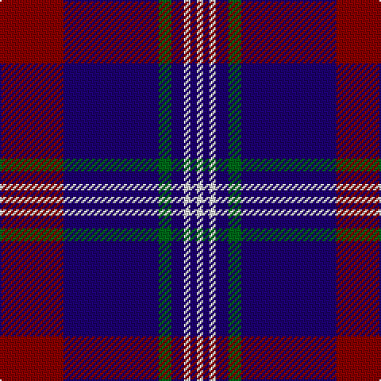

In pattern [RBGBWBW](/patterns/rbgbwbw/).

This was sourced from tartans-authority.  It is a [7 stripes tartan](/stripes/stripes7/).

Original link http://www.tartansauthority.com/tartan-ferret/display/2224/

## Thread count
DR/40 DB60 G8 DB8 LN4 DB4 LN/4

## Palette
Each colour and its ΔE from the base-6 reference it is a variant of.

| Colour | Shade | Base | ΔE (OKLab) |
|---|---|---|---|
| DB | <code style="background-color:#1C0070;">#1C0070</code> `#1C0070` | B <code style="background-color:#2C4084;">#2C4084</code> | 0.14 |
| DR | <code style="background-color:#880000;">#880000</code> `#880000` | R <code style="background-color:#C80000;">#C80000</code> | 0.14 |
| G | <code style="background-color:#006818;">#006818</code> `#006818` | G <code style="background-color:#006400;">#006400</code> | 0.02 |
| LN | <code style="background-color:#E0E0E0;">#E0E0E0</code> `#E0E0E0` | W <code style="background-color:#F4F4F0;">#F4F4F0</code> | 0.06 |

# Sample pattern

## Nearest tartans

The nearest existing variants by ΔTartan distance.

1. [Heritage of Wales (Fashion)](/setts/s7/r20b8r12b60k20b10w4-b2c2c80-k101010-rc80000-we0e0e0/) — ΔT 0.77
1. [Lothian Buses (Corporate?)](/setts/s6/w16b120r24g24r24b8-b2c2c80-g006818-rc80000-we0e0e0/) — ΔT 0.91
1. [Hannah (Personal)](/setts/s6/w4b70k18w6k18y4-b30308c-k101010-we0e0e0-ye8c000/) — ΔT 1.07
1. [Murdoch Celebration (Personal)](/setts/s8/b60r4b4r8b18k52w4k8-b2c4084-k101010-rdc0000-we0e0e0/) — ΔT 1.10
1. [Widows Sons Scotland (MRA)](/setts/s6/w9k16g10k22b67y4-b5a008c-g003c14-k101010-wc8c8c8-ye0a126/) — ΔT 1.17
1. [Unnamed C20th - USA](/setts/s7/b4y2b36g14r14b2g2-b2c2c80-g006818-rc80000-ye8c000/) — ΔT 1.17
1. [Universal Scientific Indust (Corp.)](/setts/s9/k76b4r48w4k32r12b4k6b10-b2888c4-k101010-r9c68a4-wf8f8f8/) — ΔT 1.18
1. [Prince George's Police Pipe Band](/setts/s8/b84r4g32r4b12r4g16y6-b1c0070-g789484-r880000-yd09800/) — ΔT 1.21
1. [Murdoch Clebration (Personal)](/setts/s8/k42b16r8b4r4b46k8w4-b2c2c80-k101010-rc80000-we0e0e0/) — ΔT 1.22
1. [Widows Sons Scotland Dress](/setts/s6/w12g16k12g24b75y4-b5a008c-g003c14-k101010-wc8c8c8-ye0a126/) — ΔT 1.24

## Neighbour map

Every grey dot is one of 15726 variants placed by the first two principal components of the ΔTartan feature space (44% of its variance). Red is this tartan; blue dots are its nearest — click one to open its page.

<svg viewBox="0 0 640 380" role="img" style="max-width:100%;height:auto;border:1px solid #e0e0e0;border-radius:4px;display:block" xmlns="http://www.w3.org/2000/svg"><image href="/nn/cloud.v1.png" width="640" height="380"/><a href="/setts/s7/r20b8r12b60k20b10w4-b2c2c80-k101010-rc80000-we0e0e0/"><circle cx="338.1" cy="185.5" r="4" fill="#3465a4"><title>Heritage of Wales (Fashion)</title></circle></a><a href="/setts/s6/w16b120r24g24r24b8-b2c2c80-g006818-rc80000-we0e0e0/"><circle cx="339.9" cy="175.9" r="4" fill="#3465a4"><title>Lothian Buses (Corporate?)</title></circle></a><a href="/setts/s6/w4b70k18w6k18y4-b30308c-k101010-we0e0e0-ye8c000/"><circle cx="346.4" cy="169.9" r="4" fill="#3465a4"><title>Hannah (Personal)</title></circle></a><a href="/setts/s8/b60r4b4r8b18k52w4k8-b2c4084-k101010-rdc0000-we0e0e0/"><circle cx="330.8" cy="178.7" r="4" fill="#3465a4"><title>Murdoch Celebration (Personal)</title></circle></a><a href="/setts/s6/w9k16g10k22b67y4-b5a008c-g003c14-k101010-wc8c8c8-ye0a126/"><circle cx="289.3" cy="164.2" r="4" fill="#3465a4"><title>Widows Sons Scotland (MRA)</title></circle></a><a href="/setts/s7/b4y2b36g14r14b2g2-b2c2c80-g006818-rc80000-ye8c000/"><circle cx="347.6" cy="170.3" r="4" fill="#3465a4"><title>Unnamed C20th - USA</title></circle></a><a href="/setts/s9/k76b4r48w4k32r12b4k6b10-b2888c4-k101010-r9c68a4-wf8f8f8/"><circle cx="336.6" cy="149.4" r="4" fill="#3465a4"><title>Universal Scientific Indust (Corp.)</title></circle></a><a href="/setts/s8/b84r4g32r4b12r4g16y6-b1c0070-g789484-r880000-yd09800/"><circle cx="362.0" cy="144.4" r="4" fill="#3465a4"><title>Prince George's Police Pipe Band</title></circle></a><a href="/setts/s8/k42b16r8b4r4b46k8w4-b2c2c80-k101010-rc80000-we0e0e0/"><circle cx="305.5" cy="194.8" r="4" fill="#3465a4"><title>Murdoch Clebration (Personal)</title></circle></a><a href="/setts/s6/w12g16k12g24b75y4-b5a008c-g003c14-k101010-wc8c8c8-ye0a126/"><circle cx="288.8" cy="159.7" r="4" fill="#3465a4"><title>Widows Sons Scotland Dress</title></circle></a><circle cx="337.5" cy="168.4" r="5" fill="#c00000"/></svg>

ID: /setts/s7/r40b60g8b8w4b4w4-b1c0070-g006818-r880000-we0e0e0/
