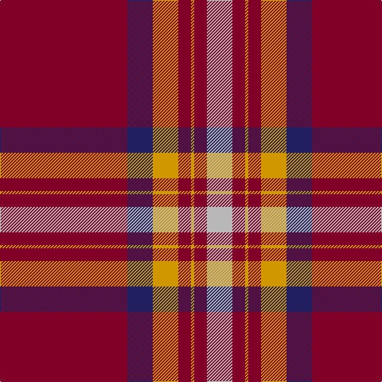

In pattern [RBYRYRY](/patterns/rbyryry/).

This was sourced from register-of-tartans.  It is a [7 stripes tartan](/stripes/stripes7/).

Original link https://www.tartanregister.gov.uk/tartanDetails.aspx?ref=4549

## Thread count
DR/160 DB32 DY32 DR16 DY4 DR16 N/32

## Palette
Each colour and its ΔE from the base-6 reference it is a variant of.

| Colour | Shade | Base | ΔE (OKLab) |
|---|---|---|---|
| DB | <code style="background-color:#202060;">#202060</code> `#202060` | B <code style="background-color:#2A418A;">#2A418A</code> | 0.11 |
| DR | <code style="background-color:#800028;">#800028</code> `#800028` | R <code style="background-color:#CC0000;">#CC0000</code> | 0.17 |
| DY | <code style="background-color:#D09800;">#D09800</code> `#D09800` | Y <code style="background-color:#F2BF00;">#F2BF00</code> | 0.12 |
| N | <code style="background-color:#B8B8B8;">#B8B8B8</code> `#B8B8B8` | Y <code style="background-color:#F2BF00;">#F2BF00</code> | 0.17 |

# Sample pattern

## Nearest tartans

The nearest existing variants by ΔTartan distance.

1. [Canadian Legion Branch 50](/setts/s7/r68b9w10b13y1b1y2x2~b202060-r880000-wa8ace8-yd09800/) — ΔT 0.92
1. [Canadian Legion Branch 50 Corporate Tartan Tartan Number: 1327. Earliest known date: pre 2003 From a study of the portrait of Lord Loudoun (c 1747) outlined in the proceedings of the STS See products available Copyright © Blair Urquhart, Comrie, 2015](/setts/s7/r68b9ba10b13y1b1y2x2~b2c2c80-ba5c8ca8-rc80000-ye8c000/) — ΔT 1.03
1. [Leslie Clan Tartan Tartan Number: 1142. Earliest known date: 1842 The Vestarium Scoticum See products available Copyright © Blair Urquhart, Comrie, 2015](/setts/s8/r4k6y1k6r4b16r32k1x2~b2c2c80-k101010-rc80000-ye8c000/) — ΔT 1.05
1. [Robberstad](/setts/s9/r60b15r4ba10w2ba10w2ba10r4x2~b3850c8-ba003c64-rc80000-wf8f8f8/) — ΔT 1.14
1. [Greig (Personal)](/setts/s6/r60k2w3g20r10g20x2~g003820-k101010-rc80000-we0e0e0/) — ΔT 1.20
1. [13, Legion Branch 50](/setts/s7/r68b9ba10b13y1b1y2x2~b304080-ba5480b0-rc00000-yf0c000/) — ΔT 1.23
1. [MacGregor Hunting Glengyle Clan Tartan Tartan Number: 1285. Earliest known date: 1960 This is the usual MacGregor sett but with a darker crimson background colour. The story goes that Alasdair MacGregor of Cardney wanted to make tartan from the wool of his own sheep. His initial dyeing attempt produced a shocking pink colour, so he dyed the wool a second time to get this dark crimson colour. He liked the result so much that he had a bolt of cloth woven and the Cardney MacGregors have worn it ever since. The addition of the term 'Hunting' to the name is, apparently a commercial attribution. Notes from the STA, quoting Sir Malcolm MacGregor of MacGregor (2006) See products available Copyright © Blair Urquhart, Comrie, 2015](/setts/s6/r96g42r16g17k4w6~g006818-k101010-ra00048-wc0c0c0/) — ΔT 1.27
1. [Brock University Alumni Association](/setts/s6/r52y2b16y2b3w5x2~b000080-rc80000-wfcfcfc-yd87c00/) — ΔT 1.28
1. [Solberg-Wormald (Personal)](/setts/s7/r155w16k34b48r18y6r9~b240090-k101010-rc80000-w98c8e8-ye8c000/) — ΔT 1.31
1. [Spens (Lochcarron)](/setts/s9/r40w1b7w1g12r8b6ba2w1x2~b2c2c80-ba5c8ca8-g408060-rc80000-wf8f8f8/) — ΔT 1.31

## Neighbour map

Every grey dot is one of 15726 variants placed by the first two principal components of the ΔTartan feature space (44% of its variance). Red is this tartan; blue dots are its nearest — click one to open its page.

<svg viewBox="0 0 640 380" role="img" style="max-width:100%;height:auto;border:1px solid #e0e0e0;border-radius:4px;display:block" xmlns="http://www.w3.org/2000/svg"><image href="/nn/cloud.v1.png" width="640" height="380"/><a href="/setts/s7/r68b9w10b13y1b1y2x2~b202060-r880000-wa8ace8-yd09800/"><circle cx="484.5" cy="112.0" r="4" fill="#3465a4"><title>Canadian Legion Branch 50</title></circle></a><a href="/setts/s7/r68b9ba10b13y1b1y2x2~b2c2c80-ba5c8ca8-rc80000-ye8c000/"><circle cx="485.0" cy="103.6" r="4" fill="#3465a4"><title>Canadian Legion Branch 50 Corporate Tartan Tartan Number: 1327. Earliest known date: pre 2003 From a study of the portrait of Lord Loudoun (c 1747) outlined in the proceedings of the STS See products available Copyright © Blair Urquhart, Comrie, 2015</title></circle></a><a href="/setts/s8/r4k6y1k6r4b16r32k1x2~b2c2c80-k101010-rc80000-ye8c000/"><circle cx="377.2" cy="129.1" r="4" fill="#3465a4"><title>Leslie Clan Tartan Tartan Number: 1142. Earliest known date: 1842 The Vestarium Scoticum See products available Copyright © Blair Urquhart, Comrie, 2015</title></circle></a><a href="/setts/s9/r60b15r4ba10w2ba10w2ba10r4x2~b3850c8-ba003c64-rc80000-wf8f8f8/"><circle cx="386.7" cy="114.1" r="4" fill="#3465a4"><title>Robberstad</title></circle></a><a href="/setts/s6/r60k2w3g20r10g20x2~g003820-k101010-rc80000-we0e0e0/"><circle cx="419.9" cy="155.5" r="4" fill="#3465a4"><title>Greig (Personal)</title></circle></a><a href="/setts/s7/r68b9ba10b13y1b1y2x2~b304080-ba5480b0-rc00000-yf0c000/"><circle cx="497.9" cy="109.9" r="4" fill="#3465a4"><title>13, Legion Branch 50</title></circle></a><a href="/setts/s6/r96g42r16g17k4w6~g006818-k101010-ra00048-wc0c0c0/"><circle cx="429.7" cy="169.8" r="4" fill="#3465a4"><title>MacGregor Hunting Glengyle Clan Tartan Tartan Number: 1285. Earliest known date: 1960 This is the usual MacGregor sett but with a darker crimson background colour. The story goes that Alasdair MacGregor of Cardney wanted to make tartan from the wool of his own sheep. His initial dyeing attempt produced a shocking pink colour, so he dyed the wool a second time to get this dark crimson colour. He liked the result so much that he had a bolt of cloth woven and the Cardney MacGregors have worn it ever since. The addition of the term 'Hunting' to the name is, apparently a commercial attribution. Notes from the STA, quoting Sir Malcolm MacGregor of MacGregor (2006) See products available Copyright © Blair Urquhart, Comrie, 2015</title></circle></a><a href="/setts/s6/r52y2b16y2b3w5x2~b000080-rc80000-wfcfcfc-yd87c00/"><circle cx="420.8" cy="127.2" r="4" fill="#3465a4"><title>Brock University Alumni Association</title></circle></a><a href="/setts/s7/r155w16k34b48r18y6r9~b240090-k101010-rc80000-w98c8e8-ye8c000/"><circle cx="382.8" cy="116.5" r="4" fill="#3465a4"><title>Solberg-Wormald (Personal)</title></circle></a><a href="/setts/s9/r40w1b7w1g12r8b6ba2w1x2~b2c2c80-ba5c8ca8-g408060-rc80000-wf8f8f8/"><circle cx="405.3" cy="87.4" r="4" fill="#3465a4"><title>Spens (Lochcarron)</title></circle></a><circle cx="444.2" cy="127.7" r="5" fill="#c00000"/></svg>

ID: /setts/s7/r40b8y8r4y1r4ya8x4~b202060-r800028-yd09800-yab8b8b8/
