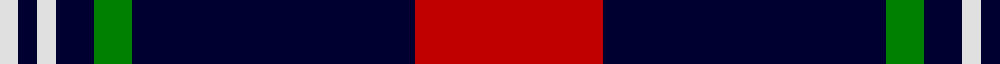
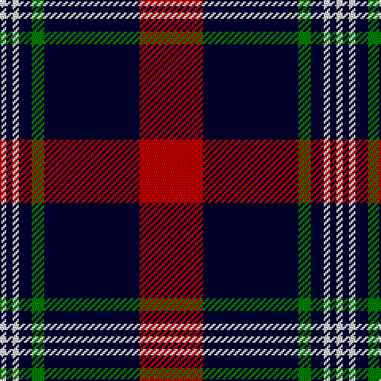

In pattern [RKGKWKW](/patterns/rkgkwkw/).

This was sourced from weddslist.  It is a [7 stripes tartan](/stripes/stripes7/).

Original link http://www.weddslist.com/cgi-bin/tartans/pg.pl?source=sts

## Thread count
LN/4 DB4 LN4 DB8 G8 DB60 R/40

## Palette
Each colour and its ΔE from the base-6 reference it is a variant of.

| Colour | Shade | Base | ΔE (OKLab) |
|---|---|---|---|
| DB | <code style="background-color:#000030;">#000030</code> `#000030` | K <code style="background-color:#000000;">#000000</code> | 0.17 |
| G | <code style="background-color:#008000;">#008000</code> `#008000` | G <code style="background-color:#006400;">#006400</code> | 0.09 |
| LN | <code style="background-color:#E0E0E0;">#E0E0E0</code> `#E0E0E0` | W <code style="background-color:#F4F4F0;">#F4F4F0</code> | 0.06 |
| R | <code style="background-color:#C00000;">#C00000</code> `#C00000` | R <code style="background-color:#C80000;">#C80000</code> | 0.02 |

# Sample pattern

## Nearest tartans

The nearest existing variants by ΔTartan distance.

1. [Phantom (Corporate)](/setts/s7/w6b20k76g22b12k4w6-b6c142c-g848484-k101010-we0e0e0/) — ΔT 0.91
1. [Universal Scientific Indust (Corp.)](/setts/s9/k76b4r48w4k32r12b4k6b10-b2888c4-k101010-r9c68a4-wf8f8f8/) — ΔT 1.00
1. [Bro-Wened](/setts/s6/k86r20w6k6w30b6-b202060-k101010-r880000-wf8e8d8/) — ΔT 1.04
1. [Cunard O' The Clyde Corporate Tartan Tartan Number: 11296. Earliest known date: 2015 The Cunard on the Clyde tartan has been created to celebrate the historical link between the Cunard and the Clyde as part of the Cunard's 175th anniversary celebrations. It was presented to Cunard by Peel Ports on May 21st 2015. See products available Copyright © Blair Urquhart, Comrie, 2015](/setts/s8/r40k12w4k60y4w12k12y4-k101010-rbc1828-we0e0e0-yc4bc68/) — ΔT 1.06
1. [Dunfermline Athletic (2008) (Corp)](/setts/s7/k88w8k8w8k32r64ra8-k101010-r888888-rac80000-we0e0e0/) — ΔT 1.19
1. [Calgary Firefighters (Corporate)](/setts/s5/r8k96r32ra24b6-b2c2c80-k101010-r888888-rac80000/) — ΔT 1.19
1. [Cunard o' the Clyde](/setts/s8/r40k12w4k60y4w12k12y4-k101010-rc80000-we0e0e0-yc4bc68/) — ΔT 1.20
1. [Hydro-Electric](/setts/s6/k6b60k16w16k4r6-b304080-k000000-rc00000-we0e0e0/) — ΔT 1.26
1. [Ikelman #4 (Personal)](/setts/s7/r40b60g8b8w4b4w4-b1c0070-g006818-r880000-we0e0e0/) — ΔT 1.26
1. [Phantom](/setts/s7/w6r20k76wa22r12k4w6-k101010-r945067-wf7feee-waeeeeec/) — ΔT 1.27

## Neighbour map

Every grey dot is one of 15726 variants placed by the first two principal components of the ΔTartan feature space (44% of its variance). Red is this tartan; blue dots are its nearest — click one to open its page.

<svg viewBox="0 0 640 380" role="img" style="max-width:100%;height:auto;border:1px solid #e0e0e0;border-radius:4px;display:block" xmlns="http://www.w3.org/2000/svg"><image href="/nn/cloud.v1.png" width="640" height="380"/><a href="/setts/s7/w6b20k76g22b12k4w6-b6c142c-g848484-k101010-we0e0e0/"><circle cx="312.1" cy="156.2" r="4" fill="#3465a4"><title>Phantom (Corporate)</title></circle></a><a href="/setts/s9/k76b4r48w4k32r12b4k6b10-b2888c4-k101010-r9c68a4-wf8f8f8/"><circle cx="336.6" cy="149.4" r="4" fill="#3465a4"><title>Universal Scientific Indust (Corp.)</title></circle></a><a href="/setts/s6/k86r20w6k6w30b6-b202060-k101010-r880000-wf8e8d8/"><circle cx="315.5" cy="163.9" r="4" fill="#3465a4"><title>Bro-Wened</title></circle></a><a href="/setts/s8/r40k12w4k60y4w12k12y4-k101010-rbc1828-we0e0e0-yc4bc68/"><circle cx="302.5" cy="154.9" r="4" fill="#3465a4"><title>Cunard O' The Clyde Corporate Tartan Tartan Number: 11296. Earliest known date: 2015 The Cunard on the Clyde tartan has been created to celebrate the historical link between the Cunard and the Clyde as part of the Cunard's 175th anniversary celebrations. It was presented to Cunard by Peel Ports on May 21st 2015. See products available Copyright © Blair Urquhart, Comrie, 2015</title></circle></a><a href="/setts/s7/k88w8k8w8k32r64ra8-k101010-r888888-rac80000-we0e0e0/"><circle cx="310.0" cy="183.2" r="4" fill="#3465a4"><title>Dunfermline Athletic (2008) (Corp)</title></circle></a><a href="/setts/s5/r8k96r32ra24b6-b2c2c80-k101010-r888888-rac80000/"><circle cx="334.5" cy="188.5" r="4" fill="#3465a4"><title>Calgary Firefighters (Corporate)</title></circle></a><a href="/setts/s8/r40k12w4k60y4w12k12y4-k101010-rc80000-we0e0e0-yc4bc68/"><circle cx="301.9" cy="153.8" r="4" fill="#3465a4"><title>Cunard o' the Clyde</title></circle></a><a href="/setts/s6/k6b60k16w16k4r6-b304080-k000000-rc00000-we0e0e0/"><circle cx="288.7" cy="168.1" r="4" fill="#3465a4"><title>Hydro-Electric</title></circle></a><a href="/setts/s7/r40b60g8b8w4b4w4-b1c0070-g006818-r880000-we0e0e0/"><circle cx="337.5" cy="168.4" r="4" fill="#3465a4"><title>Ikelman #4 (Personal)</title></circle></a><a href="/setts/s7/w6r20k76wa22r12k4w6-k101010-r945067-wf7feee-waeeeeec/"><circle cx="284.2" cy="141.7" r="4" fill="#3465a4"><title>Phantom</title></circle></a><circle cx="315.8" cy="159.4" r="5" fill="#c00000"/></svg>

ID: /setts/s7/r40k60g8k8w4k4w4-g008000-k000030-rc00000-we0e0e0/
