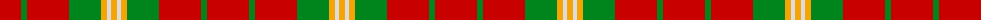
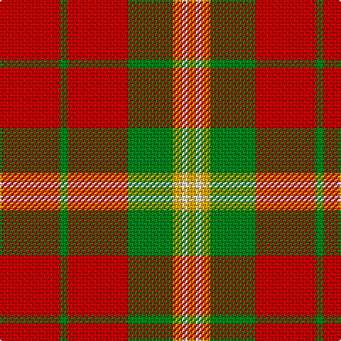

In pattern [RGRGYWY](/patterns/rgrgywy/).

This was sourced from tartans-authority.  It is a [7 stripes tartan](/stripes/stripes7/).

Original link http://www.tartansauthority.com/tartan-ferret/display/7869/

## Thread count
R/42 G6 R42 G32 Y6 LN4 Y/6

## Palette
Each colour and its ΔE from the base-6 reference it is a variant of.

| Colour | Shade | Base | ΔE (OKLab) |
|---|---|---|---|
| G | <code style="background-color:#00841C;">#00841C</code> `#00841C` | G <code style="background-color:#006400;">#006400</code> | 0.10 |
| LN | <code style="background-color:#DCDCE0;">#DCDCE0</code> `#DCDCE0` | W <code style="background-color:#F4F4F0;">#F4F4F0</code> | 0.07 |
| R | <code style="background-color:#C80000;">#C80000</code> `#C80000` | R <code style="background-color:#C80000;">#C80000</code> | 0.00 |
| Y | <code style="background-color:#F4A404;">#F4A404</code> `#F4A404` | Y <code style="background-color:#E8C000;">#E8C000</code> | 0.07 |

# Sample pattern

ID: /setts/s7/r42g6r42g32y6w4y6-g00841c-rc80000-wdcdce0-yf4a404/
