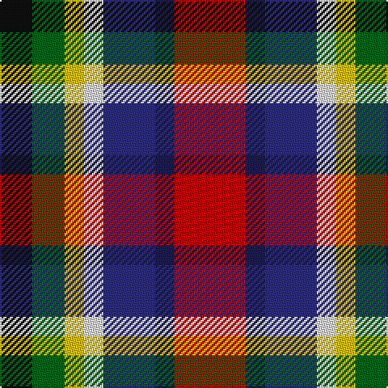

In pattern [KGYWBBR](/patterns/kgywbbr/).

This was sourced from register-of-tartans.  It is a [7 stripes tartan](/stripes/stripes7/).

Original link https://www.tartanregister.gov.uk/tartanDetails.aspx?ref=5753

## Thread count
K/20 G20 Y12 LN12 DBa32 DB12 R/44

## Palette
Each colour and its ΔE from the base-6 reference it is a variant of.

| Colour | Shade | Base | ΔE (OKLab) |
|---|---|---|---|
| DB | <code style="background-color:#1C1C50;">#1C1C50</code> `#1C1C50` | B <code style="background-color:#2C4084;">#2C4084</code> | 0.14 |
| DBa | <code style="background-color:#2C2C80;">#2C2C80</code> `#2C2C80` | B <code style="background-color:#2C4084;">#2C4084</code> | 0.05 |
| G | <code style="background-color:#006818;">#006818</code> `#006818` | G <code style="background-color:#006400;">#006400</code> | 0.02 |
| K | <code style="background-color:#101010;">#101010</code> `#101010` | K <code style="background-color:#000000;">#000000</code> | 0.17 |
| LN | <code style="background-color:#E0E0E0;">#E0E0E0</code> `#E0E0E0` | W <code style="background-color:#F4F4F0;">#F4F4F0</code> | 0.06 |
| R | <code style="background-color:#C80000;">#C80000</code> `#C80000` | R <code style="background-color:#C80000;">#C80000</code> | 0.00 |
| Y | <code style="background-color:#E8C000;">#E8C000</code> `#E8C000` | Y <code style="background-color:#E8C000;">#E8C000</code> | 0.00 |

# Sample pattern

## Nearest tartans

The nearest existing variants by ΔTartan distance.

1. [Nicolson of Assynt & Coigach (Name)](/setts/s7/b16r22g10ba6y6w10k6-b2c2c80-ba1c1c50-g006818-k101010-rc80000-we0e0e0-ye8c000/) — ΔT 0.34
1. [Tipperary County Crest (Fashion)](/setts/s9/r10y36k24r30ya8k16w18b16ya9-b2c2c80-k101010-r880000-we0e0e0-ya0a0a0-yabc8c00/) — ΔT 1.14
1. [Isle of Arran (Personal)](/setts/s9/r4y16b12r4b12ya4g12ba12ya4-b480800-ba1c0070-g006818-r880000-yd09800-yab8b8b8/) — ΔT 1.18
1. [Bhutan](/setts/s9/r6w4b12w4ba16y4g12y4r4-b1c0070-ba4c0000-g006818-r981c70-wc0c0c0-yd09800/) — ΔT 1.18
1. [Unnamed C19th (Silk Sash)](/setts/s11/b14y4ba10ya4g14ya4r10y4r10ya4b14-b202060-ba440044-g285800-rc80000-yb0b0b0-yafccc00/) — ΔT 1.27
1. [Kilkenny County Crest (Fashion)](/setts/s8/y12r16k8w12g32k26ya38k10-g5c6428-k101010-r880000-we0e0e0-ybc8c00-yaa0a0a0/) — ΔT 1.31
1. [Eusa](/setts/s7/k32y32r32g6b14w14k14-b2c2c80-g288028-k101010-rc80000-we0e0e0-ye8c000/) — ΔT 1.42
1. [Eusa (District)](/setts/s7/k32y32r32g6b14w14k14-b2c2c80-g00881c-k101010-rc80000-we0e0e0-ye8c000/) — ΔT 1.43
1. [Culloden](/setts/s8/r10b4ba28w4k26y26k4ya6-b5c8ca8-ba780078-k101010-rc80000-wfcfcfc-ybc8c00-yae8c000/) — ΔT 1.55
1. [Alabama (Fashion)](/setts/s7/r6w16k18g32r24b24y6-b5c5c5c-g006818-k101010-rc80000-wc0c0c0-yd09800/) — ΔT 1.56

## Neighbour map

Every grey dot is one of 15726 variants placed by the first two principal components of the ΔTartan feature space (44% of its variance). Red is this tartan; blue dots are its nearest — click one to open its page.

<svg viewBox="0 0 640 380" role="img" style="max-width:100%;height:auto;border:1px solid #e0e0e0;border-radius:4px;display:block" xmlns="http://www.w3.org/2000/svg"><image href="/nn/cloud.v1.png" width="640" height="380"/><a href="/setts/s7/b16r22g10ba6y6w10k6-b2c2c80-ba1c1c50-g006818-k101010-rc80000-we0e0e0-ye8c000/"><circle cx="14.0" cy="198.7" r="4" fill="#3465a4"><title>Nicolson of Assynt &amp; Coigach (Name)</title></circle></a><a href="/setts/s9/r10y36k24r30ya8k16w18b16ya9-b2c2c80-k101010-r880000-we0e0e0-ya0a0a0-yabc8c00/"><circle cx="14.0" cy="201.7" r="4" fill="#3465a4"><title>Tipperary County Crest (Fashion)</title></circle></a><a href="/setts/s9/r4y16b12r4b12ya4g12ba12ya4-b480800-ba1c0070-g006818-r880000-yd09800-yab8b8b8/"><circle cx="14.0" cy="210.7" r="4" fill="#3465a4"><title>Isle of Arran (Personal)</title></circle></a><a href="/setts/s9/r6w4b12w4ba16y4g12y4r4-b1c0070-ba4c0000-g006818-r981c70-wc0c0c0-yd09800/"><circle cx="14.0" cy="198.8" r="4" fill="#3465a4"><title>Bhutan</title></circle></a><a href="/setts/s11/b14y4ba10ya4g14ya4r10y4r10ya4b14-b202060-ba440044-g285800-rc80000-yb0b0b0-yafccc00/"><circle cx="14.0" cy="202.5" r="4" fill="#3465a4"><title>Unnamed C19th (Silk Sash)</title></circle></a><a href="/setts/s8/y12r16k8w12g32k26ya38k10-g5c6428-k101010-r880000-we0e0e0-ybc8c00-yaa0a0a0/"><circle cx="18.0" cy="203.5" r="4" fill="#3465a4"><title>Kilkenny County Crest (Fashion)</title></circle></a><a href="/setts/s7/k32y32r32g6b14w14k14-b2c2c80-g288028-k101010-rc80000-we0e0e0-ye8c000/"><circle cx="23.9" cy="200.6" r="4" fill="#3465a4"><title>Eusa</title></circle></a><a href="/setts/s7/k32y32r32g6b14w14k14-b2c2c80-g00881c-k101010-rc80000-we0e0e0-ye8c000/"><circle cx="23.6" cy="200.6" r="4" fill="#3465a4"><title>Eusa (District)</title></circle></a><a href="/setts/s8/r10b4ba28w4k26y26k4ya6-b5c8ca8-ba780078-k101010-rc80000-wfcfcfc-ybc8c00-yae8c000/"><circle cx="39.9" cy="145.4" r="4" fill="#3465a4"><title>Culloden</title></circle></a><a href="/setts/s7/r6w16k18g32r24b24y6-b5c5c5c-g006818-k101010-rc80000-wc0c0c0-yd09800/"><circle cx="23.2" cy="216.8" r="4" fill="#3465a4"><title>Alabama (Fashion)</title></circle></a><circle cx="14.0" cy="202.3" r="5" fill="#c00000"/></svg>

ID: /setts/s7/r44b12ba32w12y12g20k20-b1c1c50-ba2c2c80-g006818-k101010-rc80000-we0e0e0-ye8c000/
