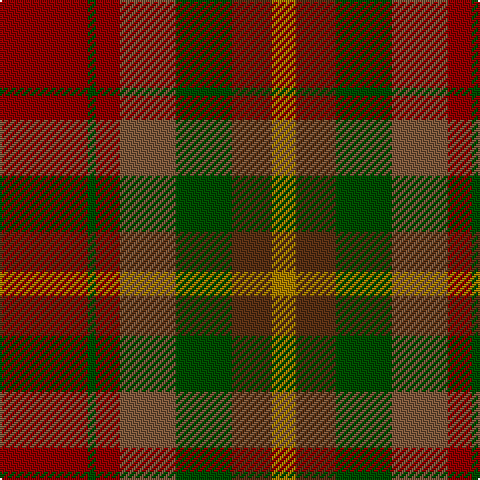

In pattern [RGGGRGR](/patterns/rgggrgr/).

This was sourced from register-of-tartans.  It is a [7 stripes tartan](/stripes/stripes7/).

Original link https://www.tartanregister.gov.uk/tartanDetails.aspx?ref=4939

## Thread count
DR/44 G4 DR12 LT28 G28 T20 DY/12

## Palette
Each colour and its ΔE from the base-6 reference it is a variant of.

| Colour | Shade | Base | ΔE (OKLab) |
|---|---|---|---|
| DR | <code style="background-color:#8C0000;">#8C0000</code> `#8C0000` | R <code style="background-color:#C80000;">#C80000</code> | 0.13 |
| DY | <code style="background-color:#A47C00;">#A47C00</code> `#A47C00` | R <code style="background-color:#C80000;">#C80000</code> | 0.20 |
| G | <code style="background-color:#004C00;">#004C00</code> `#004C00` | G <code style="background-color:#006400;">#006400</code> | 0.08 |
| LT | <code style="background-color:#7C583C;">#7C583C</code> `#7C583C` | G <code style="background-color:#006400;">#006400</code> | 0.16 |
| T | <code style="background-color:#583014;">#583014</code> `#583014` | G <code style="background-color:#006400;">#006400</code> | 0.18 |

# Sample pattern

ID: /setts/s7/r44g4r12ga28g28gb20ra12-g004c00-ga7c583c-gb583014-r8c0000-raa47c00/
