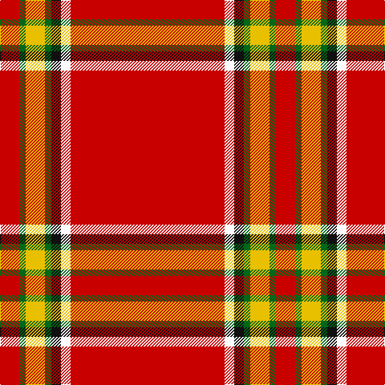

In pattern [RGYGKWR](/patterns/rgygkwr/).

This was sourced from register-of-tartans.  It is a [7 stripes tartan](/stripes/stripes7/).

Original link https://www.tartanregister.gov.uk/tartanDetails.aspx?ref=1169

## Thread count
R/24 G8 Y24 G8 K12 W12 R/192

## Palette
Each colour and its ΔE from the base-6 reference it is a variant of.

| Colour | Shade | Base | ΔE (OKLab) |
|---|---|---|---|
| G | <code style="background-color:#006818;">#006818</code> `#006818` | G <code style="background-color:#006100;">#006100</code> | 0.02 |
| K | <code style="background-color:#101010;">#101010</code> `#101010` | K <code style="background-color:#000000;">#000000</code> | 0.17 |
| R | <code style="background-color:#C80000;">#C80000</code> `#C80000` | R <code style="background-color:#CC0000;">#CC0000</code> | 0.01 |
| W | <code style="background-color:#FCFCFC;">#FCFCFC</code> `#FCFCFC` | W <code style="background-color:#F7F7F7;">#F7F7F7</code> | 0.01 |
| Y | <code style="background-color:#E8C000;">#E8C000</code> `#E8C000` | Y <code style="background-color:#F2BF00;">#F2BF00</code> | 0.02 |

# Sample pattern

## Nearest tartans

The nearest existing variants by ΔTartan distance.

1. [Ferguson, Plaid](/setts/s7/r48w3k3g2y6g2r6x4~g008000-k000000-rc00000-we0e0e0-yf0c000/) — ΔT 0.31
1. [Hackston (Green stripe) (Portrait)](/setts/s8/r51y2k11ya3r11ya3r11g3x2~g006818-k101010-rc80000-yb8b8b8-yabc8c00/) — ΔT 0.95
1. [Princess Elizabeth (Royal)](/setts/s8/r72k6w2k11y2b2y2r18x2~b2c2c80-k101010-rc80000-wc0c0c0-ye8c000/) — ΔT 0.98
1. [Earl of Inverness (Royal)](/setts/s8/r100b10w5b14y4ba8y4r24~b1c1c50-ba2c2c80-rc80000-we0e0e0-ye8c000/) — ΔT 1.03
1. [Hackston, or Halkerston](/setts/s8/r56w2k12y3r12y3r12g3x2~g008000-k000000-rc00000-we0e0e0-yf0c000/) — ΔT 1.13
1. [Junor](/setts/s9/r72g6y2g11b2g2b2r9k2x2~b8080d0-g30a010-k000000-rc00000-yf0c000/) — ΔT 1.13
1. [Inverness #2](/setts/s8/r114b10w3b16y3k3y3r28x2~b2c4084-k101010-rdc0000-we0e0e0-ye8c000/) — ΔT 1.18
1. [Princess Elizabeth Royal Family Tartan Tartan Number: 1613. Earliest known date: pre 2003 Also Earl of Inverness See products available Copyright © Blair Urquhart, Comrie, 2015](/setts/s8/r42k4w1k6y1b1y1r12x2~b2c2c80-k101010-rc80000-we0e0e0-ye8c000/) — ΔT 1.21
1. [Swiss National (Fashion)](/setts/s8/w10r47b2r2b2r18ba3w4x2~b2c2c80-ba202060-rc80000-we0e0e0/) — ΔT 1.21
1. [Inverness - 1829 (District)](/setts/s8/r36b3w1b6g1k1g1r9x4~b2c2c80-g006818-k101010-rc80000-wfcfcfc/) — ΔT 1.26

## Neighbour map

Every grey dot is one of 15726 variants placed by the first two principal components of the ΔTartan feature space (44% of its variance). Red is this tartan; blue dots are its nearest — click one to open its page.

<svg viewBox="0 0 640 380" role="img" style="max-width:100%;height:auto;border:1px solid #e0e0e0;border-radius:4px;display:block" xmlns="http://www.w3.org/2000/svg"><image href="/nn/cloud.v1.png" width="640" height="380"/><a href="/setts/s7/r48w3k3g2y6g2r6x4~g008000-k000000-rc00000-we0e0e0-yf0c000/"><circle cx="513.7" cy="105.5" r="4" fill="#3465a4"><title>Ferguson, Plaid</title></circle></a><a href="/setts/s8/r51y2k11ya3r11ya3r11g3x2~g006818-k101010-rc80000-yb8b8b8-yabc8c00/"><circle cx="524.9" cy="120.9" r="4" fill="#3465a4"><title>Hackston (Green stripe) (Portrait)</title></circle></a><a href="/setts/s8/r72k6w2k11y2b2y2r18x2~b2c2c80-k101010-rc80000-wc0c0c0-ye8c000/"><circle cx="553.4" cy="92.2" r="4" fill="#3465a4"><title>Princess Elizabeth (Royal)</title></circle></a><a href="/setts/s8/r100b10w5b14y4ba8y4r24~b1c1c50-ba2c2c80-rc80000-we0e0e0-ye8c000/"><circle cx="486.1" cy="105.9" r="4" fill="#3465a4"><title>Earl of Inverness (Royal)</title></circle></a><a href="/setts/s8/r56w2k12y3r12y3r12g3x2~g008000-k000000-rc00000-we0e0e0-yf0c000/"><circle cx="501.0" cy="105.1" r="4" fill="#3465a4"><title>Hackston, or Halkerston</title></circle></a><a href="/setts/s9/r72g6y2g11b2g2b2r9k2x2~b8080d0-g30a010-k000000-rc00000-yf0c000/"><circle cx="533.9" cy="79.5" r="4" fill="#3465a4"><title>Junor</title></circle></a><a href="/setts/s8/r114b10w3b16y3k3y3r28x2~b2c4084-k101010-rdc0000-we0e0e0-ye8c000/"><circle cx="573.7" cy="90.2" r="4" fill="#3465a4"><title>Inverness #2</title></circle></a><a href="/setts/s8/r42k4w1k6y1b1y1r12x2~b2c2c80-k101010-rc80000-we0e0e0-ye8c000/"><circle cx="569.5" cy="88.0" r="4" fill="#3465a4"><title>Princess Elizabeth Royal Family Tartan Tartan Number: 1613. Earliest known date: pre 2003 Also Earl of Inverness See products available Copyright © Blair Urquhart, Comrie, 2015</title></circle></a><a href="/setts/s8/w10r47b2r2b2r18ba3w4x2~b2c2c80-ba202060-rc80000-we0e0e0/"><circle cx="513.1" cy="125.0" r="4" fill="#3465a4"><title>Swiss National (Fashion)</title></circle></a><a href="/setts/s8/r36b3w1b6g1k1g1r9x4~b2c2c80-g006818-k101010-rc80000-wfcfcfc/"><circle cx="558.9" cy="97.6" r="4" fill="#3465a4"><title>Inverness - 1829 (District)</title></circle></a><circle cx="520.9" cy="106.5" r="5" fill="#c00000"/></svg>

ID: /setts/s7/r48w3k3g2y6g2r6x4~g006818-k101010-rc80000-wfcfcfc-ye8c000/
