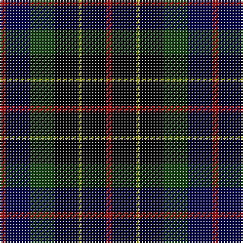

In pattern [RBGKYKR](/patterns/rbgkykr/).

This was sourced from weddslist.  It is a [7 stripes tartan](/stripes/stripes7/).

Original link http://www.weddslist.com/cgi-bin/tartans/pg.pl?source=tinsel

## Thread count
DR/4 DB16 DG16 K16 LG2 K16 DR/4

## Palette
Each colour and its ΔE from the base-6 reference it is a variant of.

| Colour | Shade | Base | ΔE (OKLab) |
|---|---|---|---|
| DB | <code style="background-color:#000052;">#000052</code> `#000052` | B <code style="background-color:#2C4084;">#2C4084</code> | 0.20 |
| DG | <code style="background-color:#11450D;">#11450D</code> `#11450D` | G <code style="background-color:#006400;">#006400</code> | 0.10 |
| DR | <code style="background-color:#AA0000;">#AA0000</code> `#AA0000` | R <code style="background-color:#C80000;">#C80000</code> | 0.06 |
| K | <code style="background-color:#000000;">#000000</code> `#000000` | K <code style="background-color:#000000;">#000000</code> | 0.00 |
| LG | <code style="background-color:#AAAA00;">#AAAA00</code> `#AAAA00` | Y <code style="background-color:#E8C000;">#E8C000</code> | 0.11 |

# Sample pattern

## Nearest tartans

The nearest existing variants by ΔTartan distance.

1. [Brodie Hunting](/setts/s7/r2b8g8k8y1k8r2-b000052-g11450d-k000000-raa0000-yaaaa00/) — ΔT 0.00
1. [Rose Hunting](/setts/s6/k8y2g20k20b20r4-b000052-g11450d-k000000-raa0000-yaaaaaa/) — ΔT 0.80
1. [Rose Hunting](/setts/s6/g4w1g10k10b10r2-b00004c-g004c00-k000000-rc80000-wd0d0d0/) — ΔT 0.97
1. [Brodie Hunting](/setts/s7/r2b8g8k8y1g8r2-b00004c-g004c00-k000000-rc80000-yffc800/) — ΔT 1.01
1. [Brodie hunting](/setts/s7/r4b16g16k16y2k16r4-b304080-g008000-k000000-rc00000-yf0c000/) — ΔT 1.14
1. [Leslie Hunting](/setts/s6/r4b16k16y2g16k2-b000052-g11450d-k000000-raa0000-yaaaaaa/) — ΔT 1.16
1. [Leslie Hunting](/setts/s6/r2b8k8y1g8k1-b000052-g11450d-k000000-raa0000-yaaaaaa/) — ΔT 1.16
1. [Fletcher C](/setts/s7/b6k1b6k8r1g8r2-b000064-g004c00-k000000-rc80000/) — ΔT 1.20
1. [Royal College of Physicians of Edinburgh](/setts/s6/b56r8k28r8g66y8-b000050-g003000-k000000-rc00000-yf0c000/) — ΔT 1.20
1. [Campbell of Cawdor](/setts/s7/b4k2g16k16ba16k2r4-b4367ae-ba000052-g11450d-k000000-raa0000/) — ΔT 1.21

## Neighbour map

Every grey dot is one of 15726 variants placed by the first two principal components of the ΔTartan feature space (44% of its variance). Red is this tartan; blue dots are its nearest — click one to open its page.

<svg viewBox="0 0 640 380" role="img" style="max-width:100%;height:auto;border:1px solid #e0e0e0;border-radius:4px;display:block" xmlns="http://www.w3.org/2000/svg"><image href="/nn/cloud.v1.png" width="640" height="380"/><a href="/setts/s7/r2b8g8k8y1k8r2-b000052-g11450d-k000000-raa0000-yaaaa00/"><circle cx="162.0" cy="228.3" r="4" fill="#3465a4"><title>Brodie Hunting</title></circle></a><a href="/setts/s6/k8y2g20k20b20r4-b000052-g11450d-k000000-raa0000-yaaaaaa/"><circle cx="165.0" cy="227.0" r="4" fill="#3465a4"><title>Rose Hunting</title></circle></a><a href="/setts/s6/g4w1g10k10b10r2-b00004c-g004c00-k000000-rc80000-wd0d0d0/"><circle cx="153.0" cy="221.6" r="4" fill="#3465a4"><title>Rose Hunting</title></circle></a><a href="/setts/s7/r2b8g8k8y1g8r2-b00004c-g004c00-k000000-rc80000-yffc800/"><circle cx="150.8" cy="222.3" r="4" fill="#3465a4"><title>Brodie Hunting</title></circle></a><a href="/setts/s7/r4b16g16k16y2k16r4-b304080-g008000-k000000-rc00000-yf0c000/"><circle cx="135.4" cy="213.4" r="4" fill="#3465a4"><title>Brodie hunting</title></circle></a><a href="/setts/s6/r4b16k16y2g16k2-b000052-g11450d-k000000-raa0000-yaaaaaa/"><circle cx="134.6" cy="223.1" r="4" fill="#3465a4"><title>Leslie Hunting</title></circle></a><a href="/setts/s6/r2b8k8y1g8k1-b000052-g11450d-k000000-raa0000-yaaaaaa/"><circle cx="134.6" cy="223.1" r="4" fill="#3465a4"><title>Leslie Hunting</title></circle></a><a href="/setts/s7/b6k1b6k8r1g8r2-b000064-g004c00-k000000-rc80000/"><circle cx="164.4" cy="239.9" r="4" fill="#3465a4"><title>Fletcher C</title></circle></a><a href="/setts/s6/b56r8k28r8g66y8-b000050-g003000-k000000-rc00000-yf0c000/"><circle cx="164.9" cy="210.2" r="4" fill="#3465a4"><title>Royal College of Physicians of Edinburgh</title></circle></a><a href="/setts/s7/b4k2g16k16ba16k2r4-b4367ae-ba000052-g11450d-k000000-raa0000/"><circle cx="138.9" cy="215.0" r="4" fill="#3465a4"><title>Campbell of Cawdor</title></circle></a><circle cx="162.0" cy="228.3" r="5" fill="#c00000"/></svg>

ID: /setts/s7/r4b16g16k16y2k16r4-b000052-g11450d-k000000-raa0000-yaaaa00/
