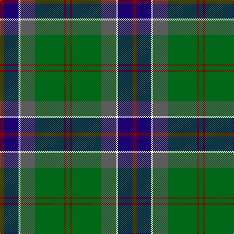

This page is one **sett** — a single exact thread-count. It belongs to the [tartan](/tartans/r4db15w2n15g30r2g4/)
(the same proportion at any scale), whose colour order is pattern [GRGBWBR](/stripes/grgbwbr/).

Sourced from register-of-tartans.  It is a [7 stripe tartan](/stripes/stripes7/).

Original link https://www.tartanregister.gov.uk/tartanDetails.aspx?ref=3795

## Also known as

This cloth is also recorded under:

- Sinclair, Green

2 attestations — the source records this cloth was collapsed from (oldest owns this page)

<ul>
<li>01/01/2002 — Sinclair Green (Personal) (register-of-tartans, <a href="https://www.tartanregister.gov.uk/tartanDetails.aspx?ref=3795">record</a>)</li>
<li>pre 2002 — Sinclair, Green (Personal) (tartans-authority, <a href="http://www.tartansauthority.com/tartan-ferret/display/890/">record</a>)</li>
</ul>

## Register references

External register numbers recorded for this tartan.

- Scottish Register of Tartans: [3795](https://www.tartanregister.gov.uk/tartanDetails.aspx?ref=3795)
- Scottish Tartans Authority (ITI): 890
- Scottish Tartans World Register: 890

## Thread count
DR/8 DB30 W4 N30 G60 DR4 G/8

## Palette

Palette: <strong>Tartan Register</strong> <small style="color:#888">(4 of 5 colours)</small>
<table><thead><tr><th>Colour</th><th>Threads</th><th>Shade</th><th>Base</th><th>OKLCh</th></tr></thead><tbody><tr><td>DR/</td><td style="text-align:right;font-variant-numeric:tabular-nums">8</td><td><code style="background-color:#880000;">#880000</code> <small style="color:#888">#880000</small></td><td>R <code style="background-color:#CC0000;">#CC0000</code></td><td><small style="color:#888">oklch(39.4% 0.162 29.2)</small></td></tr><tr><td>DB</td><td style="text-align:right;font-variant-numeric:tabular-nums">30</td><td><code style="background-color:#1C0070;">#1C0070</code> <small style="color:#888">#1C0070</small></td><td>B <code style="background-color:#2A418A;">#2A418A</code></td><td><small style="color:#888">oklch(26.3% 0.162 277.1)</small></td></tr><tr><td>W</td><td style="text-align:right;font-variant-numeric:tabular-nums">4</td><td><code style="background-color:#FCFCFC;">#FCFCFC</code> <small style="color:#888">#FCFCFC</small></td><td>W <code style="background-color:#F7F7F7;">#F7F7F7</code></td><td><small style="color:#888">oklch(99.1% 0.000 89.9)</small></td></tr><tr><td>N</td><td style="text-align:right;font-variant-numeric:tabular-nums">30</td><td><code style="background-color:#5C5C5C;">#5C5C5C</code> <small style="color:#888">#5C5C5C</small></td><td>B <code style="background-color:#2A418A;">#2A418A</code></td><td><small style="color:#888">oklch(47.5% 0.000 89.9)</small></td></tr><tr><td>G</td><td style="text-align:right;font-variant-numeric:tabular-nums">60</td><td><code style="background-color:#006818;">#006818</code> <small style="color:#888">#006818</small></td><td>G <code style="background-color:#006100;">#006100</code></td><td><small style="color:#888">oklch(45.0% 0.142 145.0)</small></td></tr><tr><td>DR</td><td style="text-align:right;font-variant-numeric:tabular-nums">4</td><td><code style="background-color:#880000;">#880000</code> <small style="color:#888">#880000</small></td><td>R <code style="background-color:#CC0000;">#CC0000</code></td><td><small style="color:#888">oklch(39.4% 0.162 29.2)</small></td></tr><tr><td>G/</td><td style="text-align:right;font-variant-numeric:tabular-nums">8</td><td><code style="background-color:#006818;">#006818</code> <small style="color:#888">#006818</small></td><td>G <code style="background-color:#006100;">#006100</code></td><td><small style="color:#888">oklch(45.0% 0.142 145.0)</small></td></tr></tbody></table>

# Sample pattern

## Nearest tartans

The nearest existing variants by ΔTartan distance, with this tartan at the top so the swatches line up against it.

ΔTartan

Tartan

Sett

—

<a href="/ttd/edit/#slug=r4db15w2n15g30r2g4~x2">Sinclair Green (Personal)</a> <a class="nn-out" href="/setts/s7/r4db15w2n15g30r2g4~x2/" title="open its dictionary page">↗</a>

0.89

<a href="/ttd/edit/#slug=g5db24g7k10g24ly2db2ly2r2~x2">Maitland Chief</a> <a class="nn-out" href="/setts/s9/g5db24g7k10g24ly2db2ly2r2~x2/" title="open its dictionary page">↗</a>

0.90

<a href="/ttd/edit/#slug=g54dt14ly7r14k7dt14r6~x2">Gloucester County Pipe Band (Corp)</a> <a class="nn-out" href="/setts/s7/g54dt14ly7r14k7dt14r6~x2/" title="open its dictionary page">↗</a>

0.92

<a href="/ttd/edit/#slug=db3g13t1r3t1db10ly1~x2">Heckenberg Htg (Personal)</a> <a class="nn-out" href="/setts/s7/db3g13t1r3t1db10ly1~x2/" title="open its dictionary page">↗</a>

0.96

<a href="/ttd/edit/#slug=gi9g1p2g1db4r1~x12">Gorman, George (Personal)</a> <a class="nn-out" href="/setts/s6/gi9g1p2g1db4r1~x12/" title="open its dictionary page">↗</a>

1.01

<a href="/ttd/edit/#slug=db10ly3db30ly5k8dg16r4dg16r2~x2">MacMillan Hunting</a> <a class="nn-out" href="/setts/s9/db10ly3db30ly5k8dg16r4dg16r2~x2/" title="open its dictionary page">↗</a>

1.02

<a href="/ttd/edit/#slug=db3g13lr1o3lr1db10lo1~x2">Graeme Heckenberg Hunting</a> <a class="nn-out" href="/setts/s7/db3g13lr1o3lr1db10lo1~x2/" title="open its dictionary page">↗</a>

1.02

<a href="/ttd/edit/#slug=dg5g32dp5k10dg8r3dg8dp3~x2">Scottish Power (Corporate)</a> <a class="nn-out" href="/setts/s8/dg5g32dp5k10dg8r3dg8dp3~x2/" title="open its dictionary page">↗</a>

1.03

<a href="/ttd/edit/#slug=b11k4g4m1g4k1r1~x4">Ednie (Personal)</a> <a class="nn-out" href="/setts/s7/b11k4g4m1g4k1r1~x4/" title="open its dictionary page">↗</a>

1.03

<a href="/ttd/edit/#slug=r3y13db13ly2dg34w3~x2">Glencross, Tynron (Name)</a> <a class="nn-out" href="/setts/s6/r3y13db13ly2dg34w3~x2/" title="open its dictionary page">↗</a>

1.03

<a href="/ttd/edit/#slug=r2db12dg2g11dg4db5g2dg24w2~x2">Fraser Gathering, Green (1997)</a> <a class="nn-out" href="/setts/s9/r2db12dg2g11dg4db5g2dg24w2~x2/" title="open its dictionary page">↗</a>

## Neighbour map

Every grey dot is one of 14359 variants placed by the first two principal components of the ΔTartan feature space (44% of its variance). Red is this tartan; blue dots are its nearest — click one to open its page.

<svg viewBox="0 0 640 380" role="img" style="max-width:100%;height:auto;border:1px solid #e0e0e0;border-radius:4px;display:block" xmlns="http://www.w3.org/2000/svg"><image href="/nn/cloud.v1.png" width="640" height="380"/><a href="/setts/s9/g5db24g7k10g24ly2db2ly2r2~x2/"><circle cx="241.5" cy="173.8" r="4" fill="#3465a4"><title>Maitland Chief</title></circle></a><a href="/setts/s7/g54dt14ly7r14k7dt14r6~x2/"><circle cx="239.8" cy="201.8" r="4" fill="#3465a4"><title>Gloucester County Pipe Band (Corp)</title></circle></a><a href="/setts/s7/db3g13t1r3t1db10ly1~x2/"><circle cx="236.2" cy="179.4" r="4" fill="#3465a4"><title>Heckenberg Htg (Personal)</title></circle></a><a href="/setts/s6/gi9g1p2g1db4r1~x12/"><circle cx="246.8" cy="203.6" r="4" fill="#3465a4"><title>Gorman, George (Personal)</title></circle></a><a href="/setts/s9/db10ly3db30ly5k8dg16r4dg16r2~x2/"><circle cx="218.5" cy="178.2" r="4" fill="#3465a4"><title>MacMillan Hunting</title></circle></a><a href="/setts/s7/db3g13lr1o3lr1db10lo1~x2/"><circle cx="261.5" cy="191.5" r="4" fill="#3465a4"><title>Graeme Heckenberg Hunting</title></circle></a><a href="/setts/s8/dg5g32dp5k10dg8r3dg8dp3~x2/"><circle cx="243.3" cy="197.6" r="4" fill="#3465a4"><title>Scottish Power (Corporate)</title></circle></a><a href="/setts/s7/b11k4g4m1g4k1r1~x4/"><circle cx="212.9" cy="195.3" r="4" fill="#3465a4"><title>Ednie (Personal)</title></circle></a><a href="/setts/s6/r3y13db13ly2dg34w3~x2/"><circle cx="259.2" cy="165.3" r="4" fill="#3465a4"><title>Glencross, Tynron (Name)</title></circle></a><a href="/setts/s9/r2db12dg2g11dg4db5g2dg24w2~x2/"><circle cx="251.1" cy="183.8" r="4" fill="#3465a4"><title>Fraser Gathering, Green (1997)</title></circle></a><circle cx="254.8" cy="183.6" r="5" fill="#c00000"/></svg>

ID: /setts/s7/r4db15w2n15g30r2g4~x2/
