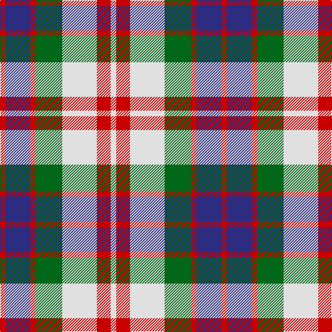

This page is one **sett** — a single exact thread-count. It belongs to the [tartan](/tartans/r4db18r4g19w25r10w4/)
(the same proportion at any scale), whose colour order is pattern [RBRGWRW](/stripes/rbrgwrw/).

Sourced from house-of-tartan.  It is a [7 stripe tartan](/stripes/stripes7/).

Original link http://www.house-of-tartan.scotland.net/house/TartanViewjs.asp?colr=Def&tnam=1427

## Thread count
R/8 DB36 R8 G38 LN50 R20 LN/8

## Palette

Palette: <strong>Tartan Register</strong>
<table><thead><tr><th>Colour</th><th>Threads</th><th>Shade</th><th>Base</th><th>OKLCh</th></tr></thead><tbody><tr><td>R/</td><td style="text-align:right;font-variant-numeric:tabular-nums">8</td><td><code style="background-color:#C80000;">#C80000</code> <small style="color:#888">#C80000</small></td><td>R <code style="background-color:#CC0000;">#CC0000</code></td><td><small style="color:#888">oklch(52.3% 0.215 29.2)</small></td></tr><tr><td>DB</td><td style="text-align:right;font-variant-numeric:tabular-nums">36</td><td><code style="background-color:#2C2C80;">#2C2C80</code> <small style="color:#888">#2C2C80</small></td><td>B <code style="background-color:#2A418A;">#2A418A</code></td><td><small style="color:#888">oklch(35.0% 0.138 276.6)</small></td></tr><tr><td>R</td><td style="text-align:right;font-variant-numeric:tabular-nums">8</td><td><code style="background-color:#C80000;">#C80000</code> <small style="color:#888">#C80000</small></td><td>R <code style="background-color:#CC0000;">#CC0000</code></td><td><small style="color:#888">oklch(52.3% 0.215 29.2)</small></td></tr><tr><td>G</td><td style="text-align:right;font-variant-numeric:tabular-nums">38</td><td><code style="background-color:#006818;">#006818</code> <small style="color:#888">#006818</small></td><td>G <code style="background-color:#006100;">#006100</code></td><td><small style="color:#888">oklch(45.0% 0.142 145.0)</small></td></tr><tr><td>LN</td><td style="text-align:right;font-variant-numeric:tabular-nums">50</td><td><code style="background-color:#E0E0E0;">#E0E0E0</code> <small style="color:#888">#E0E0E0</small></td><td>W <code style="background-color:#F7F7F7;">#F7F7F7</code></td><td><small style="color:#888">oklch(90.7% 0.000 89.9)</small></td></tr><tr><td>R</td><td style="text-align:right;font-variant-numeric:tabular-nums">20</td><td><code style="background-color:#C80000;">#C80000</code> <small style="color:#888">#C80000</small></td><td>R <code style="background-color:#CC0000;">#CC0000</code></td><td><small style="color:#888">oklch(52.3% 0.215 29.2)</small></td></tr><tr><td>LN/</td><td style="text-align:right;font-variant-numeric:tabular-nums">8</td><td><code style="background-color:#E0E0E0;">#E0E0E0</code> <small style="color:#888">#E0E0E0</small></td><td>W <code style="background-color:#F7F7F7;">#F7F7F7</code></td><td><small style="color:#888">oklch(90.7% 0.000 89.9)</small></td></tr></tbody></table>

# Sample pattern

## Nearest tartans

The nearest existing variants by ΔTartan distance, with this tartan at the top so the swatches line up against it.

ΔTartan

Tartan

Sett

—

<a href="/ttd/edit/#slug=r4db18r4g19w25r10w4~x2">Fraser Red Dress Clan Tartan Tartan Number: 1427. Earliest known date: pre 2003 A sample of this tartan was recorded by the Scottish Tartans Society during the period 1970 to 1990. See products available Copyright © Blair Urquhart, Comrie, 2015</a> <a class="nn-out" href="/setts/s7/r4db18r4g19w25r10w4~x2/" title="open its dictionary page">↗</a>

0.79

<a href="/ttd/edit/#slug=r6k14r6dg14w27k4">Fraser Dress</a> <a class="nn-out" href="/setts/s6/r6k14r6dg14w27k4/" title="open its dictionary page">↗</a>

0.86

<a href="/ttd/edit/#slug=r4db18ri4dg19w25r10w4~x2">Fraser Red Dress</a> <a class="nn-out" href="/setts/s7/r4db18ri4dg19w25r10w4~x2/" title="open its dictionary page">↗</a>

0.87

<a href="/ttd/edit/#slug=db24r4g24r4w20r10g3w4~x2">Robertson Dress (Dalgleish) #2</a> <a class="nn-out" href="/setts/s8/db24r4g24r4w20r10g3w4~x2/" title="open its dictionary page">↗</a>

0.87

<a href="/ttd/edit/#slug=r1o6k1w3k3r1~x8">Thompson Grey Dress</a> <a class="nn-out" href="/setts/s6/r1o6k1w3k3r1~x8/" title="open its dictionary page">↗</a>

0.94

<a href="/ttd/edit/#slug=r4db18ri4g19w25r10w4~x2">Fraser, Red dress</a> <a class="nn-out" href="/setts/s7/r4db18ri4g19w25r10w4~x2/" title="open its dictionary page">↗</a>

0.97

<a href="/ttd/edit/#slug=r3w8db4dg14r4db2~x4">MacKintosh Dress (Scott Adie)</a> <a class="nn-out" href="/setts/s6/r3w8db4dg14r4db2~x4/" title="open its dictionary page">↗</a>

1.03

<a href="/ttd/edit/#slug=lb13k3lb3k3lb3k15lo18r3~x2">Holden Beige (Corporate)</a> <a class="nn-out" href="/setts/s8/lb13k3lb3k3lb3k15lo18r3~x2/" title="open its dictionary page">↗</a>

1.09

<a href="/ttd/edit/#slug=dg16dp4dg8dp13k3w26dp10~x2">Because You Care</a> <a class="nn-out" href="/setts/s7/dg16dp4dg8dp13k3w26dp10~x2/" title="open its dictionary page">↗</a>

1.11

<a href="/ttd/edit/#slug=o16r3lb15r18w15o3lb3~x2">Glasgow Dress (Dance)</a> <a class="nn-out" href="/setts/s7/o16r3lb15r18w15o3lb3~x2/" title="open its dictionary page">↗</a>

1.12

<a href="/ttd/edit/#slug=db24r4g24r4db4w20r10g3w4~x2">Robertson, dress</a> <a class="nn-out" href="/setts/s9/db24r4g24r4db4w20r10g3w4~x2/" title="open its dictionary page">↗</a>

## Neighbour map

Every grey dot is one of 14359 variants placed by the first two principal components of the ΔTartan feature space (44% of its variance). Red is this tartan; blue dots are its nearest — click one to open its page.

<svg viewBox="0 0 640 380" role="img" style="max-width:100%;height:auto;border:1px solid #e0e0e0;border-radius:4px;display:block" xmlns="http://www.w3.org/2000/svg"><image href="/nn/cloud.v1.png" width="640" height="380"/><a href="/setts/s6/r6k14r6dg14w27k4/"><circle cx="119.7" cy="209.1" r="4" fill="#3465a4"><title>Fraser Dress</title></circle></a><a href="/setts/s7/r4db18ri4dg19w25r10w4~x2/"><circle cx="85.3" cy="192.3" r="4" fill="#3465a4"><title>Fraser Red Dress</title></circle></a><a href="/setts/s8/db24r4g24r4w20r10g3w4~x2/"><circle cx="105.6" cy="190.0" r="4" fill="#3465a4"><title>Robertson Dress (Dalgleish) #2</title></circle></a><a href="/setts/s6/r1o6k1w3k3r1~x8/"><circle cx="144.2" cy="215.5" r="4" fill="#3465a4"><title>Thompson Grey Dress</title></circle></a><a href="/setts/s7/r4db18ri4g19w25r10w4~x2/"><circle cx="86.0" cy="193.8" r="4" fill="#3465a4"><title>Fraser, Red dress</title></circle></a><a href="/setts/s6/r3w8db4dg14r4db2~x4/"><circle cx="150.1" cy="215.1" r="4" fill="#3465a4"><title>MacKintosh Dress (Scott Adie)</title></circle></a><a href="/setts/s8/lb13k3lb3k3lb3k15lo18r3~x2/"><circle cx="128.2" cy="192.4" r="4" fill="#3465a4"><title>Holden Beige (Corporate)</title></circle></a><a href="/setts/s7/dg16dp4dg8dp13k3w26dp10~x2/"><circle cx="119.3" cy="199.8" r="4" fill="#3465a4"><title>Because You Care</title></circle></a><a href="/setts/s7/o16r3lb15r18w15o3lb3~x2/"><circle cx="93.4" cy="212.6" r="4" fill="#3465a4"><title>Glasgow Dress (Dance)</title></circle></a><a href="/setts/s9/db24r4g24r4db4w20r10g3w4~x2/"><circle cx="110.0" cy="183.5" r="4" fill="#3465a4"><title>Robertson, dress</title></circle></a><circle cx="107.0" cy="207.5" r="5" fill="#c00000"/></svg>

ID: /setts/s7/r4db18r4g19w25r10w4~x2/
