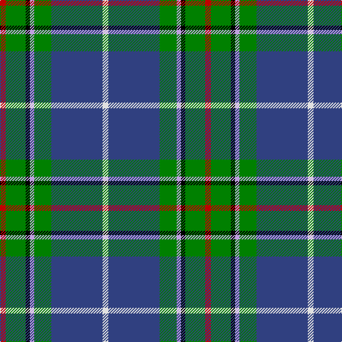

In pattern [RGKWGBW](/stripes/rgkwgbw/).

This was sourced from weddslist.  It is a [7 stripe tartan](/stripes/stripes7/).

Original link http://www.weddslist.com/cgi-bin/tartans/pg.pl?source=sts

## Attestations

This cloth appears in 2 source records; the oldest owns this page.

- undated — Vipont (weddslist, [record](http://www.weddslist.com/cgi-bin/tartans/pg.pl?source=sts))
- undated — Vipont Family Tartan Tartan Number: 1479. Earliest known date: 1983 This count comes from a sample at the Scottish Tartans Society, in the MacGregor Hastie collection. He in turn procured it from J.Wright of Edinburgh. A contradictory note in the files says, "It was apparently designed and woven by them (J.Wright) for the family of Vipont c.1930. It is rarely if ever used today." The Scottish Viponts are an ancient family, who formerly possessed lands in Aberdour, Fife. See products available Copyright © Blair Urquhart, Comrie, 2015 (house-of-tartan, [record](http://www.house-of-tartan.scotland.net/house/TartanViewjs.asp?colr=Def&tnam=1479))

## Thread count
R/8 G28 K6 LP6 G24 B72 LN/8

## Palette
Each colour and the base-6 reference it is a variant of.

| Colour | Shade | Base |
|---|---|---|
| B | <code style="background-color:#304080;">#304080</code> `oklch(39.4% 0.109 270.2)` <small>#304080</small> | B <code style="background-color:#2A418A;">#2A418A</code> |
| G | <code style="background-color:#008000;">#008000</code> `oklch(52.0% 0.177 142.5)` <small>#008000</small> | G <code style="background-color:#006100;">#006100</code> |
| K | <code style="background-color:#000000;">#000000</code> `oklch(0.0% 0.000 0.0)` <small>#000000</small> | K <code style="background-color:#000000;">#000000</code> |
| LN | <code style="background-color:#E0E0E0;">#E0E0E0</code> `oklch(90.7% 0.000 89.9)` <small>#E0E0E0</small> | W <code style="background-color:#F7F7F7;">#F7F7F7</code> |
| LP | <code style="background-color:#C0A0E0;">#C0A0E0</code> `oklch(75.7% 0.096 307.0)` <small>#C0A0E0</small> | W <code style="background-color:#F7F7F7;">#F7F7F7</code> |
| R | <code style="background-color:#C00000;">#C00000</code> `oklch(50.7% 0.208 29.2)` <small>#C00000</small> | R <code style="background-color:#CC0000;">#CC0000</code> |

# Sample pattern

## Nearest tartans

The nearest existing variants by ΔTartan distance, with this tartan at the top so the swatches line up against it.

ΔTartan

Tartan

Sett

—

<a href="/ttd/edit/#slug=r4g14k3lp3g12db36w4~x2">Vipont</a> <a class="nn-out" href="/setts/s7/r4g14k3lp3g12db36w4~x2/" title="open its dictionary page">↗</a>

0.92

<a href="/ttd/edit/#slug=r3w6r2g32db36k2db4ly2~x2">Canadian Centennial</a> <a class="nn-out" href="/setts/s8/r3w6r2g32db36k2db4ly2~x2/" title="open its dictionary page">↗</a>

0.95

<a href="/ttd/edit/#slug=w1db16ly1r3ly1g6g2g6w1~x2">Kleto, Susan (Personal)</a> <a class="nn-out" href="/setts/s9/w1db16ly1r3ly1g6g2g6w1~x2/" title="open its dictionary page">↗</a>

0.97

<a href="/ttd/edit/#slug=r3lb2g20k3db8g2lb2~x2">Royal British Legion (Corporate)</a> <a class="nn-out" href="/setts/s7/r3lb2g20k3db8g2lb2~x2/" title="open its dictionary page">↗</a>

0.99

<a href="/ttd/edit/#slug=db2r1db10w1y4g8lo1g2~x4">Ayrshire (District)</a> <a class="nn-out" href="/setts/s8/db2r1db10w1y4g8lo1g2~x4/" title="open its dictionary page">↗</a>

1.00

<a href="/ttd/edit/#slug=r6db27t2g2t2g30w4~x2">MX-5 Owners' Club</a> <a class="nn-out" href="/setts/s7/r6db27t2g2t2g30w4~x2/" title="open its dictionary page">↗</a>

1.05

<a href="/ttd/edit/#slug=k3r1ly1db11g13db5r1ly1~x2">Snodgrass</a> <a class="nn-out" href="/setts/s8/k3r1ly1db11g13db5r1ly1~x2/" title="open its dictionary page">↗</a>

1.10

<a href="/ttd/edit/#slug=b5dy28lb5k20lo5b47lo4~x2">State Seal of Washington (Fashion)</a> <a class="nn-out" href="/setts/s7/b5dy28lb5k20lo5b47lo4~x2/" title="open its dictionary page">↗</a>

1.11

<a href="/ttd/edit/#slug=y4ly2y39dt10o4dt4r4dt25w3~x2">Blue Blas Alba</a> <a class="nn-out" href="/setts/s9/y4ly2y39dt10o4dt4r4dt25w3~x2/" title="open its dictionary page">↗</a>

1.11

<a href="/ttd/edit/#slug=o5dt30w3dg15ly8r4~x2">Carleton College Rugby</a> <a class="nn-out" href="/setts/s6/o5dt30w3dg15ly8r4~x2/" title="open its dictionary page">↗</a>

1.11

<a href="/ttd/edit/#slug=db2r1db10w1dy4g8ly1g2~x4">Ayrshire District Tartan Tartan Number: 436. Earliest known date: 1988 Dr Phil Smith, a Fellow of the Scottish Tartans Society, designed the Ayrshire district tartan at the suggestion of the Clan Boyd and Clan Cunningham Societies. In his book, 'District Tartans' (1992) co-authored with Dr G Teall, he says, the colours &quot;..reflect the gold of the rising sun, the green of the land and brown of the coast, the blue of the sea and the red of the setting sun. The Ayrshire tartan is intended for those with connections in the districts of Kyle, Cunninghame and Inverclyde.&quot; See products available Copyright © Blair Urquhart, Comrie, 2015</a> <a class="nn-out" href="/setts/s8/db2r1db10w1dy4g8ly1g2~x4/" title="open its dictionary page">↗</a>

## Neighbour map

Every grey dot is one of 14299 variants placed by the first two principal components of the ΔTartan feature space (44% of its variance). Red is this tartan; blue dots are its nearest — click one to open its page.

<svg viewBox="0 0 640 380" role="img" style="max-width:100%;height:auto;border:1px solid #e0e0e0;border-radius:4px;display:block" xmlns="http://www.w3.org/2000/svg"><image href="/nn/cloud.v1.png" width="640" height="380"/><a href="/setts/s8/r3w6r2g32db36k2db4ly2~x2/"><circle cx="243.3" cy="120.5" r="4" fill="#3465a4"><title>Canadian Centennial</title></circle></a><a href="/setts/s9/w1db16ly1r3ly1g6g2g6w1~x2/"><circle cx="198.7" cy="120.9" r="4" fill="#3465a4"><title>Kleto, Susan (Personal)</title></circle></a><a href="/setts/s7/r3lb2g20k3db8g2lb2~x2/"><circle cx="219.2" cy="160.6" r="4" fill="#3465a4"><title>Royal British Legion (Corporate)</title></circle></a><a href="/setts/s8/db2r1db10w1y4g8lo1g2~x4/"><circle cx="152.8" cy="153.2" r="4" fill="#3465a4"><title>Ayrshire (District)</title></circle></a><a href="/setts/s7/r6db27t2g2t2g30w4~x2/"><circle cx="242.9" cy="158.5" r="4" fill="#3465a4"><title>MX-5 Owners' Club</title></circle></a><a href="/setts/s8/k3r1ly1db11g13db5r1ly1~x2/"><circle cx="222.0" cy="161.1" r="4" fill="#3465a4"><title>Snodgrass</title></circle></a><a href="/setts/s7/b5dy28lb5k20lo5b47lo4~x2/"><circle cx="219.0" cy="176.9" r="4" fill="#3465a4"><title>State Seal of Washington (Fashion)</title></circle></a><a href="/setts/s9/y4ly2y39dt10o4dt4r4dt25w3~x2/"><circle cx="246.5" cy="114.9" r="4" fill="#3465a4"><title>Blue Blas Alba</title></circle></a><a href="/setts/s6/o5dt30w3dg15ly8r4~x2/"><circle cx="172.0" cy="167.9" r="4" fill="#3465a4"><title>Carleton College Rugby</title></circle></a><a href="/setts/s8/db2r1db10w1dy4g8ly1g2~x4/"><circle cx="191.2" cy="172.9" r="4" fill="#3465a4"><title>Ayrshire District Tartan Tartan Number: 436. Earliest known date: 1988 Dr Phil Smith, a Fellow of the Scottish Tartans Society, designed the Ayrshire district tartan at the suggestion of the Clan Boyd and Clan Cunningham Societies. In his book, 'District Tartans' (1992) co-authored with Dr G Teall, he says, the colours &quot;..reflect the gold of the rising sun, the green of the land and brown of the coast, the blue of the sea and the red of the setting sun. The Ayrshire tartan is intended for those with connections in the districts of Kyle, Cunninghame and Inverclyde.&quot; See products available Copyright © Blair Urquhart, Comrie, 2015</title></circle></a><circle cx="221.1" cy="154.1" r="5" fill="#c00000"/></svg>

ID: /setts/s7/r4g14k3lp3g12db36w4~x2/
