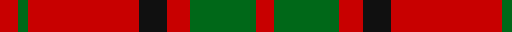
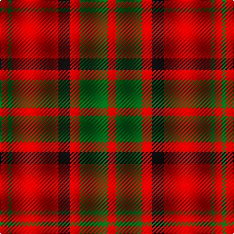

**Bands:** [RGRKRGR](/stripes/rgrkrgr/) · **Stripes:** [R G R K R G R](/stripes/stripes7/) R G R K R G R

This was sourced from house-of-tartan.  It is a [7 band tartan](/bands/bands7/).

Original link http://www.house-of-tartan.scotland.net/house/TartanViewjs.asp?colr=Def&tnam=2402

## Variants

Other setts woven to the same stripe pattern.

- [Maxwell](/setts/s7/r3g16r4k6r28g1r3~x2/)

## Thread count
R/8 G4 R48 K12 R10 G28 R/8

## Palette
Each colour and its ΔE from the base-6 reference it is a variant of.

| Colour | Shade | Base | ΔE (OKLab) |
|---|---|---|---|
| G | <code style="background-color:#006818;">#006818</code> `#006818` | G <code style="background-color:#006100;">#006100</code> | 0.02 |
| K | <code style="background-color:#101010;">#101010</code> `#101010` | K <code style="background-color:#000000;">#000000</code> | 0.17 |
| R | <code style="background-color:#C80000;">#C80000</code> `#C80000` | R <code style="background-color:#CC0000;">#CC0000</code> | 0.01 |

# Sample pattern

## Nearest tartans

The nearest existing variants by ΔTartan distance.

1. [Crawford](/setts/s7/r6lb2r30dg12r3dg12r3/) — ΔT 0.53
1. [Cameron](/setts/s6/r2dg6r2dg6r16ly1~x2/) — ΔT 0.68
1. [Cameron (Clan)](/setts/s6/r2g6r2g6r16ly1~x4/) — ΔT 0.87
1. [Cameron Clan D](/setts/s6/ly1r15dg6r1dg6r1~x2/) — ΔT 0.89
1. [Auld Reekie](/setts/s6/db4r3db3r22g8r2~x2/) — ΔT 0.89
1. [Cameron](/setts/s6/ly1r8g3r1g3r1~x8/) — ΔT 0.98
1. [MacKintosh, Plaid](/setts/s6/r16db6r2g6r2db1~x2/) — ΔT 0.99
1. [Dunbar](/setts/s6/r6g21k8r28k2r4~x2/) — ΔT 1.04
1. [Crawford](/setts/s7/r6w2r30g12r3g12r3~x2/) — ΔT 1.07
1. [Cameron](/setts/s6/r2g6r2g6r16ly1~x2/) — ΔT 1.07

## Neighbour map

Every grey dot is one of 14313 variants placed by the first two principal components of the ΔTartan feature space (44% of its variance). Red is this tartan; blue dots are its nearest — click one to open its page.

<svg viewBox="0 0 640 380" role="img" style="max-width:100%;height:auto;border:1px solid #e0e0e0;border-radius:4px;display:block" xmlns="http://www.w3.org/2000/svg"><image href="/nn/cloud.v1.png" width="640" height="380"/><a href="/setts/s7/r6lb2r30dg12r3dg12r3/"><circle cx="417.6" cy="193.7" r="4" fill="#3465a4"><title>Crawford</title></circle></a><a href="/setts/s6/r2dg6r2dg6r16ly1~x2/"><circle cx="415.0" cy="198.8" r="4" fill="#3465a4"><title>Cameron</title></circle></a><a href="/setts/s6/r2g6r2g6r16ly1~x4/"><circle cx="422.2" cy="202.4" r="4" fill="#3465a4"><title>Cameron (Clan)</title></circle></a><a href="/setts/s6/ly1r15dg6r1dg6r1~x2/"><circle cx="394.8" cy="195.5" r="4" fill="#3465a4"><title>Cameron Clan D</title></circle></a><a href="/setts/s6/db4r3db3r22g8r2~x2/"><circle cx="417.7" cy="207.4" r="4" fill="#3465a4"><title>Auld Reekie</title></circle></a><a href="/setts/s6/ly1r8g3r1g3r1~x8/"><circle cx="371.1" cy="226.6" r="4" fill="#3465a4"><title>Cameron</title></circle></a><a href="/setts/s6/r16db6r2g6r2db1~x2/"><circle cx="403.1" cy="201.9" r="4" fill="#3465a4"><title>MacKintosh, Plaid</title></circle></a><a href="/setts/s6/r6g21k8r28k2r4~x2/"><circle cx="345.8" cy="207.9" r="4" fill="#3465a4"><title>Dunbar</title></circle></a><a href="/setts/s7/r6w2r30g12r3g12r3~x2/"><circle cx="411.3" cy="198.3" r="4" fill="#3465a4"><title>Crawford</title></circle></a><a href="/setts/s6/r2g6r2g6r16ly1~x2/"><circle cx="417.2" cy="201.0" r="4" fill="#3465a4"><title>Cameron</title></circle></a><circle cx="395.1" cy="206.0" r="5" fill="#c00000"/></svg>

ID: /setts/s7/r4g14r5k6r24g2r4~x2/
