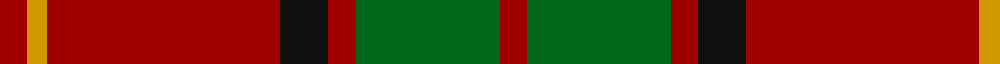

**Bands:** [RGRKRYR](/stripes/rgrkryr/) · **Stripes:** [R G R K R LO R](/stripes/stripes7/) R G R K R LO R

This was sourced from tartans-authority.  It is a [7 band tartan](/bands/bands7/).

Original link http://www.tartansauthority.com/tartan-ferret/display/4229/

## Thread count
DR/8 DY6 DR68 K14 DR8 G42 DR/8

## Palette
Each colour and its ΔE from the base-6 reference it is a variant of.

| Colour | Shade | Base | ΔE (OKLab) |
|---|---|---|---|
| DR | <code style="background-color:#A00000;">#A00000</code> `#A00000` | R <code style="background-color:#CC0000;">#CC0000</code> | 0.09 |
| DY | <code style="background-color:#D09800;">#D09800</code> `#D09800` | Y <code style="background-color:#F2BF00;">#F2BF00</code> | 0.12 |
| G | <code style="background-color:#006818;">#006818</code> `#006818` | G <code style="background-color:#006100;">#006100</code> | 0.02 |
| K | <code style="background-color:#101010;">#101010</code> `#101010` | K <code style="background-color:#000000;">#000000</code> | 0.17 |

# Sample pattern

## Nearest tartans

The nearest existing variants by ΔTartan distance.

1. [McInally (Name)](/setts/s7/lo3g2r28k6r4g16r3~x2/) — ΔT 0.92
1. [MacPhie](/setts/s9/lr1r12dg2r1dg16r1dg2r12ly1~x2/) — ΔT 0.96
1. [Burnett of Leys Family Tartan Tartan Number: 2355. Earliest known date: Unknown In Scottish Tartan Society Files but source unknown. At present woven by Lochcarron. The entry in the Lyon Court Books does not define the pattern. See products available Copyright © Blair Urquhart, Comrie, 2015](/setts/s8/r2g6ly1g6r3g2r16t1~x4/) — ΔT 0.99
1. [Espy (Fashion?)](/setts/s5/r10g3k1g3b1~x16/) — ΔT 1.03
1. [Chisholm, The](/setts/s8/r12db2w1db2r3g8r3db1~x2/) — ΔT 1.07
1. [MacAulay](/setts/s6/k2r16dg6r3dg8lr1~x2/) — ΔT 1.10
1. [MacAulay](/setts/s6/k2r16dg6r3dg8lr1/) — ΔT 1.10
1. [Kirk](/setts/s12/r4lo3r34k7r4g21r4g21r4k7r34lo3~x2/) — ΔT 1.14
1. [Comyn](/setts/s8/k1r9dg2r2dg4lr1dg4r1~x2/) — ΔT 1.15
1. [Comyn](/setts/s8/k1r9dg2r2dg4lr1dg4r1/) — ΔT 1.15

## Neighbour map

Every grey dot is one of 14313 variants placed by the first two principal components of the ΔTartan feature space (44% of its variance). Red is this tartan; blue dots are its nearest — click one to open its page.

<svg viewBox="0 0 640 380" role="img" style="max-width:100%;height:auto;border:1px solid #e0e0e0;border-radius:4px;display:block" xmlns="http://www.w3.org/2000/svg"><image href="/nn/cloud.v1.png" width="640" height="380"/><a href="/setts/s7/lo3g2r28k6r4g16r3~x2/"><circle cx="345.8" cy="171.5" r="4" fill="#3465a4"><title>McInally (Name)</title></circle></a><a href="/setts/s9/lr1r12dg2r1dg16r1dg2r12ly1~x2/"><circle cx="387.9" cy="172.5" r="4" fill="#3465a4"><title>MacPhie</title></circle></a><a href="/setts/s8/r2g6ly1g6r3g2r16t1~x4/"><circle cx="378.3" cy="168.7" r="4" fill="#3465a4"><title>Burnett of Leys Family Tartan Tartan Number: 2355. Earliest known date: Unknown In Scottish Tartan Society Files but source unknown. At present woven by Lochcarron. The entry in the Lyon Court Books does not define the pattern. See products available Copyright © Blair Urquhart, Comrie, 2015</title></circle></a><a href="/setts/s5/r10g3k1g3b1~x16/"><circle cx="338.6" cy="208.4" r="4" fill="#3465a4"><title>Espy (Fashion?)</title></circle></a><a href="/setts/s8/r12db2w1db2r3g8r3db1~x2/"><circle cx="324.5" cy="178.3" r="4" fill="#3465a4"><title>Chisholm, The</title></circle></a><a href="/setts/s6/k2r16dg6r3dg8lr1~x2/"><circle cx="343.3" cy="197.7" r="4" fill="#3465a4"><title>MacAulay</title></circle></a><a href="/setts/s6/k2r16dg6r3dg8lr1/"><circle cx="343.3" cy="197.7" r="4" fill="#3465a4"><title>MacAulay</title></circle></a><a href="/setts/s12/r4lo3r34k7r4g21r4g21r4k7r34lo3~x2/"><circle cx="345.8" cy="175.0" r="4" fill="#3465a4"><title>Kirk</title></circle></a><a href="/setts/s8/k1r9dg2r2dg4lr1dg4r1~x2/"><circle cx="305.6" cy="206.2" r="4" fill="#3465a4"><title>Comyn</title></circle></a><a href="/setts/s8/k1r9dg2r2dg4lr1dg4r1/"><circle cx="305.6" cy="206.2" r="4" fill="#3465a4"><title>Comyn</title></circle></a><circle cx="376.5" cy="194.1" r="5" fill="#c00000"/></svg>

ID: /setts/s7/r4g21r4k7r34lo3r4~x2/
