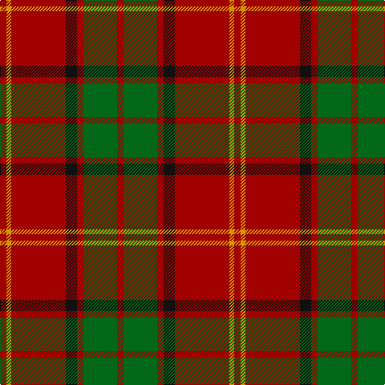

In pattern [RGRKRYR](/patterns/rgrkryr/).

This was sourced from tartans-authority.  It is a [7 stripes tartan](/stripes/stripes7/).

Original link http://www.tartansauthority.com/tartan-ferret/display/4229/

## Thread count
DR/8 DY6 DR68 K14 DR8 G42 DR/8

## Palette
Each colour and its ΔE from the base-6 reference it is a variant of.

| Colour | Shade | Base | ΔE (OKLab) |
|---|---|---|---|
| DR | <code style="background-color:#A00000;">#A00000</code> `#A00000` | R <code style="background-color:#CC0000;">#CC0000</code> | 0.09 |
| DY | <code style="background-color:#D09800;">#D09800</code> `#D09800` | Y <code style="background-color:#F2BF00;">#F2BF00</code> | 0.12 |
| G | <code style="background-color:#006818;">#006818</code> `#006818` | G <code style="background-color:#006100;">#006100</code> | 0.02 |
| K | <code style="background-color:#101010;">#101010</code> `#101010` | K <code style="background-color:#000000;">#000000</code> | 0.17 |

# Sample pattern

## Nearest tartans

The nearest existing variants by ΔTartan distance.

1. [McInally (Name)](/setts/s7/r3g16r4k6r28g2y3x2~g006818-k101010-rc80000-yd09800/) — ΔT 0.92
1. [MacPhie](/setts/s9/y1r12g2r1g16r1g2r12ya1x2~g11450d-raa0000-yaaaa00-yaaaaaaa/) — ΔT 0.96
1. [Burnett of Leys Family Tartan Tartan Number: 2355. Earliest known date: Unknown In Scottish Tartan Society Files but source unknown. At present woven by Lochcarron. The entry in the Lyon Court Books does not define the pattern. See products available Copyright © Blair Urquhart, Comrie, 2015](/setts/s8/r2g6y1g6r3g2r16b1x4~b5c8ca8-g006818-rc80000-ye8c000/) — ΔT 0.99
1. [Espy (Fashion?)](/setts/s5/r10g3k1g3b1x16~b1474b4-g006818-k101010-rc80000/) — ΔT 1.03
1. [Chisholm, The](/setts/s8/r12b2w1b2r3g8r3b1x2~b304080-g008000-rc00000-we0e0e0/) — ΔT 1.08
1. [Denny Hunting Clan Tartan Tartan Number: 518. Earliest known date: pre 2003 This tartan is remarkably similar to the Durham sett designed by Wilson's of Bannockburn around 1819. The variation in proportions may point to a deliberate modification suggested by the links between the names. See products available Copyright © Blair Urquhart, Comrie, 2015](/setts/s6/b1r16g6k1g6k1x2~b2c2c80-g006818-k101010-rc80000/) — ΔT 1.10
1. [MacAulay](/setts/s6/k2r16g6r3g8y1x2~g11450d-k000000-raa0000-yaaaaaa/) — ΔT 1.10
1. [MacAulay](/setts/s6/k2r16g6r3g8y1~g11450d-k000000-raa0000-yaaaaaa/) — ΔT 1.10
1. [Kirk](/setts/s12/r4y3r34k7r4g21r4g21r4k7r34y3x2~g006818-k101010-ra00000-yd09800/) — ΔT 1.14
1. [Cameron Clan D](/setts/s6/r1g6r1g6r15y1x2~g11450d-raa0000-yaaaa00/) — ΔT 1.15

## Neighbour map

Every grey dot is one of 15726 variants placed by the first two principal components of the ΔTartan feature space (44% of its variance). Red is this tartan; blue dots are its nearest — click one to open its page.

<svg viewBox="0 0 640 380" role="img" style="max-width:100%;height:auto;border:1px solid #e0e0e0;border-radius:4px;display:block" xmlns="http://www.w3.org/2000/svg"><image href="/nn/cloud.v1.png" width="640" height="380"/><a href="/setts/s7/r3g16r4k6r28g2y3x2~g006818-k101010-rc80000-yd09800/"><circle cx="345.5" cy="174.1" r="4" fill="#3465a4"><title>McInally (Name)</title></circle></a><a href="/setts/s9/y1r12g2r1g16r1g2r12ya1x2~g11450d-raa0000-yaaaa00-yaaaaaaa/"><circle cx="387.4" cy="171.6" r="4" fill="#3465a4"><title>MacPhie</title></circle></a><a href="/setts/s8/r2g6y1g6r3g2r16b1x4~b5c8ca8-g006818-rc80000-ye8c000/"><circle cx="378.0" cy="170.2" r="4" fill="#3465a4"><title>Burnett of Leys Family Tartan Tartan Number: 2355. Earliest known date: Unknown In Scottish Tartan Society Files but source unknown. At present woven by Lochcarron. The entry in the Lyon Court Books does not define the pattern. See products available Copyright © Blair Urquhart, Comrie, 2015</title></circle></a><a href="/setts/s5/r10g3k1g3b1x16~b1474b4-g006818-k101010-rc80000/"><circle cx="338.2" cy="210.7" r="4" fill="#3465a4"><title>Espy (Fashion?)</title></circle></a><a href="/setts/s8/r12b2w1b2r3g8r3b1x2~b304080-g008000-rc00000-we0e0e0/"><circle cx="324.0" cy="180.2" r="4" fill="#3465a4"><title>Chisholm, The</title></circle></a><a href="/setts/s6/b1r16g6k1g6k1x2~b2c2c80-g006818-k101010-rc80000/"><circle cx="342.8" cy="179.3" r="4" fill="#3465a4"><title>Denny Hunting Clan Tartan Tartan Number: 518. Earliest known date: pre 2003 This tartan is remarkably similar to the Durham sett designed by Wilson's of Bannockburn around 1819. The variation in proportions may point to a deliberate modification suggested by the links between the names. See products available Copyright © Blair Urquhart, Comrie, 2015</title></circle></a><a href="/setts/s6/k2r16g6r3g8y1x2~g11450d-k000000-raa0000-yaaaaaa/"><circle cx="342.6" cy="198.8" r="4" fill="#3465a4"><title>MacAulay</title></circle></a><a href="/setts/s6/k2r16g6r3g8y1~g11450d-k000000-raa0000-yaaaaaa/"><circle cx="342.6" cy="198.8" r="4" fill="#3465a4"><title>MacAulay</title></circle></a><a href="/setts/s12/r4y3r34k7r4g21r4g21r4k7r34y3x2~g006818-k101010-ra00000-yd09800/"><circle cx="345.3" cy="174.6" r="4" fill="#3465a4"><title>Kirk</title></circle></a><a href="/setts/s6/r1g6r1g6r15y1x2~g11450d-raa0000-yaaaa00/"><circle cx="422.2" cy="214.1" r="4" fill="#3465a4"><title>Cameron Clan D</title></circle></a><circle cx="376.2" cy="194.6" r="5" fill="#c00000"/></svg>

ID: /setts/s7/r4g21r4k7r34y3r4x2~g006818-k101010-ra00000-yd09800/
