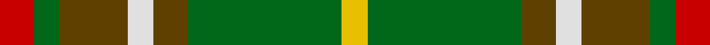

In pattern [RGGWGGY](/stripes/rggwggy/).

This was sourced from house-of-tartan.  It is a [7 stripe tartan](/stripes/stripes7/).

Original link http://www.house-of-tartan.scotland.net/house/TartanViewjs.asp?colr=Def&tnam=1543

## Thread count
R/8 G6 T16 LN6 T8 G36 Y/6

## Palette
Each colour and its ΔE from the base-6 reference it is a variant of.

| Colour | Shade | Base | ΔE (OKLab) |
|---|---|---|---|
| G | <code style="background-color:#006818;">#006818</code> `#006818` | G <code style="background-color:#006100;">#006100</code> | 0.02 |
| LN | <code style="background-color:#E0E0E0;">#E0E0E0</code> `#E0E0E0` | W <code style="background-color:#F7F7F7;">#F7F7F7</code> | 0.07 |
| R | <code style="background-color:#C80000;">#C80000</code> `#C80000` | R <code style="background-color:#CC0000;">#CC0000</code> | 0.01 |
| T | <code style="background-color:#604000;">#604000</code> `#604000` | G <code style="background-color:#006100;">#006100</code> | 0.14 |
| Y | <code style="background-color:#E8C000;">#E8C000</code> `#E8C000` | Y <code style="background-color:#F2BF00;">#F2BF00</code> | 0.02 |

# Sample pattern

## Nearest tartans

The nearest existing variants by ΔTartan distance.

1. [Newfoundland](/setts/s7/r4g3o8w3o4g18ly3~x2/) — ΔT 0.66
1. [Newfoundland](/setts/s7/r6g4do14w4do7g30lo4~x2/) — ΔT 0.85
1. [Newfoundland (District)](/setts/s7/r6dg4do14w4do7dg30lo4~x2/) — ΔT 0.99
1. [McShane (Personal)](/setts/s8/g9lb2g9k2dy14ly4lb2r2~x4/) — ΔT 1.21
1. [Red Dirt Girl](/setts/s9/dy21r2g18r2g18r2dg8w6dy10~x2/) — ΔT 1.24
1. [Wilson's, No 179](/setts/s5/g6ly1r1t2r2~x4/) — ΔT 1.25
1. [New Mexico (Fashion)](/setts/s7/g10dp42r5g42g42ly5g6/) — ΔT 1.31
1. [Invertere (Daks #2) (Fashion)](/setts/s8/ly5g14dy4db4dy27g3dy4ly5~x2/) — ΔT 1.33
1. [Oakwood](/setts/s8/dg13ly2dg2ly2dg4r10g2r2~x4/) — ΔT 1.35
1. [Manitoba](/setts/s8/t2g1t1g12r2g1r6ly2~x2/) — ΔT 1.38

## Neighbour map

Every grey dot is one of 14299 variants placed by the first two principal components of the ΔTartan feature space (44% of its variance). Red is this tartan; blue dots are its nearest — click one to open its page.

<svg viewBox="0 0 640 380" role="img" style="max-width:100%;height:auto;border:1px solid #e0e0e0;border-radius:4px;display:block" xmlns="http://www.w3.org/2000/svg"><image href="/nn/cloud.v1.png" width="640" height="380"/><a href="/setts/s7/r4g3o8w3o4g18ly3~x2/"><circle cx="225.0" cy="214.5" r="4" fill="#3465a4"><title>Newfoundland</title></circle></a><a href="/setts/s7/r6g4do14w4do7g30lo4~x2/"><circle cx="233.0" cy="196.9" r="4" fill="#3465a4"><title>Newfoundland</title></circle></a><a href="/setts/s7/r6dg4do14w4do7dg30lo4~x2/"><circle cx="237.5" cy="199.6" r="4" fill="#3465a4"><title>Newfoundland (District)</title></circle></a><a href="/setts/s8/g9lb2g9k2dy14ly4lb2r2~x4/"><circle cx="156.5" cy="189.2" r="4" fill="#3465a4"><title>McShane (Personal)</title></circle></a><a href="/setts/s9/dy21r2g18r2g18r2dg8w6dy10~x2/"><circle cx="200.6" cy="195.3" r="4" fill="#3465a4"><title>Red Dirt Girl</title></circle></a><a href="/setts/s5/g6ly1r1t2r2~x4/"><circle cx="245.2" cy="243.1" r="4" fill="#3465a4"><title>Wilson's, No 179</title></circle></a><a href="/setts/s7/g10dp42r5g42g42ly5g6/"><circle cx="171.8" cy="197.9" r="4" fill="#3465a4"><title>New Mexico (Fashion)</title></circle></a><a href="/setts/s8/ly5g14dy4db4dy27g3dy4ly5~x2/"><circle cx="278.5" cy="194.4" r="4" fill="#3465a4"><title>Invertere (Daks #2) (Fashion)</title></circle></a><a href="/setts/s8/dg13ly2dg2ly2dg4r10g2r2~x4/"><circle cx="278.8" cy="216.9" r="4" fill="#3465a4"><title>Oakwood</title></circle></a><a href="/setts/s8/t2g1t1g12r2g1r6ly2~x2/"><circle cx="268.9" cy="161.7" r="4" fill="#3465a4"><title>Manitoba</title></circle></a><circle cx="220.1" cy="213.6" r="5" fill="#c00000"/></svg>

ID: /setts/s7/r4g3dy8w3dy4g18ly3~x2/
