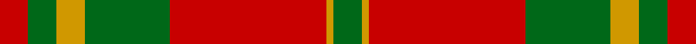
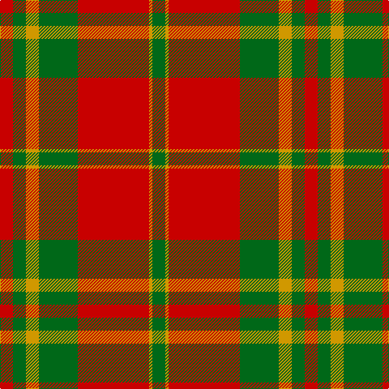

In pattern [GYRGYGR](/stripes/gyrgygr/).

This was sourced from register-of-tartans.  It is a [7 stripe tartan](/stripes/stripes7/).

Original link https://www.tartanregister.gov.uk/tartanDetails.aspx?ref=3861

## Attestations

This cloth appears in 2 source records; the oldest owns this page.

- 01/01/1972 — Spice Apple (register-of-tartans, [record](https://www.tartanregister.gov.uk/tartanDetails.aspx?ref=3861))
- pre 1972 — Spice Apple (Fashion) (tartans-authority, [record](http://www.tartansauthority.com/tartan-ferret/display/5314/))

## Register references

External register numbers recorded for this tartan.

- Scottish Register of Tartans: [3861](https://www.tartanregister.gov.uk/tartanDetails.aspx?ref=3861)
- Scottish Tartans Authority (ITI): 5314

## Thread count
R/16 G16 DY16 G48 R88 DY4 G/16

## Palette
Each colour and the base-6 reference it is a variant of.

| Colour | Shade | Base |
|---|---|---|
| DY | <code style="background-color:#D09800;">#D09800</code> `oklch(71.4% 0.147 82.1)` <small>#D09800</small> | Y <code style="background-color:#F2BF00;">#F2BF00</code> |
| G | <code style="background-color:#006818;">#006818</code> `oklch(45.0% 0.142 145.0)` <small>#006818</small> | G <code style="background-color:#006100;">#006100</code> |
| R | <code style="background-color:#C80000;">#C80000</code> `oklch(52.3% 0.215 29.2)` <small>#C80000</small> | R <code style="background-color:#CC0000;">#CC0000</code> |

# Sample pattern

## Nearest tartans

The nearest existing variants by ΔTartan distance.

1. [Robertson 6](/setts/s6/r1g10r1db4r18g1~x4/) — ΔT 0.93
1. [Unidentified Cant #09](/setts/s8/r44db2g26r3db2/) — ΔT 0.97
1. [Livingstone #2](/setts/s10/g12r4k1r2k1r4g16r20g2r8~x2/) — ΔT 1.00
1. [Caledonian](/setts/s6/r60p20r8g45r8p2~x2/) — ΔT 1.02
1. [Caledonian - 1819 (Fashion?)](/setts/s6/r60dp20r8g45r8dp2/) — ΔT 1.15
1. [MacDonald of Glenaladale (symmetrical)](/setts/s6/g5w2r27g27r5w2~x2/) — ΔT 1.16
1. [Wilson's, No 5](/setts/s6/r32t5g17r4g5w2~x2/) — ΔT 1.17
1. [MacKintosh 3](/setts/s6/r68db18r9g34r9db3~x2/) — ΔT 1.20
1. [MacAulay](/setts/s6/k2r16g6r3g8lb1~x2/) — ΔT 1.20
1. [Cameron Clan D](/setts/s6/r1dg6r1dg6r15ly1~x2/) — ΔT 1.21

## Neighbour map

Every grey dot is one of 14299 variants placed by the first two principal components of the ΔTartan feature space (44% of its variance). Red is this tartan; blue dots are its nearest — click one to open its page.

<svg viewBox="0 0 640 380" role="img" style="max-width:100%;height:auto;border:1px solid #e0e0e0;border-radius:4px;display:block" xmlns="http://www.w3.org/2000/svg"><image href="/nn/cloud.v1.png" width="640" height="380"/><a href="/setts/s6/r1g10r1db4r18g1~x4/"><circle cx="397.7" cy="186.3" r="4" fill="#3465a4"><title>Robertson 6</title></circle></a><a href="/setts/s8/r44db2g26r3db2/"><circle cx="376.6" cy="170.3" r="4" fill="#3465a4"><title>Unidentified Cant #09</title></circle></a><a href="/setts/s10/g12r4k1r2k1r4g16r20g2r8~x2/"><circle cx="387.9" cy="176.2" r="4" fill="#3465a4"><title>Livingstone #2</title></circle></a><a href="/setts/s6/r60p20r8g45r8p2~x2/"><circle cx="380.0" cy="178.5" r="4" fill="#3465a4"><title>Caledonian</title></circle></a><a href="/setts/s6/r60dp20r8g45r8dp2/"><circle cx="378.8" cy="179.0" r="4" fill="#3465a4"><title>Caledonian - 1819 (Fashion?)</title></circle></a><a href="/setts/s6/g5w2r27g27r5w2~x2/"><circle cx="335.2" cy="199.1" r="4" fill="#3465a4"><title>MacDonald of Glenaladale (symmetrical)</title></circle></a><a href="/setts/s6/r32t5g17r4g5w2~x2/"><circle cx="352.5" cy="177.7" r="4" fill="#3465a4"><title>Wilson's, No 5</title></circle></a><a href="/setts/s6/r68db18r9g34r9db3~x2/"><circle cx="419.1" cy="187.8" r="4" fill="#3465a4"><title>MacKintosh 3</title></circle></a><a href="/setts/s6/k2r16g6r3g8lb1~x2/"><circle cx="335.7" cy="189.8" r="4" fill="#3465a4"><title>MacAulay</title></circle></a><a href="/setts/s6/r1dg6r1dg6r15ly1~x2/"><circle cx="394.4" cy="195.3" r="4" fill="#3465a4"><title>Cameron Clan D</title></circle></a><circle cx="368.7" cy="184.3" r="5" fill="#c00000"/></svg>

ID: /setts/s7/r4g4lo4g12r22lo1g4~x4/
