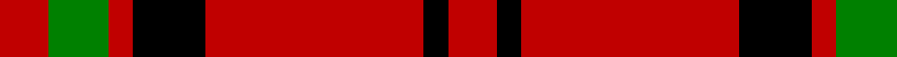

In pattern [RGRKRKR](/patterns/rgrkrkr/).

This was sourced from weddslist.  It is a [7 stripes tartan](/stripes/stripes7/).

Original link http://www.weddslist.com/cgi-bin/tartans/pg.pl?source=sts

## Thread count
R/8 G10 R4 K12 R36 K4 R/8

## Palette
Each colour and its ΔE from the base-6 reference it is a variant of.

| Colour | Shade | Base | ΔE (OKLab) |
|---|---|---|---|
| G | <code style="background-color:#008000;">#008000</code> `#008000` | G <code style="background-color:#006100;">#006100</code> | 0.10 |
| K | <code style="background-color:#000000;">#000000</code> `#000000` | K <code style="background-color:#000000;">#000000</code> | 0.00 |
| R | <code style="background-color:#C00000;">#C00000</code> `#C00000` | R <code style="background-color:#CC0000;">#CC0000</code> | 0.03 |

# Sample pattern

## Nearest tartans

The nearest existing variants by ΔTartan distance.

1. [MacQuarrie #7](/setts/s7/r4g5r2k6r18k2r4~g005020-k101010-rdc0000~x2/) — ΔT 0.87
1. [MacKeane](/setts/s5/r4k8r12k1y1~k101010-rc80000-ye8c000~x2/) — ΔT 1.10
1. [Macan, of Lurgyvallan (Hose)](/setts/s6/r10k1r4g6r4k1~g008000-k000000-rc00000~x2/) — ΔT 1.16
1. [MacGregor, Black (Personal)](/setts/s5/r41k19r7k9w3~k101010-rc80000-wfcfcfc~x2/) — ΔT 1.21
1. [Auld Reekie](/setts/s6/b4r3b3r22g8r2~b000050-g003000-rc00000~x2/) — ΔT 1.22
1. [Loevenstein Castle](/setts/s5/r20k3r4w2k7~k000000-r8c0000-wc8c8c8~x2/) — ΔT 1.26
1. [Loevenstein Castle 1 (Artefact)](/setts/s5/r20k3r4w2k7~k000000-r880000-wfcfcfc~x2/) — ΔT 1.27
1. [Glen Shiel (Fashion)](/setts/s5/r13w3r1g3w1~g003820-r880000-we8ccb8~x6/) — ΔT 1.37
1. [MacLeod #2](/setts/s8/k12r3k2r16k8r12k2r3~k101010-rdc0000~x2/) — ΔT 1.39
1. [MacDonell of Keppach](/setts/s11/r9g4r6k2r4k2r8g14r24k2r4~g008000-k000000-rc00000~x2/) — ΔT 1.39

## Neighbour map

Every grey dot is one of 15726 variants placed by the first two principal components of the ΔTartan feature space (44% of its variance). Red is this tartan; blue dots are its nearest — click one to open its page.

<svg viewBox="0 0 640 380" role="img" style="max-width:100%;height:auto;border:1px solid #e0e0e0;border-radius:4px;display:block" xmlns="http://www.w3.org/2000/svg"><image href="/nn/cloud.v1.png" width="640" height="380"/><a href="/setts/s7/r4g5r2k6r18k2r4~g005020-k101010-rdc0000~x2/"><circle cx="409.2" cy="211.2" r="4" fill="#3465a4"><title>MacQuarrie #7</title></circle></a><a href="/setts/s5/r4k8r12k1y1~k101010-rc80000-ye8c000~x2/"><circle cx="385.3" cy="220.7" r="4" fill="#3465a4"><title>MacKeane</title></circle></a><a href="/setts/s6/r10k1r4g6r4k1~g008000-k000000-rc00000~x2/"><circle cx="408.8" cy="232.5" r="4" fill="#3465a4"><title>Macan, of Lurgyvallan (Hose)</title></circle></a><a href="/setts/s5/r41k19r7k9w3~k101010-rc80000-wfcfcfc~x2/"><circle cx="383.0" cy="210.0" r="4" fill="#3465a4"><title>MacGregor, Black (Personal)</title></circle></a><a href="/setts/s6/b4r3b3r22g8r2~b000050-g003000-rc00000~x2/"><circle cx="400.2" cy="207.7" r="4" fill="#3465a4"><title>Auld Reekie</title></circle></a><a href="/setts/s5/r20k3r4w2k7~k000000-r8c0000-wc8c8c8~x2/"><circle cx="404.2" cy="225.6" r="4" fill="#3465a4"><title>Loevenstein Castle</title></circle></a><a href="/setts/s5/r20k3r4w2k7~k000000-r880000-wfcfcfc~x2/"><circle cx="397.4" cy="223.3" r="4" fill="#3465a4"><title>Loevenstein Castle 1 (Artefact)</title></circle></a><a href="/setts/s5/r13w3r1g3w1~g003820-r880000-we8ccb8~x6/"><circle cx="418.5" cy="199.8" r="4" fill="#3465a4"><title>Glen Shiel (Fashion)</title></circle></a><a href="/setts/s8/k12r3k2r16k8r12k2r3~k101010-rdc0000~x2/"><circle cx="360.3" cy="239.4" r="4" fill="#3465a4"><title>MacLeod #2</title></circle></a><a href="/setts/s11/r9g4r6k2r4k2r8g14r24k2r4~g008000-k000000-rc00000~x2/"><circle cx="421.2" cy="185.2" r="4" fill="#3465a4"><title>MacDonell of Keppach</title></circle></a><circle cx="390.5" cy="209.7" r="5" fill="#c00000"/></svg>

ID: /setts/s7/r4g5r2k6r18k2r4~g008000-k000000-rc00000~x2/
