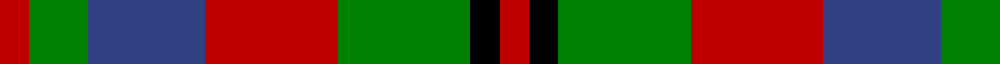

In pattern [RGBRGKR](/patterns/rgbrgkr/).

This was sourced from weddslist.  It is a [7 stripes tartan](/stripes/stripes7/).

Original link http://www.weddslist.com/cgi-bin/tartans/pg.pl?source=sts

## Thread count
R/4 G8 B16 R18 G18 K4 R/4

## Palette
Each colour and its ΔE from the base-6 reference it is a variant of.

| Colour | Shade | Base | ΔE (OKLab) |
|---|---|---|---|
| B | <code style="background-color:#304080;">#304080</code> `#304080` | B <code style="background-color:#2A418A;">#2A418A</code> | 0.02 |
| G | <code style="background-color:#008000;">#008000</code> `#008000` | G <code style="background-color:#006100;">#006100</code> | 0.10 |
| K | <code style="background-color:#000000;">#000000</code> `#000000` | K <code style="background-color:#000000;">#000000</code> | 0.00 |
| R | <code style="background-color:#C00000;">#C00000</code> `#C00000` | R <code style="background-color:#CC0000;">#CC0000</code> | 0.03 |

# Sample pattern

## Nearest tartans

The nearest existing variants by ΔTartan distance.

1. [Stewart (Artefact)](/setts/s7/r8g16b32r36g36k8r8-b2c2c80-g006818-k101010-rc80000/) — ΔT 0.61
1. [Holden Monaro Corporate Tartan Tartan Number: 8700. Earliest known date: 1831 Holden Monaro GTS 1978 car seats. Reproduction colours. Warp 162 threads Weft 202 threads. Last weaving went through with slight difference. Sett size = 4 3/8th - 4 3/4 inch (112mm - 120mm) See products available Copyright © Blair Urquhart, Comrie, 2015](/setts/s8/y20b6y6b6y6b22g22r6-b282828-g54381c-r9c4048-yb0a488/) — ΔT 0.71
1. [Londonderry, County](/setts/s7/r24k8g48y32r20k8g12-g003820-k101010-rb84c00-ybc8c00/) — ΔT 0.78
1. [Wilson's No.214](/setts/s8/b12k4b4r12g16r12b4k4-b2888c4-g006818-k101010-rc80000/) — ΔT 0.83
1. [Carnegie](/setts/s8/r33g17b50g17r11g17r9k7-b304080-g008000-k000000-rc00000/) — ΔT 0.92
1. [Chaudhri (Name)](/setts/s8/b26r16w10g48w10r20w10r20-b440044-g285800-r800028-we8ccb8/) — ΔT 0.96
1. [Creek Indian Nation](/setts/s5/b24g48y12b12r24-b2c2c80-g006818-rc80000-ye8c000/) — ΔT 1.05
1. [Martin Family Tartan Tartan Number: 1207. Earliest known date: 1977 In 1993 Kiltmaker & kilt historian Bob Martin explained that years ago when he first became interested in Scottish tartan (circa 1976) , he bought this J.P. Stevens (a weaver in Burlington North Carolina) fashion fabric from a local outlet in Greenville SC and made himself a kilt from it. He remembered the price being about $2/yd and he bought the last piece of 15yds. He wore the kilt to the Charleston Games and when Scotty Thompson asked him what it was, he replied "Martin" and SC immediately registered it with the Scottish Tartans Society and so it has remained to this day. The thread count is as given by Bob Martin -- he names the second colour as "purple" but says it is more like maroon or claret. However he suggests a more pleasing sett would have a narrower yellow stripe. See products available Copyright © Blair Urquhart, Comrie, 2015](/setts/s9/y8g16k6g6k6g6k16r21k5-g006818-k101010-r880000-ye8c000/) — ΔT 1.07
1. [Chivas Regal](/setts/s5/b12k12b12r28y6-b003c64-k101010-rb03000-ye8c000/) — ΔT 1.18
1. [Daks (Brown)](/setts/s8/g6k14g4w4y24k4y4g6-g604000-k101010-wfcfcfc-ya08858/) — ΔT 1.19

## Neighbour map

Every grey dot is one of 15726 variants placed by the first two principal components of the ΔTartan feature space (44% of its variance). Red is this tartan; blue dots are its nearest — click one to open its page.

<svg viewBox="0 0 640 380" role="img" style="max-width:100%;height:auto;border:1px solid #e0e0e0;border-radius:4px;display:block" xmlns="http://www.w3.org/2000/svg"><image href="/nn/cloud.v1.png" width="640" height="380"/><a href="/setts/s7/r8g16b32r36g36k8r8-b2c2c80-g006818-k101010-rc80000/"><circle cx="159.1" cy="251.4" r="4" fill="#3465a4"><title>Stewart (Artefact)</title></circle></a><a href="/setts/s8/y20b6y6b6y6b22g22r6-b282828-g54381c-r9c4048-yb0a488/"><circle cx="140.0" cy="249.1" r="4" fill="#3465a4"><title>Holden Monaro Corporate Tartan Tartan Number: 8700. Earliest known date: 1831 Holden Monaro GTS 1978 car seats. Reproduction colours. Warp 162 threads Weft 202 threads. Last weaving went through with slight difference. Sett size = 4 3/8th - 4 3/4 inch (112mm - 120mm) See products available Copyright © Blair Urquhart, Comrie, 2015</title></circle></a><a href="/setts/s7/r24k8g48y32r20k8g12-g003820-k101010-rb84c00-ybc8c00/"><circle cx="169.2" cy="239.5" r="4" fill="#3465a4"><title>Londonderry, County</title></circle></a><a href="/setts/s8/b12k4b4r12g16r12b4k4-b2888c4-g006818-k101010-rc80000/"><circle cx="116.1" cy="249.5" r="4" fill="#3465a4"><title>Wilson's No.214</title></circle></a><a href="/setts/s8/r33g17b50g17r11g17r9k7-b304080-g008000-k000000-rc00000/"><circle cx="156.1" cy="220.0" r="4" fill="#3465a4"><title>Carnegie</title></circle></a><a href="/setts/s8/b26r16w10g48w10r20w10r20-b440044-g285800-r800028-we8ccb8/"><circle cx="119.2" cy="231.6" r="4" fill="#3465a4"><title>Chaudhri (Name)</title></circle></a><a href="/setts/s5/b24g48y12b12r24-b2c2c80-g006818-rc80000-ye8c000/"><circle cx="143.7" cy="273.0" r="4" fill="#3465a4"><title>Creek Indian Nation</title></circle></a><a href="/setts/s9/y8g16k6g6k6g6k16r21k5-g006818-k101010-r880000-ye8c000/"><circle cx="123.3" cy="248.1" r="4" fill="#3465a4"><title>Martin Family Tartan Tartan Number: 1207. Earliest known date: 1977 In 1993 Kiltmaker &amp; kilt historian Bob Martin explained that years ago when he first became interested in Scottish tartan (circa 1976) , he bought this J.P. Stevens (a weaver in Burlington North Carolina) fashion fabric from a local outlet in Greenville SC and made himself a kilt from it. He remembered the price being about $2/yd and he bought the last piece of 15yds. He wore the kilt to the Charleston Games and when Scotty Thompson asked him what it was, he replied &quot;Martin&quot; and SC immediately registered it with the Scottish Tartans Society and so it has remained to this day. The thread count is as given by Bob Martin -- he names the second colour as &quot;purple&quot; but says it is more like maroon or claret. However he suggests a more pleasing sett would have a narrower yellow stripe. See products available Copyright © Blair Urquhart, Comrie, 2015</title></circle></a><a href="/setts/s5/b12k12b12r28y6-b003c64-k101010-rb03000-ye8c000/"><circle cx="160.7" cy="268.5" r="4" fill="#3465a4"><title>Chivas Regal</title></circle></a><a href="/setts/s8/g6k14g4w4y24k4y4g6-g604000-k101010-wfcfcfc-ya08858/"><circle cx="177.7" cy="204.7" r="4" fill="#3465a4"><title>Daks (Brown)</title></circle></a><circle cx="145.0" cy="246.3" r="5" fill="#c00000"/></svg>

ID: /setts/s7/r4g8b16r18g18k4r4-b304080-g008000-k000000-rc00000/
