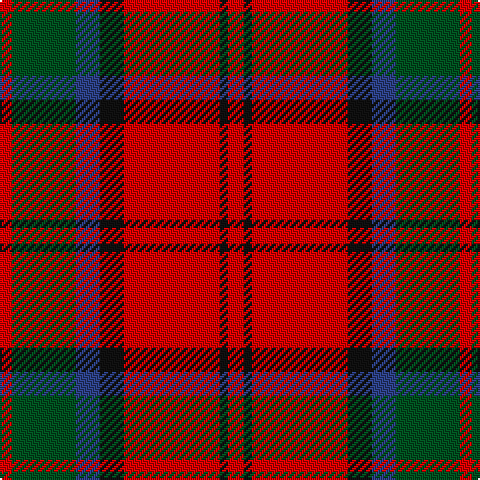

In pattern [RGBKRKR](/patterns/rgbkrkr/).

This was sourced from register-of-tartans.  It is a [7 stripes tartan](/stripes/stripes7/).

Original link https://www.tartanregister.gov.uk/tartanDetails.aspx?ref=2416

## Register references

External register numbers recorded for this tartan.

- Scottish Register of Tartans: [2416](https://www.tartanregister.gov.uk/tartanDetails.aspx?ref=2416)
- Scottish Tartans World Register: 1453

## Thread count
R/6 G32 B12 K12 R48 K4 R/8

## Palette
Each colour and its ΔE from the base-6 reference it is a variant of.

| Colour | Shade | Base | ΔE (OKLab) |
|---|---|---|---|
| B | <code style="background-color:#2C4084;">#2C4084</code> `#2C4084` | B <code style="background-color:#2A418A;">#2A418A</code> | 0.01 |
| G | <code style="background-color:#005020;">#005020</code> `#005020` | G <code style="background-color:#006100;">#006100</code> | 0.07 |
| K | <code style="background-color:#101010;">#101010</code> `#101010` | K <code style="background-color:#000000;">#000000</code> | 0.17 |
| R | <code style="background-color:#DC0000;">#DC0000</code> `#DC0000` | R <code style="background-color:#CC0000;">#CC0000</code> | 0.03 |

# Sample pattern

## Nearest tartans

The nearest existing variants by ΔTartan distance.

1. [Fraser Red Clan Tartan Tartan Number: 1424. Earliest known date: 1842 Early references include Wilson's of Bannockburn, but Wilson did not name the sett. D W Stewart contends that this is in fact an early Grant tartan which he traced to a portrait of Robert Grant of Lurg (1678-1771), hanging at Troup House before it was closed around 1894. It is undoubtedly the most popular Fraser pattern today. See products available Copyright © Blair Urquhart, Comrie, 2015](/setts/s6/r1b6r1g6r12w1~b202060-g003820-rc80000-we0e0e0~x2/) — ΔT 0.64
1. [Carrick (Strathmore) District Tartan Tartan Number: 3216. Earliest known date: c.1999 Sales help Princess Diana Memorial Trust See products available Copyright © Blair Urquhart, Comrie, 2015](/setts/s7/r28b12r3g20ba2g2r7~b202060-ba5c8ca8-g003820-rc80000~x2/) — ΔT 0.66
1. [MacBean/MacElvain](/setts/s7/k2r12b6r3g12r4b1~b2c4084-g005020-k101010-rdc0000~x2/) — ΔT 0.66
1. [MacNaughton](/setts/s9/b2k2r27g27k12b12r27k2b2~b3c82af-g005020-k101010-rdc0000~x2/) — ΔT 0.72
1. [Nisbet Family Tartan Tartan Number: 2115. Earliest known date: 1842 This is the sett that appears in the Vestiarium Scoticum as Mackintosh. There is no connection between the names, historically, to explain the position and it is interesting to note the similarity with the Dunbar tartan which also originates in the Vestiarium. The Nisbets came from the old barony of Nisbet in the parish of Edrom, Berwickshire, as early as 1160. See products available Copyright © Blair Urquhart, Comrie, 2015](/setts/s6/r5w2r28k12g16r3~g006818-k101010-rc80000-we0e0e0~x2/) — ΔT 0.73
1. [Fraser VS](/setts/s6/r1b6r1g6r12w1~b000064-g004c00-rc80000-wd0d0d0/) — ΔT 0.74
1. [MacNab (Crimson)](/setts/s7/g28r7ra7g14ra7r48k4~g005020-k101010-rdc0000-ra781c38~x2/) — ΔT 0.75
1. [MacDuff](/setts/s7/r4k2r24k6b6g16r3~b304080-g008000-k000000-rc00000~x2/) — ΔT 0.76
1. [Fraser Gathering Trade Tartan Tartan Number: 2361. Earliest known date: 1997 Unknown until House of Edgar published their own Old and Rare. See products available Copyright © Blair Urquhart, Comrie, 2015](/setts/s9/r2b12r2g11r4b5g2r24w2~b202060-g006818-rc80000-we0e0e0~x2/) — ΔT 0.77
1. [Fraser Gathering, Red (1997)](/setts/s9/r2b12r2g11r4b5g2r24w2~b202060-g006818-rc80000-wfcfcfc~x2/) — ΔT 0.78

## Neighbour map

Every grey dot is one of 15726 variants placed by the first two principal components of the ΔTartan feature space (44% of its variance). Red is this tartan; blue dots are its nearest — click one to open its page.

<svg viewBox="0 0 640 380" role="img" style="max-width:100%;height:auto;border:1px solid #e0e0e0;border-radius:4px;display:block" xmlns="http://www.w3.org/2000/svg"><image href="/nn/cloud.v1.png" width="640" height="380"/><a href="/setts/s6/r1b6r1g6r12w1~b202060-g003820-rc80000-we0e0e0~x2/"><circle cx="292.8" cy="191.0" r="4" fill="#3465a4"><title>Fraser Red Clan Tartan Tartan Number: 1424. Earliest known date: 1842 Early references include Wilson's of Bannockburn, but Wilson did not name the sett. D W Stewart contends that this is in fact an early Grant tartan which he traced to a portrait of Robert Grant of Lurg (1678-1771), hanging at Troup House before it was closed around 1894. It is undoubtedly the most popular Fraser pattern today. See products available Copyright © Blair Urquhart, Comrie, 2015</title></circle></a><a href="/setts/s7/r28b12r3g20ba2g2r7~b202060-ba5c8ca8-g003820-rc80000~x2/"><circle cx="308.3" cy="186.4" r="4" fill="#3465a4"><title>Carrick (Strathmore) District Tartan Tartan Number: 3216. Earliest known date: c.1999 Sales help Princess Diana Memorial Trust See products available Copyright © Blair Urquhart, Comrie, 2015</title></circle></a><a href="/setts/s7/k2r12b6r3g12r4b1~b2c4084-g005020-k101010-rdc0000~x2/"><circle cx="259.3" cy="199.4" r="4" fill="#3465a4"><title>MacBean/MacElvain</title></circle></a><a href="/setts/s9/b2k2r27g27k12b12r27k2b2~b3c82af-g005020-k101010-rdc0000~x2/"><circle cx="251.3" cy="167.7" r="4" fill="#3465a4"><title>MacNaughton</title></circle></a><a href="/setts/s6/r5w2r28k12g16r3~g006818-k101010-rc80000-we0e0e0~x2/"><circle cx="305.3" cy="189.8" r="4" fill="#3465a4"><title>Nisbet Family Tartan Tartan Number: 2115. Earliest known date: 1842 This is the sett that appears in the Vestiarium Scoticum as Mackintosh. There is no connection between the names, historically, to explain the position and it is interesting to note the similarity with the Dunbar tartan which also originates in the Vestiarium. The Nisbets came from the old barony of Nisbet in the parish of Edrom, Berwickshire, as early as 1160. See products available Copyright © Blair Urquhart, Comrie, 2015</title></circle></a><a href="/setts/s6/r1b6r1g6r12w1~b000064-g004c00-rc80000-wd0d0d0/"><circle cx="280.5" cy="188.2" r="4" fill="#3465a4"><title>Fraser VS</title></circle></a><a href="/setts/s7/g28r7ra7g14ra7r48k4~g005020-k101010-rdc0000-ra781c38~x2/"><circle cx="298.0" cy="188.7" r="4" fill="#3465a4"><title>MacNab (Crimson)</title></circle></a><a href="/setts/s7/r4k2r24k6b6g16r3~b304080-g008000-k000000-rc00000~x2/"><circle cx="260.2" cy="182.0" r="4" fill="#3465a4"><title>MacDuff</title></circle></a><a href="/setts/s9/r2b12r2g11r4b5g2r24w2~b202060-g006818-rc80000-we0e0e0~x2/"><circle cx="280.8" cy="166.2" r="4" fill="#3465a4"><title>Fraser Gathering Trade Tartan Tartan Number: 2361. Earliest known date: 1997 Unknown until House of Edgar published their own Old and Rare. See products available Copyright © Blair Urquhart, Comrie, 2015</title></circle></a><a href="/setts/s9/r2b12r2g11r4b5g2r24w2~b202060-g006818-rc80000-wfcfcfc~x2/"><circle cx="277.3" cy="164.7" r="4" fill="#3465a4"><title>Fraser Gathering, Red (1997)</title></circle></a><circle cx="278.5" cy="185.4" r="5" fill="#c00000"/></svg>

ID: /setts/s7/r4k2r24k6b6g16r3~b2c4084-g005020-k101010-rdc0000~x2/
