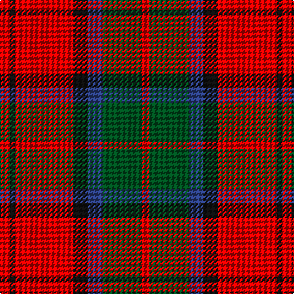

In pattern [RGBKRKR](/stripes/rgbkrkr/).

This was sourced from register-of-tartans.  It is a [7 stripe tartan](/stripes/stripes7/).

Original link https://www.tartanregister.gov.uk/tartanDetails.aspx?ref=2416

## Also known as

This cloth is also recorded under:

- MacDuff #4

## Register references

External register numbers recorded for this tartan.

- Scottish Register of Tartans: [2416](https://www.tartanregister.gov.uk/tartanDetails.aspx?ref=2416)
- Scottish Tartans World Register: 1453

## Thread count
R/8 K4 R48 K12 B12 G32 R/6

## Palette
Each colour and the base-6 reference it is a variant of.

| Colour | Shade | Base |
|---|---|---|
| B | <code style="background-color:#2C4084;">#2C4084</code> `oklch(39.4% 0.117 268.3)` <small>#2C4084</small> | B <code style="background-color:#2A418A;">#2A418A</code> |
| G | <code style="background-color:#005020;">#005020</code> `oklch(37.7% 0.105 149.6)` <small>#005020</small> | G <code style="background-color:#006100;">#006100</code> |
| K | <code style="background-color:#101010;">#101010</code> `oklch(17.3% 0.000 89.9)` <small>#101010</small> | K <code style="background-color:#000000;">#000000</code> |
| R | <code style="background-color:#DC0000;">#DC0000</code> `oklch(56.2% 0.230 29.2)` <small>#DC0000</small> | R <code style="background-color:#CC0000;">#CC0000</code> |

# Sample pattern

## Nearest tartans

The nearest existing variants by ΔTartan distance, with this tartan at the top so the swatches line up against it.

ΔTartan

Tartan

Sett

—

<a href="/ttd/edit/#slug=r4k2r24k6db6dg16r3~x2">MacDuff #4</a> <a class="nn-out" href="/setts/s7/r4k2r24k6db6dg16r3~x2/" title="open its dictionary page">↗</a>

0.64

<a href="/ttd/edit/#slug=r1db6r1dg6r12w1~x2">Fraser Red Clan Tartan Tartan Number: 1424. Earliest known date: 1842 Early references include Wilson's of Bannockburn, but Wilson did not name the sett. D W Stewart contends that this is in fact an early Grant tartan which he traced to a portrait of Robert Grant of Lurg (1678-1771), hanging at Troup House before it was closed around 1894. It is undoubtedly the most popular Fraser pattern today. See products available Copyright © Blair Urquhart, Comrie, 2015</a> <a class="nn-out" href="/setts/s6/r1db6r1dg6r12w1~x2/" title="open its dictionary page">↗</a>

0.66

<a href="/ttd/edit/#slug=r28db12r3dg20t2dg2r7~x2">Carrick (Strathmore) District Tartan Tartan Number: 3216. Earliest known date: c.1999 Sales help Princess Diana Memorial Trust See products available Copyright © Blair Urquhart, Comrie, 2015</a> <a class="nn-out" href="/setts/s7/r28db12r3dg20t2dg2r7~x2/" title="open its dictionary page">↗</a>

0.66

<a href="/ttd/edit/#slug=k2r12db6r3dg12r4db1~x2">MacBean/MacElvain</a> <a class="nn-out" href="/setts/s7/k2r12db6r3dg12r4db1~x2/" title="open its dictionary page">↗</a>

0.72

<a href="/ttd/edit/#slug=t2k2r27dg27k12t12r27k2t2~x2">MacNaughton</a> <a class="nn-out" href="/setts/s9/t2k2r27dg27k12t12r27k2t2~x2/" title="open its dictionary page">↗</a>

0.74

<a href="/ttd/edit/#slug=r1db6r1dg6r12lb1">Fraser VS</a> <a class="nn-out" href="/setts/s6/r1db6r1dg6r12lb1/" title="open its dictionary page">↗</a>

0.75

<a href="/ttd/edit/#slug=dg28r7m7dg14m7r48k4~x2">MacNab (Crimson)</a> <a class="nn-out" href="/setts/s7/dg28r7m7dg14m7r48k4~x2/" title="open its dictionary page">↗</a>

0.76

<a href="/ttd/edit/#slug=r4k2r24k6db6g16r3~x2">MacDuff</a> <a class="nn-out" href="/setts/s7/r4k2r24k6db6g16r3~x2/" title="open its dictionary page">↗</a>

0.78

<a href="/ttd/edit/#slug=r2db12r2g11r4db5g2r24w2~x2">Fraser Gathering, Red (1997)</a> <a class="nn-out" href="/setts/s9/r2db12r2g11r4db5g2r24w2~x2/" title="open its dictionary page">↗</a>

0.80

<a href="/ttd/edit/#slug=r5w2r28k12dg16r3~x2">MacKintosh #4</a> <a class="nn-out" href="/setts/s6/r5w2r28k12dg16r3~x2/" title="open its dictionary page">↗</a>

0.88

<a href="/ttd/edit/#slug=r6dg16r4db12r16t1r2~x2">MacQuarrie #6</a> <a class="nn-out" href="/setts/s7/r6dg16r4db12r16t1r2~x2/" title="open its dictionary page">↗</a>

## Neighbour map

Every grey dot is one of 14299 variants placed by the first two principal components of the ΔTartan feature space (44% of its variance). Red is this tartan; blue dots are its nearest — click one to open its page.

<svg viewBox="0 0 640 380" role="img" style="max-width:100%;height:auto;border:1px solid #e0e0e0;border-radius:4px;display:block" xmlns="http://www.w3.org/2000/svg"><image href="/nn/cloud.v1.png" width="640" height="380"/><a href="/setts/s6/r1db6r1dg6r12w1~x2/"><circle cx="293.5" cy="188.1" r="4" fill="#3465a4"><title>Fraser Red Clan Tartan Tartan Number: 1424. Earliest known date: 1842 Early references include Wilson's of Bannockburn, but Wilson did not name the sett. D W Stewart contends that this is in fact an early Grant tartan which he traced to a portrait of Robert Grant of Lurg (1678-1771), hanging at Troup House before it was closed around 1894. It is undoubtedly the most popular Fraser pattern today. See products available Copyright © Blair Urquhart, Comrie, 2015</title></circle></a><a href="/setts/s7/r28db12r3dg20t2dg2r7~x2/"><circle cx="308.9" cy="185.2" r="4" fill="#3465a4"><title>Carrick (Strathmore) District Tartan Tartan Number: 3216. Earliest known date: c.1999 Sales help Princess Diana Memorial Trust See products available Copyright © Blair Urquhart, Comrie, 2015</title></circle></a><a href="/setts/s7/k2r12db6r3dg12r4db1~x2/"><circle cx="260.0" cy="198.1" r="4" fill="#3465a4"><title>MacBean/MacElvain</title></circle></a><a href="/setts/s9/t2k2r27dg27k12t12r27k2t2~x2/"><circle cx="252.2" cy="165.9" r="4" fill="#3465a4"><title>MacNaughton</title></circle></a><a href="/setts/s6/r1db6r1dg6r12lb1/"><circle cx="281.5" cy="184.5" r="4" fill="#3465a4"><title>Fraser VS</title></circle></a><a href="/setts/s7/dg28r7m7dg14m7r48k4~x2/"><circle cx="298.1" cy="187.8" r="4" fill="#3465a4"><title>MacNab (Crimson)</title></circle></a><a href="/setts/s7/r4k2r24k6db6g16r3~x2/"><circle cx="261.2" cy="178.3" r="4" fill="#3465a4"><title>MacDuff</title></circle></a><a href="/setts/s9/r2db12r2g11r4db5g2r24w2~x2/"><circle cx="278.1" cy="162.4" r="4" fill="#3465a4"><title>Fraser Gathering, Red (1997)</title></circle></a><a href="/setts/s6/r5w2r28k12dg16r3~x2/"><circle cx="301.3" cy="181.1" r="4" fill="#3465a4"><title>MacKintosh #4</title></circle></a><a href="/setts/s7/r6dg16r4db12r16t1r2~x2/"><circle cx="285.2" cy="190.3" r="4" fill="#3465a4"><title>MacQuarrie #6</title></circle></a><circle cx="279.0" cy="182.9" r="5" fill="#c00000"/></svg>

ID: /setts/s7/r4k2r24k6db6dg16r3~x2/
