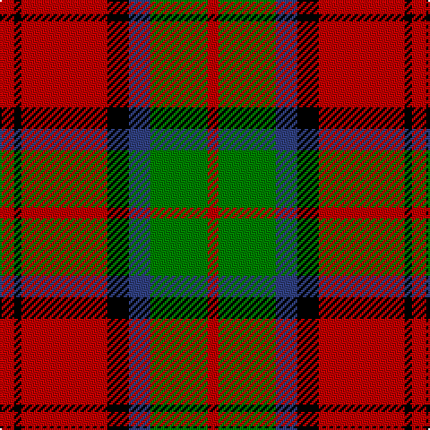

In pattern [RGBKRKR](/stripes/rgbkrkr/).

This was sourced from weddslist.  It is a [7 stripe tartan](/stripes/stripes7/).

Original link http://www.weddslist.com/cgi-bin/tartans/pg.pl?source=sts

## Also known as

This cloth is also recorded under:

- MacDuff #4

## Thread count
R/8 K4 R48 K12 B12 G32 R/6

## Palette
Each colour and the base-6 reference it is a variant of.

| Colour | Shade | Base |
|---|---|---|
| B | <code style="background-color:#304080;">#304080</code> `oklch(39.4% 0.109 270.2)` <small>#304080</small> | B <code style="background-color:#2A418A;">#2A418A</code> |
| G | <code style="background-color:#008000;">#008000</code> `oklch(52.0% 0.177 142.5)` <small>#008000</small> | G <code style="background-color:#006100;">#006100</code> |
| K | <code style="background-color:#000000;">#000000</code> `oklch(0.0% 0.000 0.0)` <small>#000000</small> | K <code style="background-color:#000000;">#000000</code> |
| R | <code style="background-color:#C00000;">#C00000</code> `oklch(50.7% 0.208 29.2)` <small>#C00000</small> | R <code style="background-color:#CC0000;">#CC0000</code> |

# Sample pattern

## Nearest tartans

The nearest existing variants by ΔTartan distance, with this tartan at the top so the swatches line up against it.

ΔTartan

Tartan

Sett

—

<a href="/ttd/edit/#slug=r4k2r24k6db6g16r3~x2">MacDuff</a> <a class="nn-out" href="/setts/s7/r4k2r24k6db6g16r3~x2/" title="open its dictionary page">↗</a>

0.73

<a href="/ttd/edit/#slug=db1k1r12g12k6db5r12k1db1~x2">Montrose</a> <a class="nn-out" href="/setts/s9/db1k1r12g12k6db5r12k1db1~x2/" title="open its dictionary page">↗</a>

0.76

<a href="/ttd/edit/#slug=r4k2r24k6db6dg16r3~x2">MacDuff #4</a> <a class="nn-out" href="/setts/s7/r4k2r24k6db6dg16r3~x2/" title="open its dictionary page">↗</a>

0.78

<a href="/ttd/edit/#slug=r5w2r28k12g16r3~x2">MacKintosh 6</a> <a class="nn-out" href="/setts/s6/r5w2r28k12g16r3~x2/" title="open its dictionary page">↗</a>

0.85

<a href="/ttd/edit/#slug=k2r12db6r3g12r4db1~x2">MacBean, MacElvain</a> <a class="nn-out" href="/setts/s7/k2r12db6r3g12r4db1~x2/" title="open its dictionary page">↗</a>

0.86

<a href="/ttd/edit/#slug=r1db6r1dg6r12lb1">Fraser VS</a> <a class="nn-out" href="/setts/s6/r1db6r1dg6r12lb1/" title="open its dictionary page">↗</a>

0.91

<a href="/ttd/edit/#slug=k15dg1k3r9dg1r3lo11k1~x4">Island of Innis, The</a> <a class="nn-out" href="/setts/s8/k15dg1k3r9dg1r3lo11k1~x4/" title="open its dictionary page">↗</a>

0.91

<a href="/ttd/edit/#slug=t2k2r27dg27k12t12r27k2t2~x2">MacNaughton</a> <a class="nn-out" href="/setts/s9/t2k2r27dg27k12t12r27k2t2~x2/" title="open its dictionary page">↗</a>

0.92

<a href="/ttd/edit/#slug=k2db2r26dg25k13db13r26db2k2~x2">MacNaughton (Logan) #2</a> <a class="nn-out" href="/setts/s9/k2db2r26dg25k13db13r26db2k2~x2/" title="open its dictionary page">↗</a>

0.96

<a href="/ttd/edit/#slug=dg3r1w5r1dg2r1dg1r9do2~x4">Redwood Dress</a> <a class="nn-out" href="/setts/s9/dg3r1w5r1dg2r1dg1r9do2~x4/" title="open its dictionary page">↗</a>

0.97

<a href="/ttd/edit/#slug=r6dg16r4db12r16lb1r2~x2">MacQuarrie LO</a> <a class="nn-out" href="/setts/s7/r6dg16r4db12r16lb1r2~x2/" title="open its dictionary page">↗</a>

## Neighbour map

Every grey dot is one of 14299 variants placed by the first two principal components of the ΔTartan feature space (44% of its variance). Red is this tartan; blue dots are its nearest — click one to open its page.

<svg viewBox="0 0 640 380" role="img" style="max-width:100%;height:auto;border:1px solid #e0e0e0;border-radius:4px;display:block" xmlns="http://www.w3.org/2000/svg"><image href="/nn/cloud.v1.png" width="640" height="380"/><a href="/setts/s9/db1k1r12g12k6db5r12k1db1~x2/"><circle cx="227.0" cy="168.9" r="4" fill="#3465a4"><title>Montrose</title></circle></a><a href="/setts/s7/r4k2r24k6db6dg16r3~x2/"><circle cx="279.0" cy="182.9" r="4" fill="#3465a4"><title>MacDuff #4</title></circle></a><a href="/setts/s6/r5w2r28k12g16r3~x2/"><circle cx="284.0" cy="177.6" r="4" fill="#3465a4"><title>MacKintosh 6</title></circle></a><a href="/setts/s7/k2r12db6r3g12r4db1~x2/"><circle cx="250.2" cy="196.7" r="4" fill="#3465a4"><title>MacBean, MacElvain</title></circle></a><a href="/setts/s6/r1db6r1dg6r12lb1/"><circle cx="281.5" cy="184.5" r="4" fill="#3465a4"><title>Fraser VS</title></circle></a><a href="/setts/s8/k15dg1k3r9dg1r3lo11k1~x4/"><circle cx="233.6" cy="162.8" r="4" fill="#3465a4"><title>Island of Innis, The</title></circle></a><a href="/setts/s9/t2k2r27dg27k12t12r27k2t2~x2/"><circle cx="252.2" cy="165.9" r="4" fill="#3465a4"><title>MacNaughton</title></circle></a><a href="/setts/s9/k2db2r26dg25k13db13r26db2k2~x2/"><circle cx="230.2" cy="161.4" r="4" fill="#3465a4"><title>MacNaughton (Logan) #2</title></circle></a><a href="/setts/s9/dg3r1w5r1dg2r1dg1r9do2~x4/"><circle cx="228.5" cy="171.1" r="4" fill="#3465a4"><title>Redwood Dress</title></circle></a><a href="/setts/s7/r6dg16r4db12r16lb1r2~x2/"><circle cx="268.3" cy="186.1" r="4" fill="#3465a4"><title>MacQuarrie LO</title></circle></a><circle cx="261.2" cy="178.3" r="5" fill="#c00000"/></svg>

ID: /setts/s7/r4k2r24k6db6g16r3~x2/
