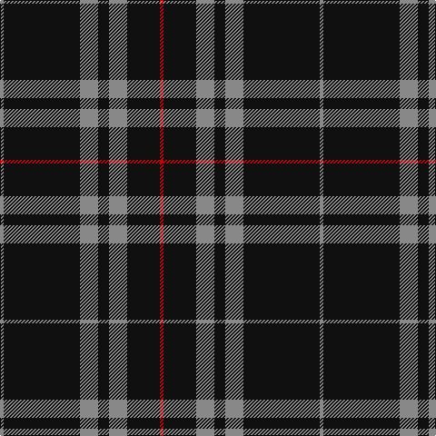

In pattern [RKRKRKR](/patterns/rkrkrkr/).

This was sourced from tartans-authority.  It is a [7 stripes tartan](/stripes/stripes7/).

Original link http://www.tartansauthority.com/tartan-ferret/display/7511/

## Attestations

This cloth appears in 3 source records; the oldest owns this page.

- July 2007 — Sunderland of Scotland (Fashion) (tartans-authority, [record](http://www.tartansauthority.com/tartan-ferret/display/7511/))
- undated — Sunderland of Scotland (register-of-tartans, [record](https://www.tartanregister.gov.uk/tartanDetails.aspx?ref=5549))
- undated — Sunderland of Scotland Fashion Tartan Tartan Number: 7511. Earliest known date: July 2007 Woven by Lochcarron for Lyle & Scott of Hawick. Count & sample from Lochcarron. See products available Copyright © Blair Urquhart, Comrie, 2015 (house-of-tartan, [record](http://www.house-of-tartan.scotland.net/house/TartanViewjs.asp?colr=Def&tnam=7511))

## Thread count
N/4 K84 N20 K12 N20 K36 R/4

## Palette
Each colour and its ΔE from the base-6 reference it is a variant of.

| Colour | Shade | Base | ΔE (OKLab) |
|---|---|---|---|
| K | <code style="background-color:#101010;">#101010</code> `#101010` | K <code style="background-color:#000000;">#000000</code> | 0.17 |
| N | <code style="background-color:#888888;">#888888</code> `#888888` | R <code style="background-color:#C80000;">#C80000</code> | 0.24 |
| R | <code style="background-color:#C80000;">#C80000</code> `#C80000` | R <code style="background-color:#C80000;">#C80000</code> | 0.00 |

# Sample pattern

ID: /setts/s7/r4k84r20k12r20k36ra4-k101010-r888888-rac80000/
