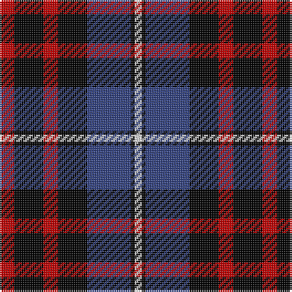

In pattern [RKRKBKW](/stripes/rkrkbkw/).

This was sourced from weddslist.  It is a [7 stripe tartan](/stripes/stripes7/).

Original link http://www.weddslist.com/cgi-bin/tartans/pg.pl?source=sts

## Thread count
R/8 K16 R8 K16 B24 K2 LN/4

## Palette
Each colour and the base-6 reference it is a variant of.

| Colour | Shade | Base |
|---|---|---|
| B | <code style="background-color:#304080;">#304080</code> `oklch(39.4% 0.109 270.2)` <small>#304080</small> | B <code style="background-color:#2A418A;">#2A418A</code> |
| K | <code style="background-color:#000000;">#000000</code> `oklch(0.0% 0.000 0.0)` <small>#000000</small> | K <code style="background-color:#000000;">#000000</code> |
| LN | <code style="background-color:#E0E0E0;">#E0E0E0</code> `oklch(90.7% 0.000 89.9)` <small>#E0E0E0</small> | W <code style="background-color:#F7F7F7;">#F7F7F7</code> |
| R | <code style="background-color:#C00000;">#C00000</code> `oklch(50.7% 0.208 29.2)` <small>#C00000</small> | R <code style="background-color:#CC0000;">#CC0000</code> |

# Sample pattern

## Nearest tartans

The nearest existing variants by ΔTartan distance.

1. [Gipsy (Fashion)](/setts/s9/k2r2k8r2w1r2db8r2k2~x4/) — ΔT 1.06
1. [Gipsy](/setts/s9/k2r2k8r2w1r2db8r2k2~x2/) — ΔT 1.10
1. [Aitken](/setts/s8/lo5db2k2db12k16r20k2r4~x2/) — ΔT 1.11
1. [Baillie](/setts/s7/p3k1p8k6g8k1w2~x2/) — ΔT 1.19
1. [Kilgour](/setts/s6/db14dg21db4r21db14ly2~x2/) — ΔT 1.20
1. [MacTavish](/setts/s6/b2r12db2b6k6b1~x2/) — ΔT 1.25
1. [MacTavish](/setts/s6/b2r12db2b6k6b1/) — ΔT 1.25
1. [Melville](/setts/s6/k5lb2dg18k17dp16k3/) — ΔT 1.25
1. [MacKean (Personal)](/setts/s7/r8k18r6k18b27k2w3~x2/) — ΔT 1.27
1. [Dutch](/setts/s6/k4o19k19o2dp22w4~x2/) — ΔT 1.33

## Neighbour map

Every grey dot is one of 14299 variants placed by the first two principal components of the ΔTartan feature space (44% of its variance). Red is this tartan; blue dots are its nearest — click one to open its page.

<svg viewBox="0 0 640 380" role="img" style="max-width:100%;height:auto;border:1px solid #e0e0e0;border-radius:4px;display:block" xmlns="http://www.w3.org/2000/svg"><image href="/nn/cloud.v1.png" width="640" height="380"/><a href="/setts/s9/k2r2k8r2w1r2db8r2k2~x4/"><circle cx="179.6" cy="193.7" r="4" fill="#3465a4"><title>Gipsy (Fashion)</title></circle></a><a href="/setts/s9/k2r2k8r2w1r2db8r2k2~x2/"><circle cx="184.2" cy="196.0" r="4" fill="#3465a4"><title>Gipsy</title></circle></a><a href="/setts/s8/lo5db2k2db12k16r20k2r4~x2/"><circle cx="188.4" cy="189.3" r="4" fill="#3465a4"><title>Aitken</title></circle></a><a href="/setts/s7/p3k1p8k6g8k1w2~x2/"><circle cx="148.2" cy="207.3" r="4" fill="#3465a4"><title>Baillie</title></circle></a><a href="/setts/s6/db14dg21db4r21db14ly2~x2/"><circle cx="197.8" cy="227.0" r="4" fill="#3465a4"><title>Kilgour</title></circle></a><a href="/setts/s6/b2r12db2b6k6b1~x2/"><circle cx="210.5" cy="195.6" r="4" fill="#3465a4"><title>MacTavish</title></circle></a><a href="/setts/s6/b2r12db2b6k6b1/"><circle cx="210.5" cy="195.6" r="4" fill="#3465a4"><title>MacTavish</title></circle></a><a href="/setts/s6/k5lb2dg18k17dp16k3/"><circle cx="187.5" cy="231.6" r="4" fill="#3465a4"><title>Melville</title></circle></a><a href="/setts/s7/r8k18r6k18b27k2w3~x2/"><circle cx="230.3" cy="194.5" r="4" fill="#3465a4"><title>MacKean (Personal)</title></circle></a><a href="/setts/s6/k4o19k19o2dp22w4~x2/"><circle cx="152.7" cy="197.2" r="4" fill="#3465a4"><title>Dutch</title></circle></a><circle cx="195.5" cy="205.2" r="5" fill="#c00000"/></svg>

ID: /setts/s7/r4k8r4k8db12k1w2~x2/
